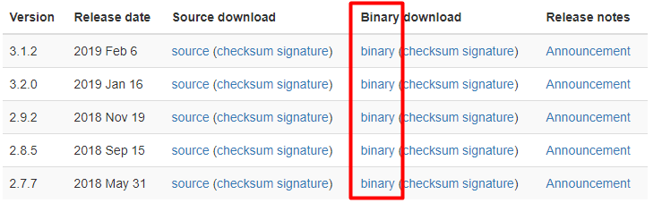

>[toc]

# 1. 下载压缩包
下载Hadoop binary二进制压缩包 https://hadoop.apache.org/releases.html 

上传到Linux并解压

# 2. 配置环境变量
提前先配置好java环境变量，编辑 `vi /etc/profile`

``` 
export HADOOP_HOME=/usr/soft/hadoop-2.7.2
PATH=$PATH:$JAVA_HOME/bin:$HADOOP_HOME/bin:$HADOOP_HOME/sbin

export PATH USER LOGNAME MAIL HOSTNAME HISTSIZE HISTCONTROL
```
运行 `source /etc/profile` 使配置生效

# 3. 配置Hadoop的JAVA_HOME路径
进入Hadoop解压目录，`vi ./etc/hadoop/hadoop-env.sh `
设置JAVA_HOME路径

```
export JAVA_HOME=/usr/soft/jdk1.8.0_144
```

# 4. WordCount
单机版Hadoop环境已经搭建完成，运行一个统计单词数量的Demo来了解一下Hadoop的运行机制

1. 复制一些xml文件

`mkdir /usr/soft/input`
`cp ./hadoop/*.xml /usr/soft/input`

2. 执行Hadoop命令

格式: **hadoop jar <jar包> <类> <输入文件夹> <输出文件夹> <条件>**

`hadoop jar ./share/hadoop/mapreduce/hadoop-mapreduce-examples-2.7.2.jar wordcount /usr/soft/input /usr/soft/output`

注意，保证之前没有这个output目录,成功之后会产生2个文件

``` 
[root@localhost output]# ll
total 8
-rw-r--r--. 1 root root 5552 Jan  2 17:20 part-r-00000
-rw-r--r--. 1 root root    0 Jan  2 17:20 _SUCCESS
```
- part-r-00000 结果文件
- _SUCCESS 成功标志

3. 查看结果

```
[root@localhost output]# more part-r-00000 
"*"     17
"AS     6
--More--(1%)
```

4. 查看hdfs文件列表

`hdfs dfs -ls /`