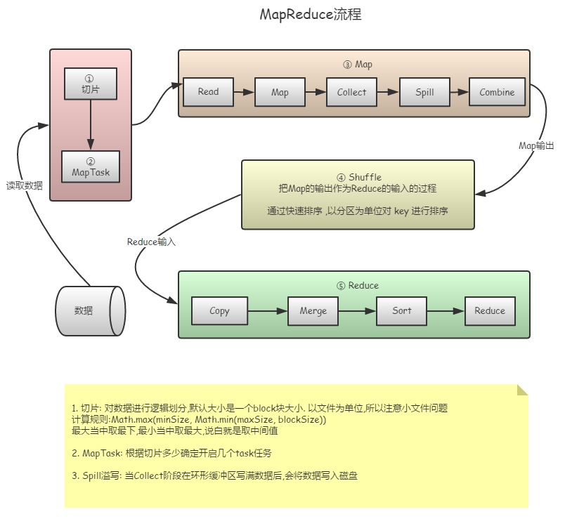
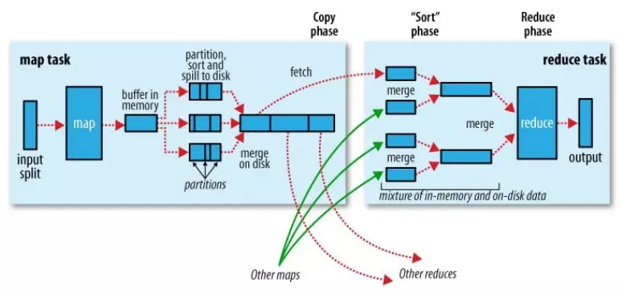

> [toc]

# 1. MapReduce流程

> 1. 切片: 对数据进行逻辑划分,默认大小是一个block块大小. 以文件为单位,所以注意小文件问题
计算规则:Math.max(minSize, Math.min(maxSize, blockSize))
最大当中取最下,最小当中取最大,说白就是取中间值
> 2. MapTask: 根据切片多少确定开启几个task任务
> 3. Spill溢写: 当Collect阶段在环形缓冲区写满数据后,会将数据写入磁盘
# 2. Shuffle流程

