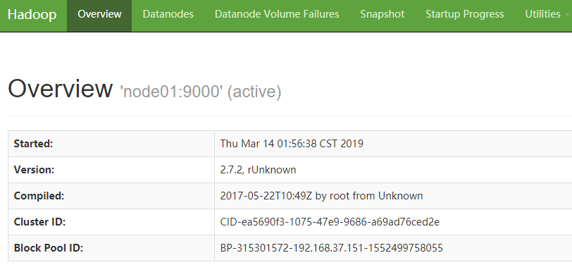
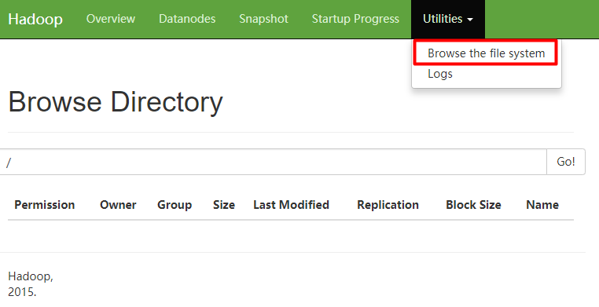
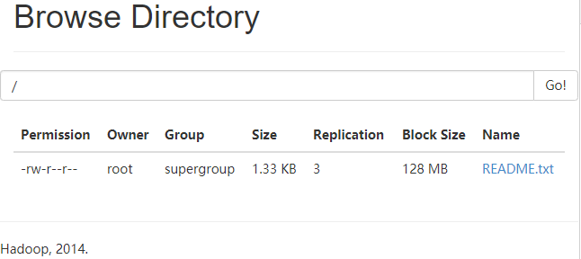
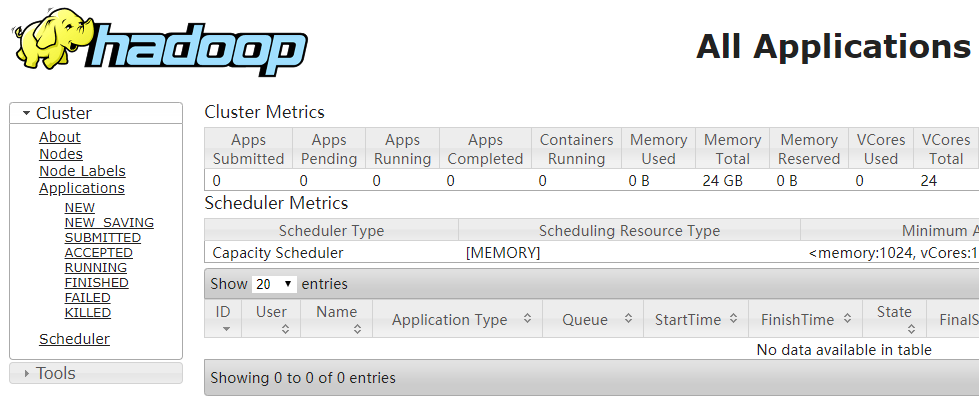
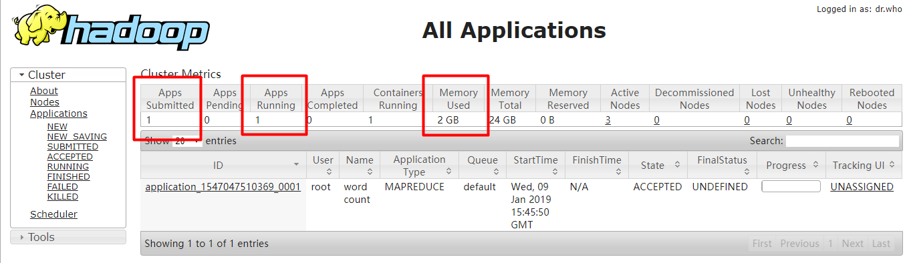
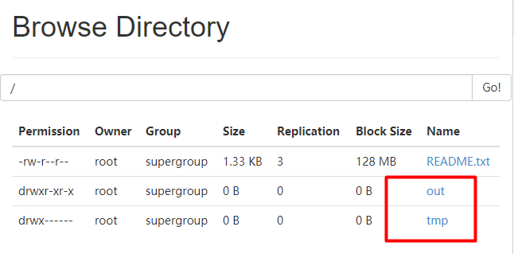
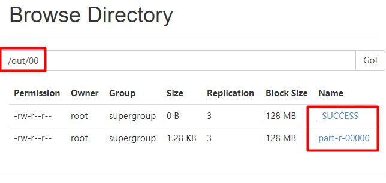

> [toc]

# 1．分布式集群规划

|     |  node01   |  node02   |  node03   |
| --- | --- | --- | --- |
|  HDFS   |  NameNode <br> DateNode   |  DateNode   |  SecondaryNameNode <br>  DataNode   |
|  YARN   |  NodeManager | NodeManager <br>  ResourceManager |  NodeManager  |

# 2. 网络IP规划

克隆3台虚拟机,IP分别为: (自己随便设置,以下为示例)
> 192.168.37.151
192.168.37.152
192.168.37.153

**提醒: 以下所有配置均在3台虚拟机之间同步**

修改hosts映射,方便后续虚拟机集群配置,以及集群间文件传递
编辑hosts `vi /etc/hosts`,添加配置:
```
192.168.37.151 node01 
192.168.37.152 node02 
192.168.37.153 node03
```
重启系统 `reboot`
重启网络 `service network restart`

修改windows系统的hosts文件,添加同样的配置,就可以通过node01、node02、node03来访问虚拟机

# 3. 修改hadoop配置

## 3.1 core-site.xml

``` xml
<!-- 指定 HDFS 中 NameNode 的地址 -->
<property>
<name>fs.defaultFS</name>
<value>hdfs://node01:9000</value>
</property>
<!-- 指定 hadoop 运行时产生文件的存储目录 -->
<property>
<name>hadoop.tmp.dir</name>
<value>/usr/module/hadoop-2.7.2/data/tmp</value>
</property>
```

## 3.2 hdfs-site.xml

``` xml
<property>
<name>dfs.replication</name>
<value>3</value>
</property>
<property>
<name>dfs.namenode.secondary.http-address</name>
<value>node03:50090</value>
</property>
```

## 3.3 mapred-site.xml

``` xml
<!-- 指定 mr 运行在 yarn 上 -->
<property>
<name>mapreduce.framework.name</name>
<value>yarn</value>
</property>
```

## 3.4 yarn-site.xml

``` xml
<!-- reducer 获取数据的方式 -->
<property>
<name>yarn.nodemanager.aux-services</name>
<value>mapreduce_shuffle</value>
</property>
<!-- 指定 YARN 的 ResourceManager 的地址 -->
<property>
<name>yarn.resourcemanager.hostname</name>
<value>node02</value>
</property>
```

## 3.5 slaves

```
node01
node02
node03
```

## 3.6 设置JAVA_HOME

修改下面3个文件的JAVA_HOME
- hadoop-env.sh
- mapred-env.sh
- yarn-env.sh


# 4. 同步hadoop集群文件

使用**scp**或者**rsync**来同步集群文件
- scp: 远程拷贝, 全量拷贝
- rsync: 远程同步,性能优于scp.比较差异,只传输差异部分

## 4.1 SSH免密登录
集群之间传递文件需要输入密码,不方便.可以配置SSH免登

生成秘钥 `ssh-keygen -t rsa`

查看生成的密钥 `ll ~/.ssh`
```
[root@localhost hadoop]# ll ~/.ssh
total 8
-rw-------. 1 root root 1675 Jan  6 22:04 id_rsa
-rw-r--r--. 1 root root  408 Jan  6 22:04 id_rsa.pub
```

写入文件 `cat ~/.ssh >> authorized_keys `
复制秘钥到另一台虚拟机的~/.ssh/authorized_keys文件中, 没有创建一个.

scp使用示例: 
``` vbnet
[root@localhost soft]scp a.test root@node02:/usr/soft
The authenticity of host 'node02 (192.168.37.130)' can't be established.
ECDSA key fingerprint is SHA256:5Qe7dlOrhDVyiGfGUEY5rWyAJJaPt+AKB9ZWq5uxglQ.
ECDSA key fingerprint is MD5:1a:11:77:81:e9:7f:3a:5c:d8:f2:4a:58:b1:55:29:9e.
# 第一次需要确认
Are you sure you want to continue connecting (yes/no)? yes
Warning: Permanently added 'hadoop02,192.168.37.130' (ECDSA) to the list of known hosts.
a.test                                               100%    0     0.0KB/s   00:00 
```

## 4.2 rsync安装

安裝rsync `yum install rsync -y`
编写集群同步脚本 `xsync.sh`

``` bash
#!/bin/bash
#1 获取输入参数个数，如果没有参数，直接退出
pcount=$#
if((pcount==0)); then
echo no args;
exit;
fi
#2 获取文件名称
p1=$1
fname=`basename $p1`
echo fname=$fname
#3 获取上级目录到绝对路径
pdir=`cd -P $(dirname $p1); pwd`
echo pdir=$pdir
#4 获取当前用户名称
user=`whoami`
#5 循环
for((host=2; host<4; host++)); do
 echo --------------- node0$host ----------------
 rsync -rvl $pdir/$fname $user@node0$host:$pdir
done
```
添加执行权限 `chmod 777 xsync.sh`

## 4.3 远程文件分发

通过scp或者xsync脚本,同步hadoop文件夹、hosts文件到其他2台虚拟机，配置好密钥登陆

# 5. 启动hadoop

## 5.1 格式化 namenode
启动前,先格式化namenode节点node01
`hadoop namenode -format`
如果之前格式化过,先删除data和logs目录,再格式化

## 5.2 启动hdfs
在node01节点启动namenode  
`sbin/start-dfs.sh`
查看进程`jps`
```
[root@node01 sbin]# jps
2368 DataNode
2275 NameNode
8067 Jps

[root@node02 soft]# jps
6135 Jps
1900 DataNode

[root@hadoop03 ~]# jps
1658 DataNode
5535 Jps
```
访问 http://node01:50070/


查看文件列表, 现在是空的


## 5.3 上传下载文件

linux查看文件列表
`hdfs dfs -ls /`
上传文件
`hdfs dfs -put ./README.txt /`
查看文件内容
`hdfs dfs -cat /README.txt`
刷新页面


# 6. 启动yarn
在node02 节点启动ResourceManager 
`sbin/start-yarn.sh`

```
[root@node01 hadoop-2.7.2]# jps
2368 DataNode
2275 NameNode
2628 NodeManager
8107 Jps

[root@node02 ~]# jps
2112 NodeManager
2017 ResourceManager
6148 Jps
1900 DataNode

[root@node03 ~]# jps
1827 NodeManager
1748 SecondaryNameNode
1658 DataNode
5563 Jps
```
访问 http://node02:8088/cluster



# 7. 同步集群时间

每台虚拟机时间是不一致的,会造成hadoop集群操作异常,下面同步集群时间

## 7.1 安装ntp
每台机器都安装
`yum install ntp -y`
## 7.2 配置ntp
`vi /etc/ntp.conf `
```
restrict 192.168.1.0 mask 255.255.255.0 nomodify notrap #注释放开

# 注释以下内容
#server 0.centos.pool.ntp.org iburst 
#server 1.centos.pool.ntp.org iburst
#server 2.centos.pool.ntp.org iburst
#server 3.centos.pool.ntp.org iburst

#添加以下内容
server 127.127.1.0
fudge 127.127.1.0 stratum 10
```
`vi/etc/sysconfig/ntpd`
``` ini
#添加
SYNC_HWCLOCK=yes
```
重启服务

```
[root@node01 ~]# service ntpd status 
ntpd is stopped
[root@node01 ~]# service ntpd start
Starting ntpd:                                             [  OK  ]
[root@node01 ~]# chkconfig ntpd on
[root@node01 ~]# date
Thu Mar 14 06:06:11 CST 2019
```

## 7.3 其他服务器

配置10分钟同步一次**node01**时间
`crontab -e`

``` elixir
*/10 * * * * /usr/sbin/ntpdate node01
```

# 8. 执行MapReduce任务

`yarn jar ./share/hadoop/mapreduce/hadoop-mapreduce-examples-2.7.2.jar wordcount /README.txt /out/00`




# 9．hdfs 常用命令

格式: **bin/hdfs dfs -命令 文件**
- -mkdir 创建文件夹
- -put 上传文件
- -get 下载文件
- -rmr 删除文件
- -cat 查看文件
- -copyFromLocal 复制文件
- -getmerge 合并下载
- -mkdir -p 创建多级目录


