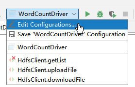
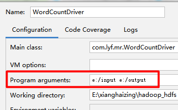

> [toc]

# 1. 配置maven环境

windows配置Maven
1. 下载Maven二进制压缩包
2. 解压配置maven环境变量
3. 验证 `mvn -v`

```
C:\Users\Administrator>mvn -v
Apache Maven 3.5.3 (3383c37e1f9e9b3bc3df5050c29c8aff9f295297; 2018-02-25T03:49:05+08:00)
```

# 2. 创建maven项目

## 2.1 pom.xml 依赖

``` xml
<properties>
  <project.build.sourceEncoding>UTF-8</project.build.sourceEncoding>
  <maven.compiler.source>1.8</maven.compiler.source>
  <maven.compiler.target>1.8</maven.compiler.target>
  <hadoop.version>2.7.2</hadoop.version>
</properties>

<dependencies>
  <dependency>
    <groupId>junit</groupId>
    <artifactId>junit</artifactId>
    <version>4.12</version>
    <scope>test</scope>
  </dependency>

  <dependency>
    <groupId>org.apache.hadoop</groupId>
    <artifactId>hadoop-client</artifactId>
    <version>${hadoop.version}</version>
  </dependency>

  <dependency>
    <groupId>org.apache.hadoop</groupId>
    <artifactId>hadoop-common</artifactId>
    <version>${hadoop.version}</version>
  </dependency>

  <dependency>
    <groupId>org.apache.hadoop</groupId>
    <artifactId>hadoop-hdfs</artifactId>
    <version>${hadoop.version}</version>
  </dependency>

</dependencies>
```

## 2.2 单元测试

读取hdfs文件内容
``` java
package com.lyf;

import org.apache.hadoop.conf.Configuration;
import org.apache.hadoop.fs.FSDataInputStream;
import org.apache.hadoop.fs.FileSystem;
import org.apache.hadoop.fs.Path;
import org.apache.hadoop.io.IOUtils;
import org.junit.Test;

import java.io.IOException;

/**
 * @author lyf
 * @date 2019/1/9 16:41
 * 用java操作hdfs文件系统
 */
public class HdfsTest {

    @Test
    public void test01() throws IOException {
        // 获取配置
        Configuration conf = new Configuration();
        // 配置参数
        conf.set("fs.defaultFS","hdfs://192.168.37.151:9000");
        // 获取hdfs文件系统的操作对象
        FileSystem fs = FileSystem.get(conf);
        // 对文件的具体操作
        FSDataInputStream fis = fs.open(new Path("/README.txt"));
        IOUtils.copyBytes(fis, System.out, 4096, true);// 4096kb 缓存大小 true 关闭流
    }
}
```

> For the latest information about Hadoop, please visit our website at:
...
  Hadoop Core uses the SSL libraries from the Jetty project written 
by mortbay.org.

# 3. hdfs文件操作

## 3.1 文件上传和下载
``` java
/**
 * @author lyf
 * @date 2019/1/9 16:41
 * 用java操作hdfs文件系统
 */
public class HdfsTest {

    /**
     * 读取文件
     * @throws IOException
     */
    @Test
    public void test01() throws IOException {
        // 获取配置
        Configuration conf = new Configuration();
        // 配置参数
        conf.set("fs.defaultFS","hdfs://192.168.37.151:9000");
        // 获取hdfs文件系统的操作对象
        FileSystem fs = FileSystem.get(conf);
        // 对文件的具体操作
        FSDataInputStream fis = fs.open(new Path("/README.txt"));
        IOUtils.copyBytes(fis, System.out, 4096, true);// 4096kb 缓存大小 true 关闭流
        fis.close();
    }

    /**
     * 下载文件
     * @throws IOException
     */
    @Test
    public void test02() throws IOException {
        // 获取配置
        Configuration conf = new Configuration();
        // 配置参数
        conf.set("fs.defaultFS","hdfs://192.168.37.151:9000");
        // 获取hdfs文件系统的操作对象
        FileSystem fs = FileSystem.get(conf);
        // 对文件的具体操作
        FSDataInputStream fis = fs.open(new Path("/README.txt"));
        OutputStream out = new FileOutputStream(new File("D:\\read.txt"));
        IOUtils.copyBytes(fis, out, 4096, true);// 4096kb 缓存大小 true 关闭流

        fis.close();
        out.close();
    }

    /**
     * 上传文件
     * @throws IOException
     */
    @Test
    public void test03() throws IOException, URISyntaxException, InterruptedException {
        // 获取配置
        Configuration conf = new Configuration();
        // 获取hdfs文件系统的操作对象
        FileSystem fs = FileSystem.get(new URI("hdfs://192.168.37.151:9000"), conf, "root");
        // 对文件的具体操作
        fs.copyFromLocalFile(new Path("D:\\123.txt"), new Path("/123"));
        System.out.println("finished...");
    }
}
```

## 3.2 RPC远程方法调用

定义接口

``` java
public interface Hello {
    public static final long versionID = 1L;
    public String say(String words);
}
```

实现接口

``` java
public class RpcServer implements Hello {
    @Override
    public String say(String words) {
        System.out.println("Client: "+words);
        return words + " [by Server]";
    }

    public static void main(String []args) {

        try {
            RPC.Server server = new RPC.Builder(new Configuration())
                    .setInstance(new RpcServer())
                    .setProtocol(Hello.class)
                    .setBindAddress("127.0.0.1")
                    .setPort(6666)
                    .build();
            // 启动服务
            server.start();
            System.out.println("server is running...");
        } catch (IOException e) {
            e.printStackTrace();
        }

    }
}
```

远程调用

``` java
public class RpcClient {
    public static void main(String []args) throws IOException, InterruptedException {
        Hello hello = RPC.getProxy(Hello.class,
                1,
                new InetSocketAddress("127.0.0.1", 6666),
                new Configuration());
        String res = hello.say("I'm lyf");
        Thread.sleep(2000);
        System.out.println(res);
    }
}
```

> server is running...
Client: I'm lyf
I'm lyf [by Server]


# 4. MapReduce操作

分布式并行离线计算框架
## 4.1 WordCount

pom.xml

``` xml
<properties>
  <project.build.sourceEncoding>UTF-8</project.build.sourceEncoding>
  <maven.compiler.source>1.8</maven.compiler.source>
  <maven.compiler.target>1.8</maven.compiler.target>
  <hadoop.version>2.7.2</hadoop.version>
</properties>

<dependencies>
  <dependency>
    <groupId>junit</groupId>
    <artifactId>junit</artifactId>
    <version>4.12</version>
    <scope>test</scope>
  </dependency>

  <dependency>
    <groupId>org.apache.hadoop</groupId>
    <artifactId>hadoop-client</artifactId>
    <version>${hadoop.version}</version>
  </dependency>

  <dependency>
    <groupId>org.apache.hadoop</groupId>
    <artifactId>hadoop-common</artifactId>
    <version>${hadoop.version}</version>
  </dependency>

  <dependency>
    <groupId>org.apache.hadoop</groupId>
    <artifactId>hadoop-hdfs</artifactId>
    <version>${hadoop.version}</version>
  </dependency>

</dependencies>
```

统计单次出现次数

``` java
package com.lyf;

import org.apache.hadoop.conf.Configuration;
import org.apache.hadoop.fs.Path;
import org.apache.hadoop.io.IntWritable;
import org.apache.hadoop.io.LongWritable;
import org.apache.hadoop.io.Text;
import org.apache.hadoop.mapreduce.Job;
import org.apache.hadoop.mapreduce.Mapper;
import org.apache.hadoop.mapreduce.Reducer;
import org.apache.hadoop.mapreduce.lib.input.FileInputFormat;// 长包的是2.x
import org.apache.hadoop.mapreduce.lib.output.FileOutputFormat;

import java.io.IOException;

/**
 * Word count 词频统计
 * @author lyf
 * @date 2019/1/26 14:45
 */
public class MyWordCount {

    /**
     * Mapper<KEYIN, VALUEIN, KEYOUT, VALUEOUT>
     *     KEYIN 行偏移量, map阶段输入key类型
     *     VALUEIN 行的值, map阶段输入value类型
     *     KEYOUT  map阶段输出key类型
     *     VALUEOUT map阶段输出value类型
     *
     * When you are old and grey and full of sleep
     * And nodding by the fire，take down this book
     * And slowly read,and dream of the soft look
     * Your eyes had once,and of their shadows deep
     *
     * 0    When you are old and grey and full of sleep
     * 43   And nodding by the fire，take down this book
     * 87   And slowly read,and dream of the soft look
     * 130  Your eyes had once,and of their shadows deep
     *
     * map阶段输出:
     * When 1
     * you 1
     * are 1
     * old 1
     * and 1
     * grey 1
     * and 1
     * full 1
     * of 1
     * sleep 1
     *
     * reduce阶段
     * reducer输入:
     */
    public static class MyMapper extends Mapper<LongWritable, Text, Text, IntWritable>{

        public static Text k = new Text();
        public static IntWritable v = new IntWritable();
        @Override
        protected void map(LongWritable key, Text value, Context context) throws IOException, InterruptedException {
            /***
             * 1. 从输入数据中获取文件每一行的值
             * 2. 对每一行进行切分(非必须),当前例子是空格
             * 3. 循环处理
             * */
            String line = value.toString();
            String[] words = line.split(" ");
            for(String word : words){
                k.set(word);
                v.set(1);
                // map阶段输出
                context.write(k,v);
            }
        }
    }

    public static class MyReducer extends Reducer<Text, IntWritable, Text, IntWritable>{
        @Override
        protected void reduce(Text key, Iterable<IntWritable> values, Context context) throws IOException, InterruptedException {
            /***
             * 1. 自定义计数器
             * 2. 循环计数
             * 3. 输出结果
             * */
            int counter = 0;
            for (IntWritable i : values){
                counter += i.get();
            }
            context.write(key, new IntWritable(counter));
        }
    }

    public static void main(String []args) throws IOException, ClassNotFoundException, InterruptedException {
        // 1. 获取配置
        Configuration conf = new Configuration();
        // 2. 对conf进行设置(没有不用设置)
        // 3. 获取job对象
        Job job = Job.getInstance(conf, "mywordcount");
        // 4. 设置job运行主类
        job.setJarByClass(MyWordCount.class);

        // 5. 对map阶段进行设置
        job.setMapperClass(MyMapper.class);
        job.setMapOutputKeyClass(Text.class);
        job.setMapOutputValueClass(IntWritable.class);
        FileInputFormat.addInputPath(job, new Path(args[0]));

        // 6. 对reduce阶段进行设置
        job.setReducerClass(MyReducer.class);
        job.setOutputKeyClass(Text.class);
        job.setOutputValueClass(IntWritable.class);
        FileOutputFormat.setOutputPath(job, new Path(args[1]));

        // 7. 提交job并打印信息
        int isok = job.waitForCompletion(true) ? 0 : 1;
        // 退出整个job
        System.exit(isok);
    }
}
```
测试文本:
> When you are old and grey and full of sleep
And nodding by the fire，take down this book
And slowly read,and dream of the soft look
Your eyes had once,and of their shadows deep

## 4.2 本地模式运行
下载hadoop Windows安装包,配置`HADOOP_HOME`,Path中添加`%HADOOP_HOME%/bin`,注意bin目录中不要缺少**winutil.exe**,否则会报错.配置完后重启电脑生效
在idea中添加 运行参数, 选择


运行main函数就可以看到结果

## 4.3 集群模式运行

1. Maven打包
2. Linux创建mywords测试文件,并上传到hdfs
`hdfs dfs -put /home/mywords /mywords`
3. 运行测试
`yarn jar /home/mr01-1.0-SNAPSHOT.jar com.lyf.MyWordCount /mywords /out/02`
4. 查看结果
`hdfs dfs -cat /out/02/part-r-00000`
> And     2
When    1
...
you     1

# 5. 封装util

``` java
package com.lyf.utils;

import org.apache.hadoop.conf.Configuration;
import org.apache.hadoop.fs.Path;
import org.apache.hadoop.mapreduce.Job;
import org.apache.hadoop.mapreduce.lib.input.FileInputFormat;
import org.apache.hadoop.mapreduce.lib.output.FileOutputFormat;

import java.io.IOException;
import java.lang.reflect.ParameterizedType;
import java.util.Date;

/**
 * @author lyf
 * @date 2019/3/18 0018 下午 7:58
 */
public class HadoopDriverUtilPro{

    private String jobName;
    private Class map;
    private Class reduce;
    private Class main;
    private String outPath;

    /**
     * 自动生成任务编号
     */
    public HadoopDriverUtilPro() {
        this.jobName = "job_" + new Date().getTime();
    }

    /**
     * 设置运行类
     * @param map   Mapper类
     * @param reducer   Reduce类
     * @param main  运行主类
     */
    public HadoopDriverUtilPro(Class map, Class reducer, Class main) {
        this.jobName = "job_" + new Date().getTime();
        this.map = map;
        this.reduce = reducer;
        this.main = main;
    }

    /**
     * 设置输入输出路径
     * @param in    文件输入路径
     * @param out   文件输出路径
     * @return
     * @throws IOException
     */
    public Job getInstance(String in, String out) throws IOException {
        // 1. 获取配置
        Configuration conf = new Configuration();
        // 2. 获取job对象
        Job job = Job.getInstance(conf, jobName);
        // 3. 设置运行主类
        job.setJarByClass(main);
        // 4. 设置Map
        job.setMapperClass(map);
        // 获取泛型列表
        ParameterizedType p = (ParameterizedType) map.getGenericSuperclass();
        // 获取map阶段的输出类型并设置
        job.setMapOutputKeyClass((Class) p.getActualTypeArguments()[2]);
        job.setMapOutputValueClass((Class) p.getActualTypeArguments()[3]);
        FileInputFormat.addInputPath(job, new Path(in));

        // 5. 设置Reduce
        job.setReducerClass(reduce);
        // 获取reduce阶段的输出类型并设置
        p = (ParameterizedType) reduce.getGenericSuperclass();
        job.setOutputKeyClass((Class) p.getActualTypeArguments()[2]);
        job.setOutputValueClass((Class) p.getActualTypeArguments()[3]);
        // 6. 随机生成输出目录,方便调试
        this.outPath = out+"\\"+r(4);
        FileOutputFormat.setOutputPath(job, new Path(outPath));
        return job;
    }

    /**
     * 生成随机数
     * @param len 随机数长度
     * @return
     */
    public String r(int len) {
        return (Math.random()+"").substring(2,len+2);
    }

    public void close(Job job) throws InterruptedException, IOException, ClassNotFoundException {
        // 提交job
        int isok = job.waitForCompletion(true) ? 0 : 1;
        System.out.println("---------输出目录-----------");
        System.out.println("outpath: "+outPath);
        // 退出
        System.exit(isok);
    }
}
```
修改WordCount的main函数为:

``` java
public static void main(String []args) throws IOException, ClassNotFoundException, InterruptedException {
    // 构建Util,参数依次为: Mapper类 Reduce类 驱动类
    HadoopDriverUtilPro util = new HadoopDriverUtilPro(MyMapper.class, MyReducer.class, MyWordCount.class);
    // 创建job,参数依次为: 输入路径 输出路径
    // 直接写死路径测试也可以
    Job job = util.getInstance(args[0],args[1]);
    // 关闭任务
    util.close(job);
}
```
测试起来更方便点


