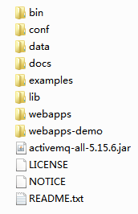
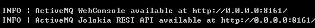
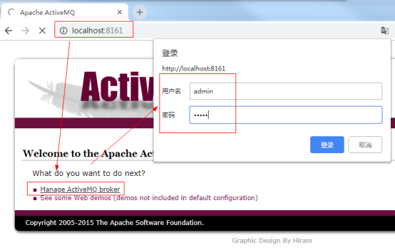
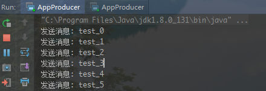
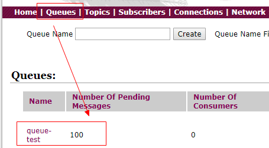
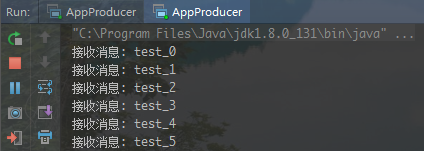
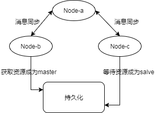

> [toc]

*ActiveMQ是Apache基金会开源的一个消息队列框架，也叫消息中间件。*

预备知识：
1. 什么是JMS？
Java消息服务（Java Message Service）即JMS，是一个Java平台中面向中间件的API，用于两个程序间或者分布式系统中发送消息，进行异步通信。
2. 什么是AMQP？
AMQP（Advanced Message Queuing Protocol）是一个提供统一消息服务的应用层标准协议，不受语言限制。
3. JMS相关概念
* 消费者、订阅者： 接收并处理消息
* 消息：传递数据的内容
* 消息模式：传递消息的方式，JMS中定义了队列和主题两种模式
4. 队列模式和主题模式区别？
* 队列模式中，一个消息只能被一个消费者消费
* 主题模式中，一个消息可以被所有订阅者消费，但必须提前订阅

# 一、Windows安装ActiveMQ
## 1．下载解压
地址： http://www.apache.org/dyn/closer.cgi?filename=/activemq/5.15.6/apache-activemq-5.15.6-bin.zip&action=download
解压后目录


## 2．启动服务
双击运行 \bin\win64\activemq.bat，如果失败使用管理员权限运行



默认端口为8161，访问 http://localhost:8161/ 用户名密码都为admin



# 二、Linux安装ActiveMQ
## 1．下载解压
1）创建并切换目录 mkdir /usr/soft && cd /usr/soft
2）下载压缩包 wget http://www.apache.org/dyn/closer.cgi?filename=/activemq/5.15.6/apache-activemq-5.15.6-bin.tar.gz&action=download
3）解压 `tar -zvxf apache-activemq-5.15.6-bin.tar.gz` 
## 2．启动访问
进入bin目录 `./activemq start`，访问虚拟机 ip地址：8161

# 三、队列模式
## 1．创建maven项目

``` xml
<?xml version="1.0" encoding="UTF-8"?>

<project xmlns="http://maven.apache.org/POM/4.0.0" xmlns:xsi="http://www.w3.org/2001/XMLSchema-instance"
  xsi:schemaLocation="http://maven.apache.org/POM/4.0.0 http://maven.apache.org/xsd/maven-4.0.0.xsd">
  <modelVersion>4.0.0</modelVersion>

  <groupId>com.lyf</groupId>
  <artifactId>jms-test</artifactId>
  <version>1.0-SNAPSHOT</version>

  <name>jms-test</name>

  <properties>
    <project.build.sourceEncoding>UTF-8</project.build.sourceEncoding>
    <maven.compiler.source>1.8</maven.compiler.source>
    <maven.compiler.target>1.8</maven.compiler.target>
  </properties>

  <dependencies>
    <dependency>
      <groupId>org.apache.activemq</groupId>
      <artifactId>activemq-all</artifactId>
      <version>5.15.6</version>
    </dependency>
  </dependencies>

</project>
```

## 2．生产者

``` java

import org.apache.activemq.ActiveMQConnectionFactory;

import javax.jms.*;

public class AppProducer {
  private final static String url = "tcp://127.0.0.1:61616";
  private final static String queueName = "queue-test";

  public static void main(String[] args) throws JMSException {
    //1. 创建连接工厂
    ConnectionFactory connectionFactory = new ActiveMQConnectionFactory(url);
    
    //2. 创建连接
    Connection connection = connectionFactory.createConnection();
    
    //3. 启动连接
    connection.start();
    
    //4. 创建会话
    Session session = connection.createSession(false, Session.AUTO_ACKNOWLEDGE);
    
    //5. 创建目标
    Destination destination = session.createQueue(queueName);
    
    //6. 创建生产者
    MessageProducer producer = session.createProducer(destination);
    
    for (int i = 0; i < 100; i++) {
      //7. 创建消息
      TextMessage textMessage = session.createTextMessage("test_"+i);
      
      //8. 发送消息
      producer.send(textMessage);
      System.out.println("发送消息: "+textMessage.getText());
    }
    
    //9. 关闭连接
    session.close();
  }
}
```

查看队列


## 3．消费者

``` java
import org.apache.activemq.ActiveMQConnectionFactory;

import javax.jms.*;

public class AppConsumer {
  private final static String url = "tcp://127.0.0.1:61616";
  private final static String queueName = "queue-test";

  public static void main(String[] args) throws JMSException {
    //1. 创建连接工厂
    ConnectionFactory connectionFactory = new ActiveMQConnectionFactory(url);

    //2. 创建连接
    Connection connection = connectionFactory.createConnection();

    //3. 启动连接
    connection.start();

    //4. 创建会话
    Session session = connection.createSession(false, Session.AUTO_ACKNOWLEDGE);

    //5. 创建目标
    Destination destination = session.createQueue(queueName);

    //6. 创建消费者
    MessageConsumer consumer = session.createConsumer(destination);

    //7. 创建监听器
    consumer.setMessageListener((message) -> {
      //8. 接收消息
      TextMessage textMessage = (TextMessage) message;
      try {
        System.out.println("接收消息: " + textMessage.getText());
      } catch (JMSException e) {
        e.printStackTrace();
      }
    });
  }
}
```

# 四、主题模式
## 1．修改队列名字

``` java
private final static String topicName = "topic-test";
```

## 2．修改主题

``` java
Destination destination = session.createTopic(topicName);
```

注意： 先启动消费者再启动生产者

# 五、Spring集成ActiveMQ
* ConnectionFactory 用于管理连接的连接工厂
* JmsTemplate 用于发送和接收消息的模板类,直接处理JMS消息
* MessageListener 消息监听器,实现onMessage(Message msg)方法

## 1．pom.xml

``` xml
<?xml version="1.0" encoding="UTF-8"?>

<project xmlns="http://maven.apache.org/POM/4.0.0" xmlns:xsi="http://www.w3.org/2001/XMLSchema-instance"
  xsi:schemaLocation="http://maven.apache.org/POM/4.0.0 http://maven.apache.org/xsd/maven-4.0.0.xsd">
  <modelVersion>4.0.0</modelVersion>

  <groupId>com.lyf</groupId>
  <artifactId>jms-test</artifactId>
  <version>1.0-SNAPSHOT</version>

  <name>jms-test</name>

  <properties>
    <project.build.sourceEncoding>UTF-8</project.build.sourceEncoding>
    <maven.compiler.source>1.8</maven.compiler.source>
    <maven.compiler.target>1.8</maven.compiler.target>
  </properties>

  <dependencies>
    <dependency>
      <groupId>junit</groupId>
      <artifactId>junit</artifactId>
      <version>4.12</version>
    </dependency>
    <dependency>
      <groupId>org.springframework</groupId>
      <artifactId>spring-context</artifactId>
      <version>RELEASE</version>
    </dependency>
    <dependency>
      <groupId>org.springframework</groupId>
      <artifactId>spring-jms</artifactId>
        <version>RELEASE</version>
    </dependency>
    <dependency>
      <groupId>org.springframework</groupId>
      <artifactId>spring-test</artifactId>
      <version>RELEASE</version>
    </dependency>
    <dependency>
      <groupId>org.apache.activemq</groupId>
      <artifactId>activemq-core</artifactId>
      <version>5.7.0</version>
    </dependency>
    <dependency>
      <groupId>javax.jms</groupId>
      <artifactId>javax.jms-api</artifactId>
      <version>2.0.1</version>
    </dependency>
    
    <!-- 非集成环境使用 -->
    <dependency>
      <groupId>org.apache.activemq</groupId>
      <artifactId>activemq-all</artifactId>
      <version>5.7.0</version>
    </dependency>
    
  </dependencies>
</project>
```

## 2．消息接口

``` java
public interface ProducerService {
  void sendMessage(String message);
}
```

## 3．生产者

``` java
import org.springframework.beans.factory.annotation.Autowired;
import org.springframework.jms.core.JmsTemplate;
import org.springframework.stereotype.Component;

import javax.annotation.Resource;
import javax.jms.Destination;
import javax.jms.TextMessage;

@Component
public class ProducerServiceImpl implements ProducerService {

  @Autowired
  private JmsTemplate jmsTemplate;

  // @Resource(name = "topicDestination")
  @Resource(name = "queueDestination")
  private Destination destination;

  @Override
  public void sendMessage(String message) {
    jmsTemplate.send(destination, session -> {
      TextMessage textMessage = session.createTextMessage(message);
      System.out.println("发送消息: " + textMessage.getText());
      return textMessage;
    });
  }
}
```

## 4．消费监听

``` java
import org.springframework.stereotype.Component;

import javax.jms.JMSException;
import javax.jms.Message;
import javax.jms.MessageListener;
import javax.jms.TextMessage;

@Component
public class ConsumerMessageListener implements MessageListener{
  
  @Override
  public void onMessage(Message message) {
    TextMessage textMessage = (TextMessage) message;
    try {
      System.out.println("接收消息: "+textMessage.getText());
    } catch (JMSException e) {
      e.printStackTrace();
    }
  }
}
```

## 5．spring配置

``` xml
<?xml version="1.0" encoding="UTF-8"?>
<beans xmlns="http://www.springframework.org/schema/beans"
       xmlns:xsi="http://www.w3.org/2001/XMLSchema-instance"
       xmlns:context="http://www.springframework.org/schema/context" 
       xsi:schemaLocation="http://www.springframework.org/schema/beans 
       http://www.springframework.org/schema/beans/spring-beans.xsd 
       http://www.springframework.org/schema/context 
       http://www.springframework.org/schema/context/spring-context.xsd">
    <context:component-scan base-package="com.lyf" />

    <!-- ActiveMQ 提供连接工厂-->
    <bean id="amqConnectionFactory" class="org.apache.activemq.ActiveMQConnectionFactory">
        <property name="brokerURL" value="tcp://http://192.168.184.200:61616"></property>
        <property name="userName" value="admin"></property>
        <property name="password" value="admin"></property>
    </bean>
    <!-- 配置JMS连接 -->
    <bean id="connectionFactory"
          class="org.springframework.jms.connection.SingleConnectionFactory">
        <constructor-arg ref="amqConnectionFactory" />
    </bean>

    <!-- 定义消息队列 -->
    <bean id="queueDestination" class="org.apache.activemq.command.ActiveMQQueue">
        <!-- 设置消息队列的名字 -->
        <constructor-arg value="queue"></constructor-arg>
    </bean>
    
    <bean id="topicDestination" class="org.apache.activemq.command.ActiveMQTopic">
        <!-- 设置消息队列的名字 -->
        <constructor-arg value="topic"></constructor-arg>
    </bean>

    <!-- 配置JMS模板 -->
    <bean id="jmsTemplate" class="org.springframework.jms.core.JmsTemplate">
        <property name="connectionFactory" ref="connectionFactory" />
    </bean>

    <!-- 配置消息队列监听者 -->
    <bean id="consumerMessageListener" class="com.lyf.spring.ConsumerMessageListener" />

    <!-- 消息监听容器-->
    <bean id="queueListenerContainer"
          class="org.springframework.jms.listener.DefaultMessageListenerContainer">
        <property name="connectionFactory" ref="connectionFactory" />
        <property name="destination" ref="queueDestination" />
        <!--<property name="destination" ref="topicDestination" />-->
        <property name="messageListener" ref="consumerMessageListener" />
    </bean>
</beans>
```

## 6．单元测试

``` java
import com.lyf.spring.ProducerServiceImpl;
import org.junit.Test;
import org.junit.runner.RunWith;
import org.springframework.beans.factory.annotation.Autowired;
import org.springframework.test.context.ContextConfiguration;
import org.springframework.test.context.junit4.SpringJUnit4ClassRunner;

@RunWith(SpringJUnit4ClassRunner.class)
@ContextConfiguration(locations = {"classpath:spring.xml"})
public class App {
  
  @Autowired
  private ProducerServiceImpl producerService;
  
  @Test
  public void producer(){
    for (int i = 0; i < 100; i++) {
      producerService.sendMessage("test_"+i);
}
  }
}
```
# 六、集群环境
*高可用：解决单点故障引起的服务中断
负载均衡：多服务器提供服务，避免单台服务器性能问题*
## 1．集群方式
* Broker cluster：实现负载均衡，通过zookper同步多个Broker之间消息
* Master Slave：实现高可用，Master挂掉，Slave节点变为Master提供服务

|     |  高可用   |  负载均衡   |
| --- | --- | --- |
|  Master Slave   |  是   |  否   |
|  Broker Cluster  | 否    |  是   |
Master Slave只有一个节点提供服务，Broker Cluster多个节点同时工作

## 2．高可用和高并发集群


1. Node-a 同步消息
2. Node-b 和 Node-c 做主从
3. 生产者为Node-b和Node-c,三个都可以为消费者
## 3．集群配置
复制三份activemq分别命名为activemq-a、activemq-b、activemq-c
依次修改jetty.xml中port端口：8161、8162、8163
依次修改activemq.xml中tcp端口：61616、61617、61618,并添加networkConnectors配置:
activemq-a:

``` xml
    <transportConnectors>
        <transportConnector name="openwire" uri="tcp://0.0.0.0:61616?maximumConnections=1000&amp;wireFormat.maxFrameSize=104857600"/>
    </transportConnectors>
	<networkConnectors>
		<networkConnector name="local_network" uri="static:(tcp:127.0.0.1:61617,tcp:127.0.0.1:61618)" />
	</networkConnectors>
```

activemq-b:

``` xml
    <transportConnectors>
        <transportConnector name="openwire" uri="tcp://0.0.0.0:61617?maximumConnections=1000&amp;wireFormat.maxFrameSize=104857600"/>
    </transportConnectors>
	<networkConnectors>
		<networkConnector name="network_a" uri="static:(tcp:127.0.0.1:61616)" />
	</networkConnectors>
```

activemq-c:

``` xml
    <transportConnectors>
        <transportConnector name="openwire" uri="tcp://0.0.0.0:61618?maximumConnections=1000&amp;wireFormat.maxFrameSize=104857600"/>
    </transportConnectors>
	<networkConnectors>
		<networkConnector name="network_b" uri="static:(tcp:127.0.0.1:61616)" />
	</networkConnectors>
```
启动服务

## 4．客户端配置
ActiveMQ失效转移（failover）允许其中一台消息服务器宕机时，重新连接其他服务器。

生产者

``` java
private final static String url = "failover:(tcp://192.168.184.200:61617,tcp://192.168.184.200:61618)?randomize=true";
```

消费者

``` java
private final static String url = "failover:(tcp://192.168.184.200:61616,tcp://192.168.184.200:61617,tcp://192.168.184.200:61618)?randomize=true";
```

# 参考资料
* https://www.imooc.com/learn/856
* https://www.cnblogs.com/jaycekon/p/ActiveMq.html


  


  


