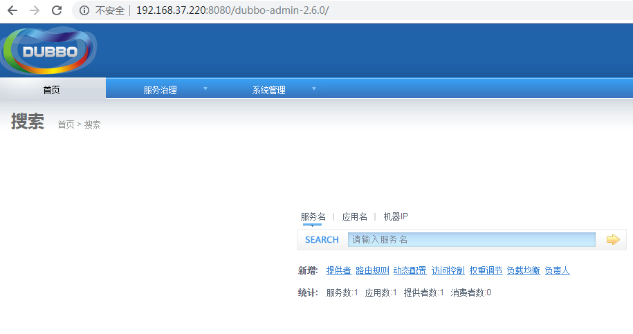
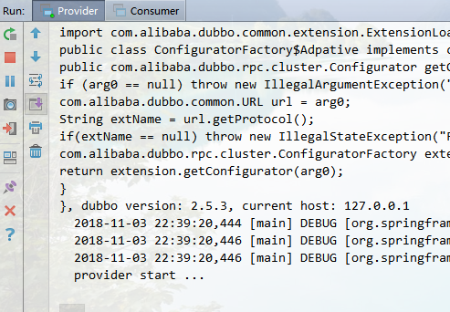
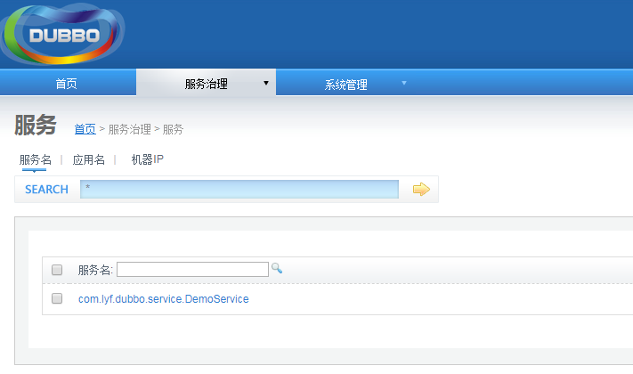
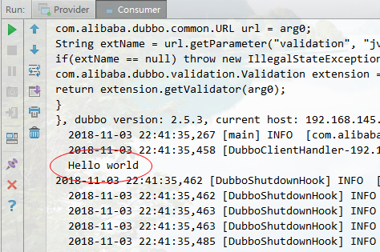
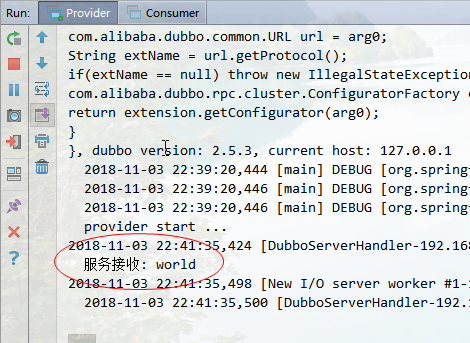

> [toc]

*搭建dubbo微服务需要使用zookeeper作为服务注册中心,首先要搭建好zookeeper,安装方式参考[zookeeper安装教程](https://www.cnblogs.com/linyufeng/p/9902297.html#MySignature)*

# 1.部署dubbo服务管理中心
下载 [dubbo-admin-2.6.0.war](http://www.java1234.com/a/javabook/javaweb/2018/0224/10496.html), 放在/apache-tomcat-8.5.34/webapps 目录下,启动tomcat服务,浏览器访问:`http://192.168.37.220:8080/dubbo-admin-2.6.0/` (修改成自己ip进行访问),用户名`root` 密码`root`



# 2.搭建dubbo服务环境

搭建服务需要3个项目:
* api项目,定义公共接口
* dubbo-provider项目,提供服务
* dubbo-consumer项目,消费服务

可以使用maven创建多模块项目来模拟,不会创建maven多模块,自行度娘...

pom依赖和log4j日志打印配置

## 2.1 pom.xml 依赖

``` xml
<?xml version="1.0" encoding="UTF-8"?>

<project xmlns="http://maven.apache.org/POM/4.0.0" xmlns:xsi="http://www.w3.org/2001/XMLSchema-instance"
         xsi:schemaLocation="http://maven.apache.org/POM/4.0.0 http://maven.apache.org/xsd/maven-4.0.0.xsd">
    <parent>
        <artifactId>lyfcode</artifactId>
        <groupId>com.lyf</groupId>
        <version>1.0-SNAPSHOT</version>
    </parent>
    <modelVersion>4.0.0</modelVersion>

    <artifactId>dubbo-provider</artifactId>

    <name>dubbo-provider</name>

    <properties>
        <project.build.sourceEncoding>UTF-8</project.build.sourceEncoding>
        <maven.compiler.source>1.8</maven.compiler.source>
        <maven.compiler.target>1.8</maven.compiler.target>
    </properties>

    <dependencies>
        <dependency>
            <groupId>junit</groupId>
            <artifactId>junit</artifactId>
            <version>4.12</version>
            <scope>test</scope>
        </dependency>
        <dependency>
            <groupId>com.lyf</groupId>
            <artifactId>api</artifactId>
            <version>1.0-SNAPSHOT</version>
        </dependency>
        <!-- spring 核心jar -->
        <dependency>
            <groupId>org.springframework</groupId>
            <artifactId>spring-context</artifactId>
            <version>4.3.2.RELEASE</version>
        </dependency>

        <!-- spring 测试jar -->
        <dependency>
            <groupId>org.springframework</groupId>
            <artifactId>spring-test</artifactId>
            <version>4.3.2.RELEASE</version>
        </dependency>

        <!-- spring jdbc -->
        <dependency>
            <groupId>org.springframework</groupId>
            <artifactId>spring-jdbc</artifactId>
            <version>4.3.2.RELEASE</version>
        </dependency>

        <!-- spring事物 -->
        <dependency>
            <groupId>org.springframework</groupId>
            <artifactId>spring-tx</artifactId>
            <version>4.3.2.RELEASE</version>
        </dependency>

        <!-- aspectj切面编程的jar -->
        <dependency>
            <groupId>org.aspectj</groupId>
            <artifactId>aspectjweaver</artifactId>
            <version>1.8.9</version>
        </dependency>

        <!-- 日志打印相关的jar -->
        <dependency>
            <groupId>org.slf4j</groupId>
            <artifactId>slf4j-log4j12</artifactId>
            <version>1.7.2</version>
        </dependency>
        <dependency>
            <groupId>org.slf4j</groupId>
            <artifactId>slf4j-api</artifactId>
            <version>1.7.2</version>
        </dependency>
        <dependency>
            <groupId>com.alibaba</groupId>
            <artifactId>dubbo</artifactId>
            <version>2.5.3</version>
        </dependency>
        <dependency>
            <groupId>org.apache.zookeeper</groupId>
            <artifactId>zookeeper</artifactId>
            <version>3.3.3</version>
        </dependency>
        <!-- zookeeper client依赖，用于向zookeeper注册服务 -->
        <dependency>
            <groupId>com.github.sgroschupf</groupId>
            <artifactId>zkclient</artifactId>
            <version>0.1</version>
        </dependency>
        
    </dependencies>

    <build>
    </build>
</project>
```

## 2.2 log4j.properties 日志打印

``` bash
log4j.rootLogger=DEBUG, Console  
#Console
log4j.appender.Console=org.apache.log4j.ConsoleAppender  
log4j.appender.Console.layout=org.apache.log4j.PatternLayout  
log4j.appender.Console.layout.ConversionPattern=%d [%t] %-5p [%c] - %m%n  
log4j.logger.java.sql.ResultSet=INFO  
log4j.logger.org.apache=INFO  
log4j.logger.java.sql.Connection=DEBUG  
log4j.logger.java.sql.Statement=DEBUG  
log4j.logger.java.sql.PreparedStatement=DEBUG
```


# 3.api模块定义公共接口

``` java
package com.lyf.dubbo.service;

public interface DemoService {
    String sayHello(String name);
}
```

# 4.dubbo-provider实现接口提供服务


## 4.1 DemoServiceImpl.java 服务实现

``` java
package com.lyf.dubbo.service.service;

import com.lyf.dubbo.service.DemoService;

public class DemoServiceImpl implements DemoService {
 
    public String sayHello(String name) {
        System.out.println("服务接收: "+name);
        return "Hello " + name;
    }
 
}
```


## 4.2 dubbo-provider.xml 服务配置

``` xml
<?xml version="1.0" encoding="UTF-8"?>
<beans xmlns="http://www.springframework.org/schema/beans"
       xmlns:xsi="http://www.w3.org/2001/XMLSchema-instance"
       xmlns:dubbo="http://code.alibabatech.com/schema/dubbo"
       xsi:schemaLocation="http://www.springframework.org/schema/beans        
       http://www.springframework.org/schema/beans/spring-beans.xsd        
       http://code.alibabatech.com/schema/dubbo        
       http://code.alibabatech.com/schema/dubbo/dubbo.xsd">

    <!-- 提供方应用信息，用于计算依赖关系 -->
    <dubbo:application name="admin-provider" owner="admin" organization="dubbox" />

    <!-- 使用multicast广播注册中心暴露服务地址 -->
    <dubbo:registry address="zookeeper://192.168.37.220:2181" />

    <!-- 用dubbo协议在20880端口暴露服务 -->
    <dubbo:protocol name="dubbo" port="20880" />
    
    <!-- 和本地bean一样实现服务 -->
    <bean id="demoService" class="com.lyf.dubbo.service.service.DemoServiceImpl" />

    <!-- 声明需要暴露的服务接口 -->
    <dubbo:service interface="com.lyf.dubbo.service.DemoService" ref="demoService" />
</beans>
```

## 4.3 spring.xml 配置

``` xml
<?xml version="1.0" encoding="UTF-8"?>
<beans xmlns="http://www.springframework.org/schema/beans"
       xmlns:xsi="http://www.w3.org/2001/XMLSchema-instance"
       xmlns:context="http://www.springframework.org/schema/context"
       xmlns:aop="http://www.springframework.org/schema/aop"
       xmlns:tx="http://www.springframework.org/schema/tx"
       xmlns:task="http://www.springframework.org/schema/task"
       xsi:schemaLocation="http://www.springframework.org/schema/beans
        http://www.springframework.org/schema/beans/spring-beans.xsd
        http://www.springframework.org/schema/context
        http://www.springframework.org/schema/context/spring-context.xsd
        http://www.springframework.org/schema/aop
        http://www.springframework.org/schema/aop/spring-aop.xsd
        http://www.springframework.org/schema/tx
        http://www.springframework.org/schema/tx/spring-tx.xsd
        http://www.springframework.org/schema/task
        http://www.springframework.org/schema/task/spring-task.xsd">
    
    <context:component-scan base-package="com.lyf"/>
    
    <import resource="dubbo-provider.xml"/>

</beans>
```

## 4.4 启动服务

``` java
package com.lyf;

import org.springframework.context.support.ClassPathXmlApplicationContext;

public class Provider {
 
    public static void main(String[] args) throws Exception {
        ClassPathXmlApplicationContext context = new ClassPathXmlApplicationContext("spring.xml");
        context.start();
        System.out.println("provider start ...");
        System.in.read(); // 按任意键退出
    }
 
}
```




# 5.dubbo-consumer消费服务

## 5.1 dubbo-consumer.xml

``` xml
<?xml version="1.0" encoding="UTF-8"?>
<beans xmlns="http://www.springframework.org/schema/beans"
       xmlns:xsi="http://www.w3.org/2001/XMLSchema-instance"
       xmlns:dubbo="http://code.alibabatech.com/schema/dubbo"
       xsi:schemaLocation="http://www.springframework.org/schema/beans        http://www.springframework.org/schema/beans/spring-beans.xsd        http://code.alibabatech.com/schema/dubbo        http://code.alibabatech.com/schema/dubbo/dubbo.xsd">

    <!-- 消费方应用名，用于计算依赖关系，不是匹配条件，不要与提供方一样 -->
    <dubbo:application name="admin-provider" owner="admin" organization="dubbox" />

    <!-- 使用multicast广播注册中心暴露发现服务地址 -->
    <dubbo:registry address="zookeeper://192.168.37.220:2181" />

    <!-- 生成远程服务代理，可以和本地bean一样使用demoService -->
    <dubbo:reference id="demoService" interface="com.lyf.dubbo.service.DemoService" />

</beans>
```

## 5.2 spring.xml

``` xml
<?xml version="1.0" encoding="UTF-8"?>
<beans xmlns="http://www.springframework.org/schema/beans"
       xmlns:xsi="http://www.w3.org/2001/XMLSchema-instance"
       xmlns:context="http://www.springframework.org/schema/context"
       xmlns:aop="http://www.springframework.org/schema/aop"
       xmlns:tx="http://www.springframework.org/schema/tx"
       xmlns:task="http://www.springframework.org/schema/task"
       xsi:schemaLocation="http://www.springframework.org/schema/beans
        http://www.springframework.org/schema/beans/spring-beans.xsd
        http://www.springframework.org/schema/context
        http://www.springframework.org/schema/context/spring-context.xsd
        http://www.springframework.org/schema/aop
        http://www.springframework.org/schema/aop/spring-aop.xsd
        http://www.springframework.org/schema/tx
        http://www.springframework.org/schema/tx/spring-tx.xsd
        http://www.springframework.org/schema/task
        http://www.springframework.org/schema/task/spring-task.xsd">
    
    <context:component-scan base-package="com.lyf"/>
    
    <import resource="dubbo-consumer.xml"/>

</beans>
```

## 5.3 启动consumer

``` java
package com.lyf;

import com.lyf.dubbo.service.DemoService;
import org.springframework.context.support.ClassPathXmlApplicationContext;

public class Consumer {
 
    public static void main(String[] args) throws Exception {
        ClassPathXmlApplicationContext context = new ClassPathXmlApplicationContext("spring.xml");
        context.start();
        DemoService demoService = (DemoService)context.getBean("demoService"); // 获取远程服务代理
        String hello = demoService.sayHello("world"); // 执行远程方法
        System.out.println(hello); // 显示调用结果
    }
 
}
```



