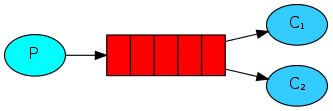
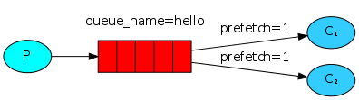
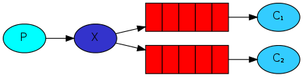
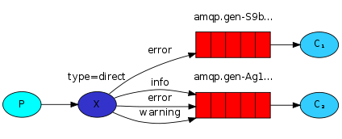
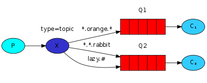

# 一、Hello World

## 1．amqp-client客户端依赖

``` xml
<dependency>
    <groupId>com.rabbitmq</groupId>
    <artifactId>amqp-client</artifactId>
    <version>5.0.0</version>
</dependency>
```

## 2．Rabbitmq类与方法

- ConnectionFactory：设置port端口(5672)、host主机、用户名密码、virtual host虚拟主机信息
- Channel： 通道
- queueDeclare：声明队列，参数依次为：queueName队列名、durable持久化、exclusive排他队列、autoDelete自动删除、arguments（Map）其他参数配置

``` java
/**
 * Declare a queue
 * @see com.rabbitmq.client.AMQP.Queue.Declare
 * @see com.rabbitmq.client.AMQP.Queue.DeclareOk
 * @param queue the name of the queue
 * @param durable true if we are declaring a durable queue (the queue will survive a server restart)
 * @param exclusive true if we are declaring an exclusive queue (restricted to this connection)
 * @param autoDelete true if we are declaring an autodelete queue (server will delete it when no longer in use)
 * @param arguments other properties (construction arguments) for the queue
 * @return a declaration-confirm method to indicate the queue was successfully declared
 * @throws java.io.IOException if an error is encountered
 */
Queue.DeclareOk queueDeclare(String queue, boolean durable, boolean exclusive, boolean autoDelete,
                             Map<String, Object> arguments) throws IOException;
```

- basicPublish：发布消息，参数依次为：exchange交换机名、queueName队列名、props其他参数、body消息（Byte[]）

``` java
/**
 * Publish a message.
 *
 * Publishing to a non-existent exchange will result in a channel-level
 * protocol exception, which closes the channel.
 *
 * Invocations of <code>Channel#basicPublish</code> will eventually block if a
 * <a href="http://www.rabbitmq.com/alarms.html">resource-driven alarm</a> is in effect.
 *
 * @see com.rabbitmq.client.AMQP.Basic.Publish
 * @see <a href="http://www.rabbitmq.com/alarms.html">Resource-driven alarms</a>
 * @param exchange the exchange to publish the message to
 * @param routingKey the routing key
 * @param props other properties for the message - routing headers etc
 * @param body the message body
 * @throws java.io.IOException if an error is encountered
 */
void basicPublish(String exchange, String routingKey, BasicProperties props, byte[] body) throws IOException;
```

- DefaultConsumer：消息消费者，通过handleDelivery方法处理消息，使用时需重写该方法
- handleDelivery：接收处理消息，参数依次为：consumerTag客户标记、envelope包含amqp参数、props其他参数、body消息（Byte[]）

``` java
/**
 * No-op implementation of {@link Consumer#handleDelivery}.
 */
@Override
public void handleDelivery(String consumerTag,
                           Envelope envelope,
                           AMQP.BasicProperties properties,
                           byte[] body)
    throws IOException
{
        // no work to do
}
- basicConsumer：监听队列，参数依次为：queue队列名、autoAck自动应答、callback回调
/**
 * Start a non-nolocal, non-exclusive consumer, with
 * a server-generated consumerTag.
 * @param queue the name of the queue
 * @param autoAck true if the server should consider messages
 * acknowledged once delivered; false if the server should expect
 * explicit acknowledgements
 * @param callback an interface to the consumer object
 * @return the consumerTag generated by the server
 * @throws java.io.IOException if an error is encountered
 * @see com.rabbitmq.client.AMQP.Basic.Consume
 * @see com.rabbitmq.client.AMQP.Basic.ConsumeOk
 * @see #basicConsume(String, boolean, String, boolean, boolean, Map, Consumer)
 */
String basicConsume(String queue, boolean autoAck, Consumer callback) throws IOException;
```

3．Sender生产者

``` java
package com.lyf.springboot02.mq;

import com.rabbitmq.client.Channel;
import com.rabbitmq.client.Connection;
import com.rabbitmq.client.ConnectionFactory;

import java.io.IOException;
import java.util.concurrent.TimeoutException;

/**
 * @author lyf
 * @date 2019/7/28 18:12
 */
public class Sender {
    public static final String QUEUE_NAME = "simple";

    public static void main(String[] args) throws IOException, TimeoutException {
        /**
         * 1. 获取连接connection
         * 2. 声明消息队列queue name
         * 3. 发送消息message
         * 4. 关闭连接connection
         */
        // 定义连接工厂
        ConnectionFactory factory = new ConnectionFactory();
        factory.setPort(5672);
        factory.setHost("192.168.37.200");
        factory.setUsername("lyf");
        factory.setPassword("123456");
        factory.setVirtualHost("/lyf");
				
        // 创建连接
        Connection connection = factory.newConnection();
        // 获取通道
        Channel channel = connection.createChannel();
        /*  声明一个 Queue
            第一个参数叫 queue 名称
            第二个参数 durable：是否持久化
            第三个参数： Exclusive：排他队列，如果一个队列被声明为排他队列，该队列仅
            对首次声明它的连接可见，并在连接断开时自动删除。这里需要注意三点：
            其一，排他队列是基于连接可见的，同一连接的不同通道是可以同时访问同一个
            连接创建的排他队列的。
            其二，“首次”，如果一个连接已经声明了一个排他队列，其他连接是不允许建
            立同名的排他队列的，这个与普通队列不同。
            其三，即使该队列是持久化的，一旦连接关闭或者客户端退出，该排他队列都会
            被自动删除的。
            这种队列适用于只限于一个客户端发送读取消息的应用场景。
            第四个参数：Auto-delete:自动删除，如果该队列没有任何订阅的消费者的话，该
            队列会被自动删除。这种队列适用于临时队列。
        */
        channel.queueDeclare(QUEUE_NAME, false, false, false, null);
        // 发送消息
        String msg = "hello mq";
        // 发送消息到 mq 队列中
        channel.basicPublish("", QUEUE_NAME, null, msg.getBytes("utf-8"));
        // 关闭通道
        channel.close();
        // 关闭连接
        connection.close();
    }
}
```

4．Receiver消费者

``` java
package com.lyf.springboot02.mq;

import com.rabbitmq.client.*;

import java.io.IOException;
import java.util.concurrent.TimeoutException;

public class Receiver {
    public static final String QUEUE_NAME = "simple";

    public static void main(String[] args) throws IOException, TimeoutException {
        // 创建连接工厂
        ConnectionFactory factory = new ConnectionFactory();
        factory.setPort(5672);
        factory.setHost("192.168.37.200");
        factory.setUsername("lyf");
        factory.setPassword("123456");
        factory.setVirtualHost("/lyf");
        // 创建连接对象
        Connection connection = factory.newConnection();
        // 获取通道
        Channel channel = connection.createChannel();
        // 指定队列
        channel.queueDeclare(QUEUE_NAME, false, false, false, null);
        // 获取消息
        Consumer consumer = new DefaultConsumer(channel) {
            @Override
            public void handleDelivery(String consumerTag, Envelope envelope,
                                       AMQP.BasicProperties properties, byte[] body) throws IOException {
                // 获取消息并在控制台打印
                String msg = new String(body, "utf-8");
                System.out.println("get msg:" + msg);
            }
        };
        // 监听队列
        channel.basicConsume(QUEUE_NAME, true, consumer);
    }
}
```

# 二、交换机类型 Exchange Type

- Fanout 广播模式
- Direct 路由模式
- Topic 主题模式
- Header 
- RPC


## 1．消息轮询分发(Round Robin)

**默认方式**，队列中的消息依次、平均分配给每个消费者。
注意：消费者中autoAck设为true，收到消息自动回执。
缺点：不同机子性能不一样，处理速度不一样。会造成慢的太累，快的太闲。
通过for循环生成多条消息，启动两个客户端，结果大致如下：
>生产者：1 2 3 4 5 6 7 8 9 10
消费者1：1 3 5 7 9	
消费者2：2 4 6 8 10

## 2．消息公平分发(Fair Dispatch)

机子性能好就多发，性能差就少发。
注意：
- 消费者通道basicQos的prefetchCount设为1，每次只接收一条消息
- autoAck设为false，手动回执
- 回执消息basicAck，参数依次为：DeliveryTag消息通道名字、multiple批量

不足：每个消息只能被一个消费者消费
Receiver代码修改如下，通过线程睡眠模拟处理消息速度

``` java
channel.basicQos(1);

// 获取消息
Consumer consumer=new DefaultConsumer(channel){
    @Override
    public void handleDelivery(String consumerTag, Envelope envelope,
                               AMQP.BasicProperties properties, byte[] body) throws IOException {
        String msg=new String(body,"utf-8");
        System.out.println("1 号消费者消费消息:msg-->"+msg);
        try {
            Thread.sleep(250);
            channel.basicAck(envelope.getDeliveryTag(), false);
        } catch (InterruptedException e) {
            e.printStackTrace();
        }
    }
};

channel.basicConsume(QUEUE_NAME, false, consumer);
```

## 3．发布与订阅模式(Publish/Subscribe)

Fanout：生产者发送消息到交换机，交换机投递到多个队列，每个队列由各自的消费者消费
注意：
- 生产者不再声明队列，声明交换机exchangeDeclare，参数依次为：exchange交换机名、type交换机类型

``` java
/**
 * Actively declare a non-autodelete, non-durable exchange with no extra arguments
 * @see com.rabbitmq.client.AMQP.Exchange.Declare
 * @see com.rabbitmq.client.AMQP.Exchange.DeclareOk
 * @param exchange the name of the exchange
 * @param type the exchange type
 * @return a declaration-confirm method to indicate the exchange was successfully declared
 * @throws java.io.IOException if an error is encountered
 */
Exchange.DeclareOk exchangeDeclare(String exchange, BuiltinExchangeType type) throws IOException;
```
- 发布消息时，指定交换机名、路由key为空
- 消费者绑定队列到交换机queueBind,参数依次为：queue队列名、exchange交换机名、routingKey路由键

``` java
/**
 * Bind a queue to an exchange, with no extra arguments.
 * @see com.rabbitmq.client.AMQP.Queue.Bind
 * @see com.rabbitmq.client.AMQP.Queue.BindOk
 * @param queue the name of the queue
 * @param exchange the name of the exchange
 * @param routingKey the routing key to use for the binding
 * @return a binding-confirm method if the binding was successfully created
 * @throws java.io.IOException if an error is encountered
 */
Queue.BindOk queueBind(String queue, String exchange, String routingKey) throws IOException;
```
缺点：不能区分消费者

Sender修改部分：

``` java
// 定义交换机名
final String EXCHANGE_NAME="hello-fanout";
// 声明交换机
channel.exchangeDeclare(EXCHANGE_NAME, BuiltinExchangeType.FANOUT);
// 发布消息
String msg = "Hello";
channel.basicPublish(EXCHANGE_NAME,"",null,msg.getBytes("utf-8"));
```

Receiver修改如下：

``` java
// 定义交换机名
final String EXCHANGE_NAME="hello-fanout";
// 声明交换机
channel.exchangeDeclare(EXCHANGE_NAME,BuiltinExchangeType.FANOUT);
// 创建默认排他队列
String queueName = channel.queueDeclare().getQueue();
// 绑定队列到路由
channel.queueBind(queueName,EXCHANGE_NAME,"");
```

## 4．路由模式(Routing)

Direct：通过指定路由key发送到不同队列，区分不同消费者
缺点：路由规则不灵活
Sender修改部分：

``` java
// 发布消息
String msg = "Hello-info";
// 设置路由key
String routingKey = "info";
// 绑定队列到路由
channel.basicPublish(EXCHANGE_NAME,routingKey,null,msg.getBytes("utf-8"));
```

Receiver修改如下：

``` java
// 设置路由key
String routingKey = "info";
// 绑定队列到路由
channel.queueBind(queueName,EXCHANGE_NAME,routingKey);
```

## 5．主题模式(Topics)

路由规则：
- `.` 通过点分割一个单词
- `*` 模糊匹配一个单词
- `#` 模糊匹配多个单词，可以没有


以上图中的配置为例：
>routingKey=”quick.orange.rabbit”的消息会同时路由到Q1与Q2，
routingKey=”lazy.orange.fox”的消息会路由到Q1，Q2, 
routingKey=”lazy.brown.fox”的消息会路由到Q2，
routingKey=”lazy.pink.rabbit”的消息会路由到Q2；
routingKey=”quick.brown.fox”、
routingKey=”orange”、
routingKey=”quick.orange.male.rabbit”的消息将会被丢弃，因为它们没有匹配任何bindingKey。

``` java
// 声明交换机
channel.exchangeDeclare(EXCHANGE_NAME, BuiltinExchangeType.TOPIC);
```

# 三、消息事务机制

如何**保证生产者的消息成功投递到队列**，两种方式：**transition事务模式**和**confirm确认模式**，两种模式不能同时开启。

## 1．transition事务模式

类似JDBC操作，发送消息前开启事务，成功后提交事务，失败则回滚事务；
缺点：效率低
- channel.txSelect() 开启事务
- channel.txCommit() 提交事务
- channel.txRollback() 回滚事务            

## 2．confirm确认模式

实现生产者confirm 机制有**三种**方式:
1.	普通confirm模式：每发送一条消息后，调用waitForConfirms()方法，等待服务器端confirm。实际上是一种串行confirm了。
2.	批量confirm模式：每发送一批消息后，调用waitForConfirmsOrDie()方法，等待服务器端confirm。
3.	异步confirm模式：提供一个回调方法，服务端confirm了一条或者多条消息后Client端会回调这个方法。

- channel.confirmSelect() 开启确认模式
- channel.waitForConfirms() 等待消息被确认
- addConfirmListener() 添加异步监听器，重写handleAck消息成功和handleNack消息失败方法

### 1) 普通confirm模式

``` java
// 开启确认模式
channel.confirmSelect();
...
// 等待确认
if(channel.waitForConfirms()){
    System.out.println("发送成功。。。");
}
```

### 2) 批量confirm模式

``` java
// 开启确认模式
channel.confirmSelect();
...
// 等待确认
channel.waitForConfirmsOrDie();
System.out.println("发送成功。。。");
```

### 3) 异步confirm模式

``` java
// 定义集合存放seqNO
final SortedSet<Long> confirmSet = Collections.synchronizedNavigableSet(new TreeSet<Long>());
...
// 开启确认模式
channel.confirmSelect();

// 绑定监听器
channel.addConfirmListener(new ConfirmListener() {
    @Override
    public void handleAck(long deliveryTag, boolean multiple) throws IOException {
        if(multiple){
            System.out.println("mutil-succe: "+deliveryTag);
            confirmSet.headSet(deliveryTag+1L).clear();
        }else{
            System.out.println("single-succe: "+deliveryTag);
            confirmSet.remove(deliveryTag);
        }
    }

    @Override
    public void handleNack(long deliveryTag, boolean multiple) throws IOException {
        if(multiple){
            System.out.println("mutil-fail: "+deliveryTag);
            confirmSet.headSet(deliveryTag+1L).clear();
        }else{
            System.out.println("single-fail: "+deliveryTag);
            confirmSet.remove(deliveryTag);
        }
    }
});
...
// 获取编号
long seqNo = channel.getNextPublishSeqNo();
channel.basicPublish(EXCHANGE_NAME,routingKey,null,msg.getBytes("utf-8"));
System.out.println("Send: "+msg);
//添加编号
confirmSet.add(seqNo);
```

