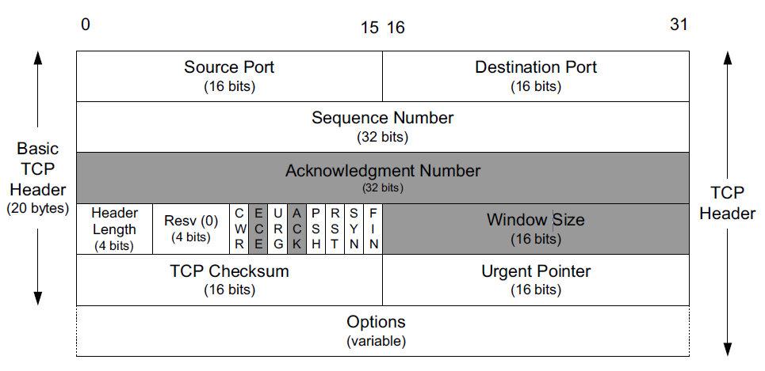
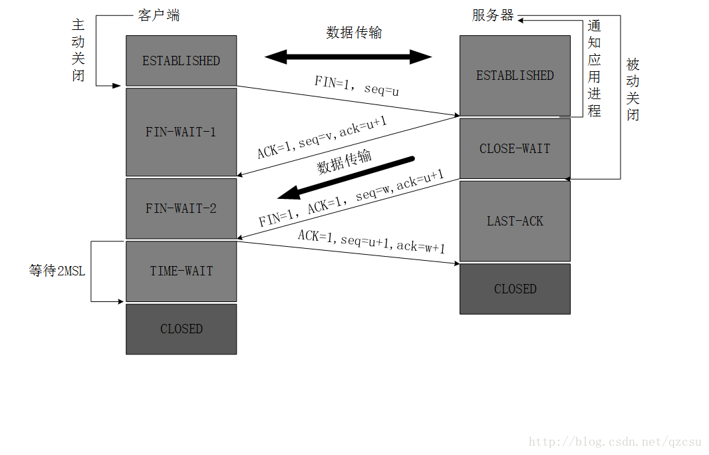

>[toc]

# TCP Header

TCP通信时，发送的报文分为：消息头和消息体两部分。
消息头如上图所示，重点关注`ACK`、`SYN`和`FIN`这几个标志位。

|  字段   |  含义   |
| --- | --- |
|   ACK  |   确认号 |
|  SYN   |   请求建立连接  |
|  FIN    |    请求断开连接  |

- **ACK** 、**SYN** 和 **FIN** 这些大写的单词表示标志位，其值要么是1，要么是0；
- **ack**、**seq**小写的单词表示序号。

# 三次握手

通信过程：
>1. [客户端]发送: SYN=1, seq=x
>2. [服务端]响应: SYN=1, ACK=1, seq=y, ack=x+1
>3. [客户端]发送: ACK=1, seq=x+1, ack=y+1

动图效果:

# 四次挥手

通信过程：
>1. [客户端]发送: FIN=1, seq=u
>2. [服务端]响应: ACK=1, seq=v, ack=u+1
>3. [服务端]发送: FIN=1, ACK=1, seq=w, ack=u+1
>4. [客户端]发送: ACK=1, seq=u+1, ack=w+1

动图效果:

参考：
- https://www.cnblogs.com/zzq919101/p/7866550.html
- https://blog.csdn.net/qq_38950316/article/details/81087809
- https://blog.csdn.net/qzcsu/article/details/72861891