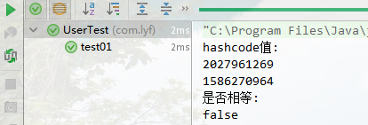
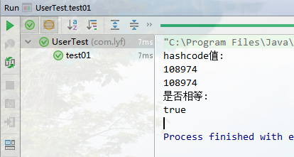

当新建一个java类时,需要**重写equals和hashcode方法**,大家都知道!但是,为什么要重写呢?
**需要保证对象调用equals方法为true时,hashcode必须相同.**

先看下面的例子:
没有重写equals和hashcode方法User类

``` java
public class User {
  
  private Integer age;
  private String name;

  public User() {
  }

  public User(Integer age, String name) {
    this.age = age;
    this.name = name;
  }

  public Integer getAge() {
    return age;
  }

  public void setAge(Integer age) {
    this.age = age;
  }

  public String getName() {
    return name;
  }

  public void setName(String name) {
    this.name = name;
  }
}
```


``` java
@Test
public void test01(){
  User user1 = new User(12, "lyf");
  User user2 = new User(12, "lyf");
  System.out.println("hashcode值:");
  System.out.println(user1.hashCode());
  System.out.println(user2.hashCode());
  System.out.println("是否相等:");
  System.out.println(user1.equals(user2));
}
```

用相同的值创建两个对象,发现hashcode不同,并且equals也为false.

了解hashcode算法的话你会明白,即使hashcode相同值也有可能不同!那么,就需要我们重写这两个方法.

``` java
@Override
public boolean equals(Object o) {
  if (this == o) return true;
  if (o == null || getClass() != o.getClass()) return false;
  User user = (User) o;
  return Objects.equals(age, user.age) &&
      Objects.equals(name, user.name);
}

@Override
public int hashCode() {
  return Objects.hash(age, name);
}
```

重新调用的结果:




  
