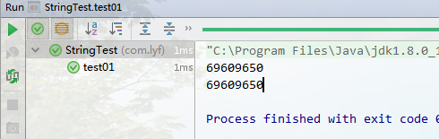

> [toc]

# 1.hash

*Hash，一般翻译做“散列”，也有直接音译为“哈希”的，就是把任意长度的输入（又叫做预映射pre-image）通过散列算法变换成固定长度的输出，该输出就是散列值。这种转换是一种压缩映射，也就是，散列值的空间通常远小于输入的空间，不同的输入可能会散列成相同的输出，所以不可能从散列值来确定唯一的输入值。简单的说就是一种将任意长度的消息压缩到某一固定长度的消息摘要的函数。* -- **来自百度百科**

大白话: **任意输入值都有一个固定长度的输出**

# 2.hash算法

hash算法很多,下面是Java中,字符串计算hashcode的源码:

``` java
public int hashCode() {
    int h = hash;
    if (h == 0 && value.length > 0) {
        char val[] = value;
        for (int i = 0; i < value.length; i++) {
            h = 31 * h + val[i];
        }
        hash = h;
    }
    return h;
}
```

**很多人会疑惑为什么会是31?**

1. 31时是质数(只能分解成1和自身)可以增加结果的唯一性,因为函数算法(也叫散列函数)要尽可能的平均分布
2. 虚拟机可以优化计算速度.

当然,也可以不使用31用其他值代替...,单元测试模拟一下
``` java
@Test
public void test01(){
  String s = "Hello";
  System.out.println(s.hashCode());
  
  int code = (int)'H';
  code = 31*code + (int)'e';
  code = 31*code + (int)'l';
  code = 31*code + (int)'l';
  code = 31*code + (int)'o';
  System.out.println(code);
}
```




参考资料
* https://blog.csdn.net/reggergdsg/article/details/53819293
* https://www.jb51.net/article/132419.htm