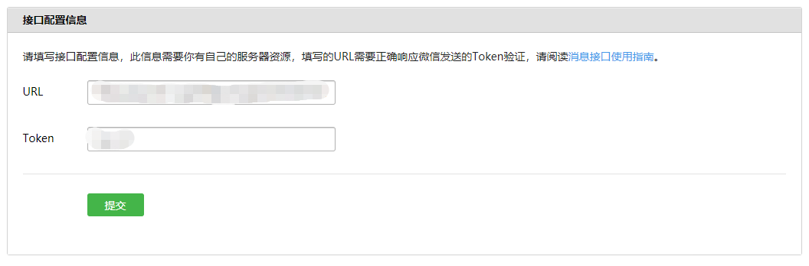

# 申请测试账号

微信扫码登陆: http://mp.weixin.qq.com/debug/cgi-bin/sandbox?t=sandbox/login

设置服务器接口验证

作用就是服务器验证签名,验证成功即可使用微信公众号测试功能

`java后台验证代码`:
``` java
   /**
     * 微信URL接入验证
     * @param signature
     * @param timestamp
     * @param nonce
     * @param echostr
     * @return
     */
    @RequestMapping(value="/validate",method= RequestMethod.GET)
    @ResponseBody
    public String validate(String signature,String timestamp,String nonce,String echostr){
        //1. 将token、timestamp、nonce三个参数进行字典序排序
//        String[] arr = {timestamp,nonce,WeChatUtil.TOKEN};
        String[] arr = {timestamp,nonce,"wx_123"};
        Arrays.sort(arr);
        //2. 将三个参数字符串拼接成一个字符串进行sha1加密
        StringBuilder sb = new StringBuilder();
        for (String temp : arr) {
            sb.append(temp);
        }
        //3. 开发者获得加密后的字符串可与signature对比，标识该请求来源于微信
        try {
            if(Sha1Util.encode(sb.toString().getBytes()).equals(signature)){
                //接入成功
                return echostr;
            }
        } catch (NoSuchAlgorithmException e) {
            e.printStackTrace();
        }
        //接入失败
        return null;
    }
```

`SHA加密`:
``` java
/**
* SHA1不可逆加密工具
*/

public class Sha1Util {

  public static String getSha1(byte[] input) throws NoSuchAlgorithmException{
        MessageDigest mDigest = MessageDigest.getInstance("SHA1");
        byte[] result = mDigest.digest(input);
        StringBuffer sb = new StringBuffer();
        for (int i = 0; i < result.length; i++) {
            sb.append(Integer.toString((result[i] & 0xff) + 0x100, 16).substring(1));
        }
        return sb.toString();
  }
}
```
-- https://www.jianshu.com/p/9d4e8ccf16a2

# 获取公开信息

步骤:
1. 用户授权并获取code
2. 使用code换取access_token
3. 使用access_token获取用户信息

代码:
``` java
    /**
     * 用户授权并获取code
     * @return
     */
    @GetMapping(value="/authorize")
    public String authorize(){
        //redirect_uri 地址要URLecode编码
        String url = "https://open.weixin.qq.com/connect/oauth2/authorize" +
                "?appid=APPID" +
                "&redirect_uri=https%3A%2F%2Fpunch1.superlib.com%2Fapi%2Fwechat%2FuserInfo" +
                "&response_type=code" +
                "&scope=snsapi_userinfo" +
                "&state=1#wechat_redirect";
        return "redirect:" + url;
    }

    /**
     * 使用code换取access_token,并获取用户信息
     * @param code
     * @return
     */
    @GetMapping(value="/userInfo")
    @ResponseBody
    public String userInfo(String code){
        logger.info("userInfo...");
        String url = "https://api.weixin.qq.com/sns/oauth2/access_token" +
                "?appid=APPID" +
                "&secret=SECRET" +
                "&code=" + code +
                "&grant_type=authorization_code";
        String result = HttpClient.sendGet(url, null);
        JSONObject data = JSON.parseObject(result);
        String access_token = data.getString("access_token");
        String openid = data.getString("openid");
        url = "https://api.weixin.qq.com/sns/userinfo?access_token="+access_token+"&openid="+openid+"&lang=zh_CN";
        result = HttpClient.sendGet(url, null);
        return result;
    }
```

# 4001异常

微信第三方登录出现错误40001解决方案

为什么会存在调用错api呢？原因很简单:

1. https://api.weixin.qq.com/sns/userinfo
2. https://api.weixin.qq.com/cgi-bin/user/info

上面两个api都是获取用户信息的，并且传入的参数也是一样的，
- 第一个(未关注公众号)用户网页端
- 第二个(关注公共号后)获取用户信息

希望以后的小伙伴可以记住!!!不要跟我犯一样的错误了。

-- http://blog.sina.com.cn/s/blog_13a1fe1db0102xkbf.html


参考:
- https://www.jianshu.com/p/443c905e58a3/
- https://www.cnblogs.com/jinxiaohang/p/7193505.html
- https://developers.weixin.qq.com/doc/offiaccount/OA_Web_Apps/Wechat_webpage_authorization.html#3


