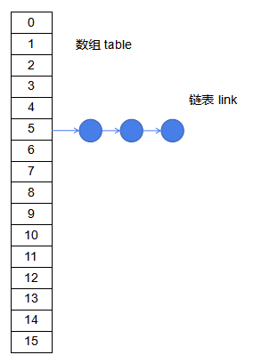
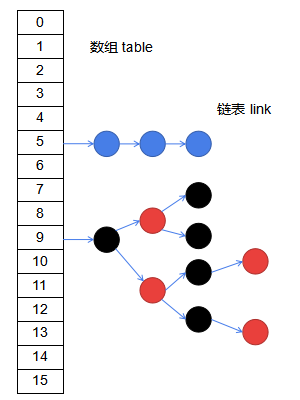

> [toc]

*简述HasHMap底层原理,不到之处还请批评指正...*

# 1.HashMap底层概述

在JDK1.7中HashMap采用的是 数组Array 和 链表Link 这两种数据结构,而在JDK1.8中对底层实现进行了优化,开始采用 数组 链表 和 红黑树.

# 2.JDK1.7实现方式

初始化创建length为16的数组,当通过put方法存值时,采用hash算法算出,在数组中存放的索引index位置进行存储.
hash算法的特点时尽量平均分布,但不能保证index不重复.如果重复,就在该位置追加链表进行存储,最新的值放在链表最前面.
数组长度只有16,显然不够,在必要时就需要扩容,当数组容量用到75%时,触发扩容机制,过程随机的.
加载因子loadfactor官方指定为0.75,这个数值是一个比较理想的参数.

# 3.JDK1.8实现方式

在1.7的基础上对hash算法进行了改进,并增加链表存储阈值为8.当链表长度大于8时,转换为红黑树存储

# 4.关键名词

* 数据结构 数组 链表 红黑树
* capacity容量16
* loadfactor 加载因子0.75
* threshold 临界值 size>16*0.75扩容
* bucket 桶 阈值为8

# 5.相关问题

1. 数组长度为偶数2^n,因为硬件计算中位运算比取模2. 效率高,有利于hash均匀分布
3. 常用String和Integer作为key,这些类是Immutable不可变类,可以保证线程安全.
4. 多线程下HashMap不安全,扩容时会造成死锁