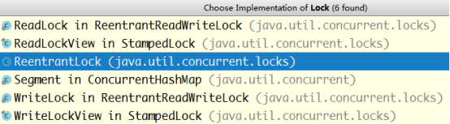
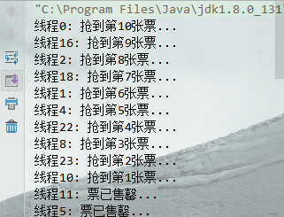
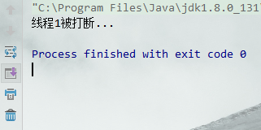
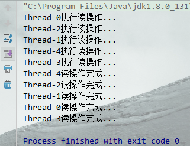
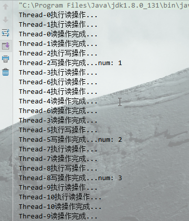

> [toc]

*搞明白 `线程` `锁`和`多线程`系列*

# 1.synchronized锁

锁分为 **类锁** 和 **对象锁**, **方法锁和私有锁都属于对象锁**

1. 类锁：在代码中的**方法**上加了`static`和`synchronized`的锁，或者内部使用`synchronized(xxx.class)`

2. 对象锁：在代码中的**方法**上加了`synchronized`的锁，或者内部使用`synchronized(this)`的代码段

3. 私有锁：在**类内部**声明一个私有属性如`private Object lock`，在需要加锁的代码段`synchronized(lock)`


``` java
package com.lyf.lock;

/**
 * @Author lyf
 * @Date 2018/11/17 0017 14:13
 */
public class Ticket {
  private static int num = 10;
  private Object lock = new Object();

  // 类锁 static synchronized
  public static synchronized void buy01() {
    buy();
  }

  // 类锁 synchronized (xxx.class)
  public void buy02() {
    synchronized (MyLock.class){
      buy();
    }
  }

  // 对象锁 synchronized
  public synchronized void buy03() {
    buy();
  }

  // 对象锁 synchronized (this)
  public void buy04() {
    synchronized (this){
      buy();
    }
  }

  // 私有锁 synchronized (lock)
  public void buy05() {
    synchronized (lock){
      buy();
    }
  }

  public static void buy(){
    if (num > 0) {
      try {
        Thread.sleep((long) (Math.random() * 100));
      } catch (InterruptedException e) {
        e.printStackTrace();
      }
      System.out.println(Thread.currentThread().getName()+": 抢到第" + num-- + "张票...");
    } else {
      System.out.println(Thread.currentThread().getName()+": 票已售罄...");
    }
  }

  public static void main(String[] args) {
    final Ticket ticket = new Ticket();
    for (int i = 0; i < 200; i++) { 
//      new Thread(() -> { ticket.buy01(); }).start();
//      new Thread(() -> { ticket.buy02(); }).start();
//      new Thread(() -> { ticket.buy03(); }).start();
//      new Thread(() -> { ticket.buy04(); }).start();
      new Thread(() -> { ticket.buy05(); }).start();
    }
  }
}
```

依次放开注释,自己玩玩看吧~

synchronized加锁方式有很多弊端:

1. A线程获得锁,B线程只能进入阻塞状态,不能取消等待.

2. A线程进行写操作,B C 线程进行读操作.读写操作会发生冲突,读读操作也会有冲突

# 2.Lock接口

在concurrent包下面有一个Lock接口,接口规范中定义的方法可以解决上边synchronized所带来的问题.接口有6个实现类如下图所示:



``` java
package java.util.concurrent.locks;
public interface Lock {
    void lock();
    void lockInterruptibly() throws InterruptedException;
    boolean tryLock();
    boolean tryLock(long time, TimeUnitunit) throws InterruptedException;
    void unlock();
    Condition newCondition();
}
```

* lock 获取锁,如果其他线程获得锁,则进行等待.但需要主动释放锁unlock

* lockInterruptibly 可中断锁,在线程等待过程中,可以调用interrupt()方法中断等待.如果已获得锁是不能被中断的.

* `tryLock` 判断是否获得锁,获得返回true,否则返回false

* `tryLock(long time, TimeUnitunit)` 在指定时间内判断是否获得锁

* `unlock` 释放锁

* `newCondition` 条件

# 3.ReentrantLock重入锁

ReentrantLock 是Lock的实现类,下面是使用示例:

1. `private Lock lock = new ReentrantLock();`

2. l`ock.lock();// 获取锁`

3. `finally中调用lock.unlock();// 释放锁`

``` java
package thread;

import java.util.concurrent.locks.Lock;
import java.util.concurrent.locks.ReentrantLock;

/**
 * @Author lyf
 * @Date 2018/11/17 0017 14:13
 */
public class MyLock {
  private static int num = 10;
  private Lock lock = new ReentrantLock();

  public void buy01() {
    lock.lock();// 获取锁
    try {
      if (num > 0) {
        Thread.sleep((long) (Math.random() * 100));
        System.out.println(Thread.currentThread().getName() + ": 抢到第" + num-- + "张票...");
      } else {
        System.out.println(Thread.currentThread().getName() + ": 票已售罄...");
      }
    } catch (InterruptedException e) {
      e.printStackTrace();
    } finally {
      lock.unlock();// 释放锁
    }
  }

  public static void main(String[] args) {
    final MyLock myLock = new MyLock();
    for (int i = 0; i < 200; i++) {
  	new Thread(() -> { myLock.buy01(); }, "线程"+i).start();
     }
  }
}
```


使用`lockInterruptibly`获得锁,在**线程等待过程中,可以被打断**.

``` java
public void buy03() throws InterruptedException {
  lock.lockInterruptibly();// 获取锁
  try {
      Thread.sleep(2000);
      if (num > 0) {
        System.out.println(Thread.currentThread().getName() + ": 抢到第" + num-- + "张票...");
      } else {
        System.out.println(Thread.currentThread().getName() + ": 票已售罄...");
      }
  } finally {
    lock.unlock();// 释放锁
  }
}

Thread t1 = new Thread(()->{
  try {
    myLock.buy03();
  } catch (InterruptedException e) {
    System.out.println(Thread.currentThread().getName()+"被打断...");
  }
}, "线程1");
t1.start();// 启动线程
Thread.sleep(1000);
t1.interrupt();// 打断线程
```


# 4.ReentrantReadWriteLock读写锁

读写锁可以实现:

* 读读不冲突 

* 写写互斥 

* 读写互斥

``` java
package thread;

import java.util.concurrent.locks.ReadWriteLock;
import java.util.concurrent.locks.ReentrantReadWriteLock;

/**
 * @Author lyf
 * @Date 2018/11/18 0018 10:30
 */
public class MyReadWriteLock {

  private ReentrantReadWriteLock rwl = new ReentrantReadWriteLock();
  private int num = 0;

  public void readFile() {
    rwl.readLock().lock();
    try {
      System.out.println(Thread.currentThread().getName() + "执行读操作...");
      Thread.sleep((long) (Math.random() * 1000));
      System.out.println(Thread.currentThread().getName() + "读操作完成...");
    } catch (InterruptedException e) {
      e.printStackTrace();
    } finally {
      rwl.readLock().unlock();
    }
  }


  public void writeFile() {
    rwl.writeLock().lock();
    System.out.println(Thread.currentThread().getName() + "执行写操作...");
    try {
      num++;
      Thread.sleep((long) (Math.random() * 1000));
      System.out.println(Thread.currentThread().getName() + "写操作完成...num: " + num);
    } catch (InterruptedException e) {
      e.printStackTrace();
    } finally {
      rwl.writeLock().unlock();
    }
  }

  public static void main(String[] args) {

    MyReadWriteLock myReadWriteLock = new MyReadWriteLock();
    for (int i = 0; i < 5; i++) {
      new Thread(()->{myReadWriteLock.readFile();}).start();// 读语句1
      new Thread(()->{myReadWriteLock.readFile();}).start();// 读语句2
      new Thread(() -> { myReadWriteLock.writeFile(); }).start();// 写语句
    }
  }
}
```

单独**执行读语句1**:

``` java
MyReadWriteLock myReadWriteLock = new MyReadWriteLock();
for (int i = 0; i < 5; i++) {
  new Thread(()->{myReadWriteLock.readFile();}).start();// 读语句1
//   new Thread(()->{myReadWriteLock.readFile();}).start();// 读语句2
//   new Thread(() -> { myReadWriteLock.writeFile(); }).start();// 写语句
}
```


单独**执行写语句**:

``` java
MyReadWriteLock myReadWriteLock = new MyReadWriteLock();
for (int i = 0; i < 5; i++) {
//      new Thread(()->{myReadWriteLock.readFile();}).start();// 读语句1
//      new Thread(()->{myReadWriteLock.readFile();}).start();// 读语句2
  new Thread(() -> { myReadWriteLock.writeFile(); }).start();// 写语句
}
```


同时运行 **读语句1 读语句2 写语句**:

``` java
MyReadWriteLock myReadWriteLock = new MyReadWriteLock();
for (int i = 0; i < 5; i++) {
  new Thread(()->{myReadWriteLock.readFile();}).start();// 读语句1
  new Thread(()->{myReadWriteLock.readFile();}).start();// 读语句2
  new Thread(() -> { myReadWriteLock.writeFile(); }).start();// 写语句
}
```

