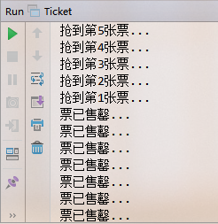

> [toc]

*搞明白 `线程` `锁`和`多线程`系列*

# 1.线程创建

线程创建常见的三种方式:

* 继承`Thread`类
* 实现`Runnable`接口
* 实现`Callable`接口

第三种方式有异步调用效果,类似js中的ajax可以接收返回值,其余两种不能.

## 1.1 继承`Thread`类

```java
class Thread01 extends Thread {
  public Thread01(String name) {
    super(name);
  }

  @Override
  public void run() {
    System.out.println(Thread.currentThread().getName() + "执行...");
  }
}

```

## 1.2 实现`Runnable`接口

``` java
class Thread02 implements Runnable {

  @Override
  public void run() {
    System.out.println(Thread.currentThread().getName() + "执行...");
  }
}
```

## 1.3 实现`Callable`接口

``` java
class Thread03 implements Callable<String> {

  @Override
  public String call() throws Exception {
    Thread.sleep(3000);
    System.out.println(Thread.currentThread().getName() + "执行...");
    return "hello";
  }
}
```

## 使用方式
``` java
package thread;

import java.util.concurrent.Callable;
import java.util.concurrent.ExecutionException;
import java.util.concurrent.FutureTask;

/**
 * @Author lyf
 * @Date 2018/11/17 0017 13:38
 */
public class MyThread {
  public static void main(String[] args) throws ExecutionException, InterruptedException {
    // 继承Thread类  
    new Thread01("线程1").start();
    // 实现Runnable接口
    new Thread(new Thread02(), "线程2").start();
    // 实现Callable接口
    FutureTask<String> futureTask = new FutureTask<>(new Thread03());
    futureTask.run();
    while (futureTask.isDone()) { // 判断线程是否运行结束
      System.out.println("结果: " + futureTask.get());// 获取结果
      return;
    }
  }
}
```

# 2.线程安全

多线程下访问数据会有**线程安全问题**.比如买火车票,只有10张票20人买,那就要确保**不能卖重,不能多卖**.看下面例子:

``` java
package thread;

/**
 * @Author lyf
 * @Date 2018/11/17 0017 14:13
 */
public class Ticket {
  private int num = 10;

  public void buy() {
    if (num > 0) {
      try {
        Thread.sleep((long) (Math.random() * 100));
      } catch (InterruptedException e) {
        e.printStackTrace();
      }
      System.out.println("抢到第" + num-- + "张票...");
    } else {
      System.out.println("票已售罄...");
    }
  }

  public static void main(String[] args) {
    final Ticket ticket = new Ticket();
    for (int i = 0; i < 200; i++) {
      new Thread(() -> { ticket.buy(); }).start();
    }
  }
}
```


多线程操作下,就会出现多卖的情况.如果要解决,可以通过**加锁synchronized**方式来实现.把上边的代码修改如下:

``` java
public synchronized void buy() {
  ...
}
```

可以保证不存在多卖情况.