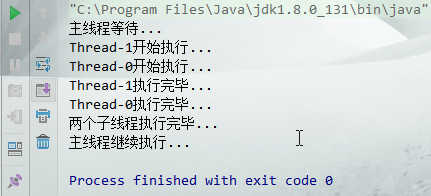
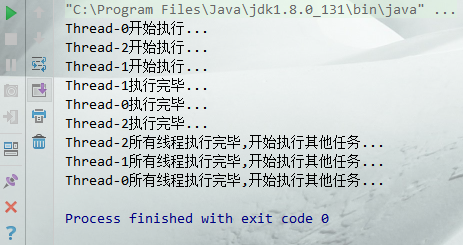
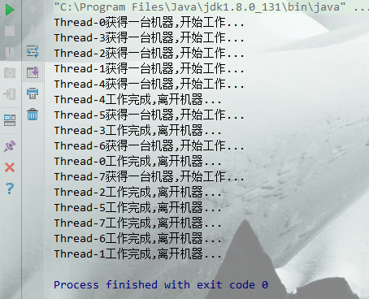

> [toc]

*搞明白 `线程` `锁`和`多线程`系列*

# 1.CountDownLatch

`CountDownLatch`拥有类似**线程计数器**的功能, 每个线程执行完**计数器做减1**操作,减到0时,等待线程开始执行.
使用场景:**主线程要等2个子线程执行完再继续操作**. *办公室的A4纸用一张少一张,等用完时,就要去买了*

* `new CountDownLatch(2)`创建2个线程计数
* `countDown()`计数器减1

``` java
package com.lyf.message;

import java.util.concurrent.CountDownLatch;

/**
 * @Author lyf
 * @Date 2018/11/19 0019 21:16
 */
public class CountDownLatchTest {
  
  public static void main(String[] args) throws InterruptedException {

    final CountDownLatch countDownLatch = new CountDownLatch(2);
    
    for (int i = 0; i < 2; i++) {
      new Thread(()->{
        System.out.println(Thread.currentThread().getName()+"开始执行...");
        try {
          Thread.sleep(2000);
        } catch (InterruptedException e) {
          e.printStackTrace();
        }
        System.out.println(Thread.currentThread().getName()+"执行完毕...");
        countDownLatch.countDown();// 计数器减1
      }).start();
    }

    System.out.println("主线程等待...");
    countDownLatch.await();
    System.out.println("两个子线程执行完毕...");
    System.out.println("主线程继续执行...");
    
  }
}
```


# 2.CyclicBarrier

`CyclicBarrier`拥有对齐等待功能,让多个线程都准备,一起开始执行.
使用场景: **多个线程在执行写操作,所有写操作执行完,再去执行各自的任务**. *早上儿子和女儿都吃完饭,才能一齐送到幼儿园*

* `new CyclicBarrier(3)`创建3个线程对齐
* `await()`线程执行完开始等待

``` java
package com.lyf.message;

import java.util.concurrent.BrokenBarrierException;
import java.util.concurrent.CyclicBarrier;

/**
 * @Author lyf
 * @Date 2018/11/19 0019 21:51
 */
public class CyclicBarrierTest {
  
  public static void main(String[] args){
    CyclicBarrier cyclicBarrier = new CyclicBarrier(3);

    for (int i = 0; i < 3; i++) {
      new Thread(()->{
        System.out.println(Thread.currentThread().getName()+"开始执行...");
        try {
          Thread.sleep((long) (3000*Math.random()));
          System.out.println(Thread.currentThread().getName()+"执行完毕...");
          cyclicBarrier.await();
        } catch (InterruptedException e) {
          e.printStackTrace();
        } catch (BrokenBarrierException e) {
          e.printStackTrace();
        }
        System.out.println(Thread.currentThread().getName()+"所有线程执行完毕,开始执行其他任务...");
      }).start();
    }
  }
}
```


# 3.Semaphore

`Semaphore`信号量拥有线程限流功能,可以规定同一时刻有多少线程在执行.
使用场景: *购票窗口只有5个,同一时刻只能卖5张票,其余人等待*

* `new Semaphore(5)`同一时刻5个线程可以执行
* `acquire()`获取执行权限
* `release()`释放执行权限

``` java
package com.lyf.message;

import java.util.concurrent.Semaphore;

/**
 * @Author lyf
 * @Date 2018/11/19 0019 22:01
 */
public class SemaphoreTest {
  public static void main(String[] args) {
    final int people = 8;// 8个人
    final int machine = 5;// 5个机器
    Semaphore semaphore = new Semaphore(machine);

    for (int i = 0; i < people; i++) {
      new Thread(()->{
        try {
          semaphore.acquire();
          System.out.println(Thread.currentThread().getName()+"获得一台机器,开始工作...");
          Thread.sleep((long) (3000*Math.random()));
          System.out.println(Thread.currentThread().getName()+"工作完成,离开机器...");
          semaphore.release();
        } catch (InterruptedException e) {
          e.printStackTrace();
        }
      }).start();
    }
  }
}
```

