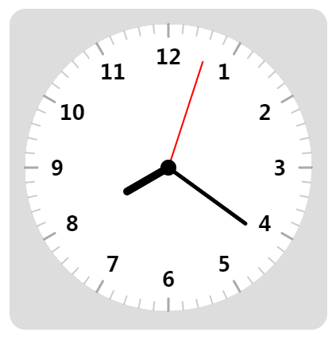
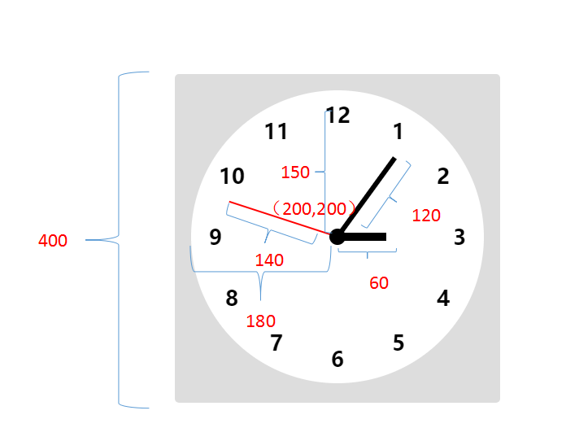

``` html?linenums
<!DOCTYPE html>
<html lang="en">
<head>
    <meta charset="UTF-8">
    <title>Title</title>
    <style>
        .clock {
            width: 400px;
            margin: 100px auto;
            background: #ddd;
            border-radius: 20px;
        }
    </style>
</head>
<body>
<div class="clock">
    <canvas id="view" height="400px" width="400px"></canvas>
</div>
<script>
    var canvas = document.getElementById('view');//1.获取元素
    var c = canvas.getContext('2d');//2.获取上下文对象

    //3.定义基础变量
    var w = h = 400;//时钟宽高
    var x = y = 200;//时钟中心坐标
    var r = 180;//时钟半径
    var r_hour = 60;//时针长度
    var r_minute = 120;//分针长度
    var r_second = 140;//秒针长度
    var r_text = 140;//定义表盘文字的半径
    var r_square = 165;//刻度
    var r_circle = 10;// 表盘小圆点
    var deg = 2 * Math.PI;//定义基本的圆周

    //平移中心点
    c.translate(w/2, h/2);

    //TODO step2: 画时钟的针
    function clock(){
        //TODO step1: 画表盘
        drawCircle(0, 0, r, '#fff');
        //获取真实的时间
        var date = new Date();
        var hour = date.getHours()*(deg/12) - deg/4;//[0-23]
        var miunte = date.getMinutes()*(deg/60) - deg/4;//[0-59]
        var second = date.getSeconds()*(deg/60) - deg/4;//[0-59]

        drawLine(0, 0, r_hour*Math.cos(hour), r_hour*Math.sin(hour), '#000', 10);
        drawLine(0, 0, r_minute*Math.cos(miunte), r_minute*Math.sin(miunte), '#000', 5);
        drawLine(0, 0, r_second*Math.cos(second), r_second*Math.sin(second), '#f00', 2);

        //TODO step3: 时钟帽
        drawCircle(0, 0, r_circle, '#000');
        //TODO step4: 画时钟文字
        for (var i = 1; i <= 12; i++) {
            /**
             * 计算圆周坐标
             * x = x + r*cos(θ)
             * y = y + r*sin(θ)
             * */
            var θ = i/12 * deg - deg/4;
            var x = r_text*Math.cos(θ);
            var y = r_text*Math.sin(θ);
            drawText(i, x, y);
        }

        //TODO step5: 画刻度
        for (var i = 0; i < 60; i++) {
            // 确定起点和终点
            var θ = (deg/60) *i;
            //起点
            var x1 = r * Math.cos(θ);
            var y1= r * Math.sin(θ);
            //终点点
            var x2 = r_square * Math.cos(θ);
            var y2= r_square * Math.sin(θ);

            //终点2
            var x3 = (r_square+5) * Math.cos(θ);
            var y3= (r_square+5) * Math.sin(θ);

            //画刻度
            if(i%5==0){//如果是整点就长一点
                drawLine(x1, y1, x2, y2, '#aaa', 3);
            }else{//否则短一点
                drawLine(x1, y1, x3, y3, '#ccc', 2);
            }

        }
    }

    clock();//初始化执行一次
    setInterval(function () {
        c.clearRect(0,0, w, h);
        clock();
    })

    /******
     * @func: 写文字
     * */
    function drawText(text, x, y) {
        c.font = 'bold 26px 微软雅黑';
        c.fillStyle = '#000';
        c.textAlign = 'center';
        c.textBaseline = 'middle';
        c.fillText(text, x, y);
    }

    /***
     * @func: 画直线
     * */
    function drawLine(x1, y1, x2, y2, color, width) {
        c.beginPath();
        c.moveTo(x1, y1);
        c.lineTo(x2, y2);
        c.strokeStyle = color;
        c.lineWidth = width;
        //让指针头变圆
        c.lineCap = 'round';//变圆
        c.stroke();
        c.closePath();
    }

    /***
     * @func: 画圆
     * */
    function drawCircle(x, y, r, color){
        c.beginPath();
        c.arc(x, y, r, 0, Math.PI*2);
        c.fillStyle = color;
        c.fill();
        c.closePath();
    }
</script>
</body>
</html>
```