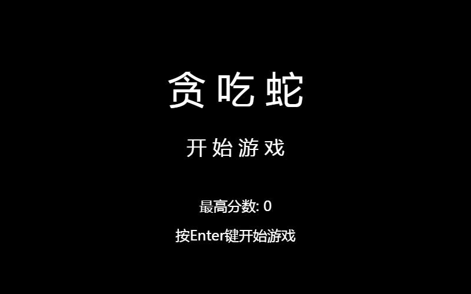
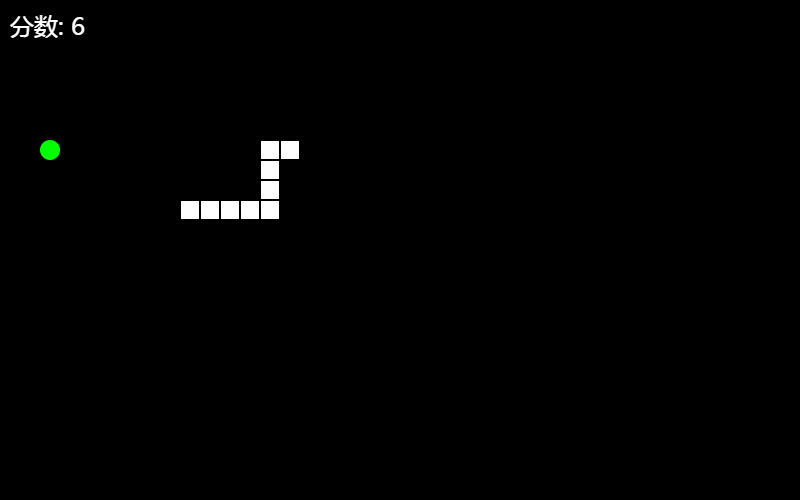
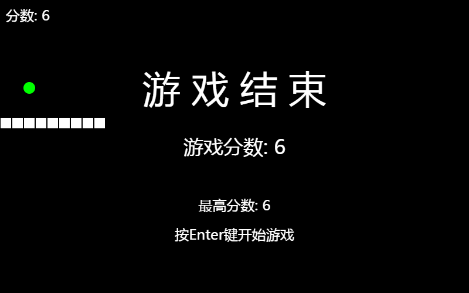

用canvas做了一个贪吃蛇小游戏







``` html?linenums
<!DOCTYPE html>
<html>
<head>
    <meta charset="UTF-8">
    <title>贪吃蛇</title>
    <style>
        body{background: #666;text-align: center;}
        canvas{margin: 50px auto 0;/*border: 2px solid green;*/}
    </style>
</head>
<body>
<canvas id="snake" width="800" height="500"></canvas>
<script>
/**
 * Created by linyufeng on 2017/7/26.
 */
var width = 800;//游戏宽度
var height = 500;//游戏高度
var flag = false;//控制游戏是否结束
var snakeArr;//存放身体坐标
var food;//指定食物
var direction;//运动方向
var snakeMove;//自动运动(定时器)
var size = 20;//食物和蛇大小
var speed = 1000;//运动速度
var highScore = 0;//最高分数
var snake = document.getElementById('snake').getContext('2d');//获取canvas对象
//重置游戏
function reset(){
    flag = true;//开始游戏
    snakeArr = [{x:size*10,y:size*10},{x:size*10,y:size*10+size},{x:size*10,y:size*10+2*size}];//生成身体
    food = createFood();//随机食物
    direction = 39;//指定默认运动方向: 37左 38上 39右 40下
}
//开始游戏
function start(){
    drawRect({x:0,y:0,w:width,h:width});
    drawText({text:'贪 吃 蛇',x:width/2,y:150,font:'64px 微软雅黑'});
    drawText({text:'开 始 游 戏',x:width/2,y:250,font:'34px 微软雅黑'});
    drawText({text:'最高分数: '+highScore,x:width/2,y:350,font:'24px 微软雅黑'});
    drawText({text:'按Enter键开始游戏',x:width/2,y:width/2,font:'24px 微软雅黑'});
}
//结束游戏
function end(){
    clearInterval(snakeMove);
    flag = false;
    var score = snakeArr.length-3;
    highScore = highScore<score?score:highScore;
    drawText({text:'游 戏 结 束',x:width/2,y:150,font:'64px 微软雅黑'});
    drawText({text:'游戏分数: '+score,x:width/2,y:250,font:'34px 微软雅黑'});
    drawText({text:'最高分数: '+highScore,x:width/2,y:350,font:'24px 微软雅黑'});
    drawText({text:'按Enter键开始游戏',x:width/2,y:width/2,font:'24px 微软雅黑'});
}
//初始化游戏
function init(){
    reset();
    draw();
    snakeMove = setInterval(function(){
        update(direction);
    },speed);
}
//画游戏界面
function draw(){
    snake.clearRect(0,0,width,height);//清屏
    drawRect({x:0,y:0,w:width,h:width});//画背景
    drawSnake(snakeArr);//画蛇
    drawCircle(food.x,food.y);//画食物
    drawText({text:'分数: '+(snakeArr.length-3),x:10,y:10,font:'24px 微软雅黑',baseline:'top',align:'left'});//画分数
}
//随机产生食物
function createFood(){
    var x = parseInt(Math.random()*(width/size))*size;
    var y = parseInt(Math.random()*(height/size))*size;
    return {x:x, y:y};
}
//身体运动和碰撞检测
function update(direction){
    var head = snakeArr[0];
    if(!flag){
        return;//结束游戏
    }
    var newHead = {};
    if(direction == 37){//左
        newHead = {x:head.x-size,y:head.y};
    }else if(direction == 38){//上
        newHead = {x:head.x,y:head.y-size};
    }else if(direction == 39){//右
        newHead = {x:head.x+size,y:head.y};
    }else if(direction == 40){//下
        newHead = {x:head.x,y:head.y+size};
    }
    //身体自身碰撞检测
    for (var i = 0; i < snakeArr.length; i++) {
        var snake = snakeArr[i];
        if(snake.x==newHead.x && snake.y==newHead.y){
            end();
            return;
        }
    }
    //墙壁碰撞检测
    if(head.x<=0 || head.x>=width || head.y<=0 || head.y>=height){
        end();
        return;
    }else{
        //食物碰撞检测
        if(newHead.x==food.x && newHead.y==food.y){
            snakeArr.unshift(food);//添身体
            food = createFood();
        }else{
            snakeArr.unshift(newHead);//添头
            snakeArr.pop();//去尾
        }
        draw();
    }
}
//游戏开始画面
start();
//绑定鼠标控制事件
document.addEventListener('keydown',function(e){
    e.preventDefault();
    /*******************************************
    * 37    Left（左箭头）
    * 38	Up（上箭头）
    * 39	Right（右箭头）
    * 40	Down（下箭头）
    * ******************************************/
    var code = e.keyCode || e.which;
    /***************************************
     * 只对上下左右键和Enter键生效,屏蔽其他键!
     * *************************************/
    if(code==37 || code==38 || code==39 || code==40 || code==13){
        /********************************************
         * 如果游戏未开始或者已结束,此时按下Enter键开始游戏
         * ******************************************/
        if(code==13){
            if(flag==false){
                init();
            }
        }else{
            /******************************************
             * 如果蛇的运动方向是上,那么不能向下运动
             * 如果蛇的运动方向是下,那么不能向上运动
             * 如果蛇的运动方向是左,那么不能向右运动
             * 如果蛇的运动方向是右,那么不能向左运动
             * ****************************************/
            if(Math.abs(code-direction)==2){
                return;//不允许这种移动方式
            }
            direction = code;
            update(direction);
        }
    }
});
/******************************************************************
 * 封装公共方法:
 * 1. 画矩形
 * 2. 写文字
 * 3. 画小方块
 * ****************************************************************/
/**
 * @func: 画矩形
 * @params: {x} x坐标
 * @params: {y} y坐标
 * @params: {w} 宽度
 * @params: {h} 高度
 * @color: {color} 颜色
 * */
function drawRect(option){
    /**************************************************************
     * 说明:canvas对象应该从外部传入,但是为了避免每次调用方法时都要传入,就固定写死了!
     * ************************************************************/
    snake.beginPath();
    snake.fillStyle = option.color || '#000';
    snake.fillRect(option.x,option.y,option.w,option.h);
    snake.closePath();
}
/**
 * @func: 写文字
 * @params: {x} x坐标
 * @params: {y} y坐标
 * @params: {w} 宽度
 * @params: {h} 高度
 * @params: {color} 颜色
 * @params: {baseline}  文字上下对齐方式
 * @params: {align} 文字左右对齐方式
 * */
function drawText(option){
    snake.beginPath();
    snake.fillStyle = option.color || '#fff';
    snake.fontFamily = '微软雅黑';
    snake.font = option.font;
    snake.textBaseline = option.baseline || 'middle';
    snake.textAlign = option.align || 'center';
    snake.fillText(option.text,option.x,option.y);
    snake.closePath();
}
/**
 * @func: 画小方块
 * @params: {x} x坐标
 * @params: {y} y坐标
 * */
function drawSquare(x,y){
    snake.beginPath();
    snake.fillStyle = '#fff';
    snake.fillRect(x+1,y+1,size-2,size-2);
    snake.closePath();
}
/**
 * @func: 画食物
 * @params: {x} x坐标
 * @params: {y} y坐标
 * */
function drawCircle(x,y){
    snake.beginPath();
    snake.arc(x+size/2, y+size/2, size/2, 0, Math.PI*2,true);
    snake.fillStyle = '#0f0';
    snake.fill();
    snake.closePath();
}
/**
 * @func: 画蛇
 * @params: {arr} 蛇身体坐标
 * */
function drawSnake(arr){
    for (var i = 0; i < arr.length; i++) {
        var snake = arr[i];
        drawSquare(snake.x,snake.y)
    }
}

</script>
</body>
</html>
```