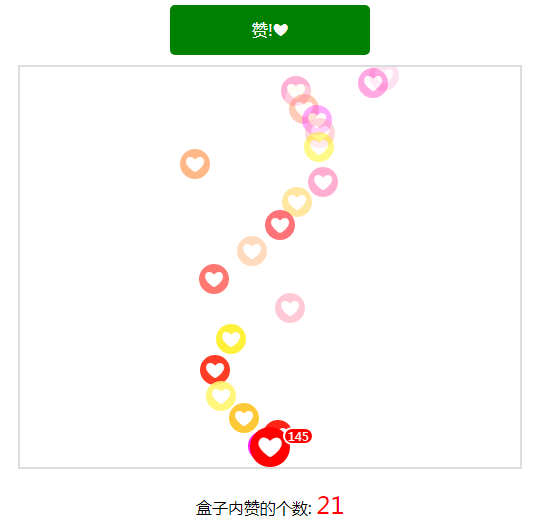

1. 混合模式创建点赞: 不同颜色, 运动轨迹,到达顶端opacity为0, 整体向上跑
2. 享元模式存储点赞对象

``` html?linenums
<!DOCTYPE html>
<html lang="en">
<head>
    <meta charset="UTF-8">
    <title>点赞</title>
    <script src="http://apps.bdimg.com/libs/jquery/2.1.4/jquery.min.js"></script>
    <style>
        .box{width: 500px;height: 400px;border:2px solid #ddd;margin: 10px auto;position: relative;overflow: hidden;}
        .btn{width: 200px;height: 50px;text-align: center;line-height: 50px;cursor: pointer;
            background: green;color: #fff;margin: 0 auto;border-radius: 5px;}
        .love{width: 30px;height: 30px;border-radius: 50%;line-height: 30px;opacity: 1;animation-duration: 3s;
            text-align: center; box-sizing: border-box; cursor: pointer;position: absolute;left: 235px;bottom: 0;font-size: 20px;}
        .line{ position: absolute; background: red; color: #fff; width: 40px; height: 40px; line-height: 40px; font-size: 26px; left: 230px;z-index: 99;}
        .line #count{ position: absolute; font-size: 12px;background: red;color: #fff;line-height: 1; padding: 1px 3px; border-radius: 10px; border: 2px solid #fff;}
        .line1{animation-name: line1;}
        .line2{animation-name: line2;}
        .line3{animation-name: line3;}
        @keyframes line1{
            0%{ opacity: 1; bottom: 0; left: 235px; }
            25%{ left: 195px; }
			50%{ left: 285px; }
            75%{ left: 255px; }
            100%{ opacity: 0.3; bottom: 400px; left: 235px; }
        }
        @keyframes line2{
            0%{ opacity: 1; bottom: 0; left: 235px; }
            25%{ left: 175px; }
            50%{ left: 305px; }
            75%{ left: 215px; }
            100%{ opacity: 0.3; bottom: 400px; left: 235px; }
        }
        @keyframes line3{
            0%{ opacity: 1; bottom: 0; left: 235px; }
            25%{ left: 255px; }
            50%{ left: 155px; }
            75%{ left: 355px; }
            100%{ opacity: 0.3; bottom: 400px; left: 235px; }
        }
        .desc{padding: 10px;text-align: center;}
        .desc #num{color: red;font-size: 24px;}
    </style>
    <script>
        var countZan = 0;
        var createZan = 0;
		
		// [0,255]
		function randomNum(num){
			return parseInt(Math.random()*num);
		}
        function Love(){

            /*******
             * 享元模式: 复用已经完成的对象
             * */
            this.line = 'line'+parseInt(Math.random()*3+1);
            var oldLoveArr = $('[flag=false]');
            if(oldLoveArr.size()>0){
                this.tpl = oldLoveArr.eq(0).removeClass().addClass('love');
            }else{
                createZan ++;
                this.tpl = '<div class="love" style="background: ' +
                        'rgb('+255+','+randomNum(255)+','+randomNum(255)+');' +
                        'color: rgb(255,255,255);">❤</div>';
            }
        }
        Love.prototype.show = function () {
            var heart = $(this.tpl);
            heart.addClass(this.line).attr('flag',true).appendTo($('.box'));
            setTimeout(function () {
                heart.attr('flag',false);
            },2000);

            //更新计数
            this.updateCount();
        }

        Love.prototype.updateCount = function () {
            $('#count').html(countZan);
            $('#num').html(createZan);
        }
        
        $(function () {
            $('.btn').click(function () {
                countZan ++;
                new Love().show();
            });
            setInterval(function () {
                $('.btn').click();
            }, 100);
        });
    </script>
</head>
<body>
<div class="btn">赞!❤</div>
<div class="box">
    <div class="love line">❤<span id="count">0</span></div>
</div>
<div class="desc">
    盒子内赞的个数: <span id="num">0</span>
</div>
</body>
</html>
```