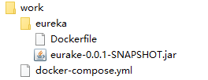

> [toc]

docker的好处自不必多说，启动迅速，占用资源少，方便管理。把jar包build构建成docker镜像，再结合docker-compose管理docker容器的启动，简直是开发Spring cloud项目的最佳助手！


# 安装docker和compose
[参考：安装docker](https://www.cnblogs.com/linyufeng/p/10093568.html) 使用**CentOS7**,6不能安装。
[参考：安装compose](https://docs.docker.com/compose/install/)

1.安装稳定版docker compose:
`sudo curl -L "https://github.com/docker/compose/releases/download/1.25.0/docker-compose-$(uname -s)-$(uname -m)" -o /usr/local/bin/docker-compose`
2.文件授权
`sudo chmod +x /usr/local/bin/docker-compose`
3.查看是否安装成功
>$ `docker-compose --version`
docker-compose version 1.25.0, build 1110ad01


# 准备jar包
自行准备一个可运行的jar包即可，测试使用的是一个eureka注册中心的项目jar包。步骤：
1.创建springboot项目
2.添加eureka依赖
``` 
<dependency>
            <groupId>org.springframework.cloud</groupId>
            <artifactId>spring-cloud-starter-netflix-eureka-server</artifactId>
        </dependency>
```
3.添加application配置

``` 
spring:
  application:
    name: eureka-server

server:
  port: 8761

eureka:
  client:
    registerWithEureka: false
    fetchRegistry: false
  serviceUrl:
    defaultZone: http://${eureka.instance.hostname}:${server.port}/eureka/
```

# 编写配置文件



- 测试jar包
- Dockerfile: 构建docker镜像配置
- docker-compose.yml: compose配置,创建docker容器

## Dockerfile

``` 
FROM java:8
MAINTAINER lin
ADD eurake-0.0.1-SNAPSHOT.jar app.jar
EXPOSE 8761
ENTRYPOINT ["java","-jar","app.jar"]
```
- FROM: 基础镜像,通过jdk8镜像开始
- MAINTAINER: 维护者
- ADD: 复制jar包到镜像内,名字为app.jar
- EXPOSE: 声明端口
- ENTRYPOINT: docker启动时,运行的命令.这里就是容器运行就启动jar服务

进入Dockerfile的同级目录,指定镜像构建:
`docker build -t lin/eureka .` 
**最后的点不要漏掉**,`lin/eureka`是给镜像起的名字

查看镜像: `docker image ls`           

```
REPOSITORY          TAG                 IMAGE ID            CREATED             SIZE
>>==lin/eureka==<<          latest              f45c58780812        4 hours ago         691MB
redis               latest              dcf9ec9265e0        3 weeks ago         98.2MB
java                8                   d23bdf5b1b1b        2 years ago         643MB
```

## docker-compose.yml

``` 
version: '3'
services:
  eureka:
    image: lin/eureka
    container_name: lin-eureka
    restart: always
    ports:
      - 8761:8761
```
- services: 指定容器服务,下面可配多个服务
- eureka: 服务名字,自己指定.这里就代表我的eureka服务
- image: 指定启动的镜像,就是上边通过Dockerfile构建的镜像
- container_name: 给容器起一个名字
- restart: 可重启,使用always就好
- ports: 声明映射端口

检查配置是否正确
`docker-compose config`
启动容器服务
`docker-compose up`
停止并删除容器服务
`docker-compose down`
强制启动重新建立容器
`docker-compose up -d --force-recreate`

## 查看服务

查看进程: `docker ps`

``` 
CONTAINER ID        IMAGE               COMMAND                  CREATED             STATUS              PORTS                    NAMES
f21fdb5bb57c        >>==lin/eureka==<<          "java -jar app.jar"      4 hours ago         Up 4 hours          0.0.0.0:8761->8761/tcp   lin-eureka

```
查看日志: `docker logs lin-eureka`              

```
2019-12-16 17:18:17.104  INFO 1 --- [           main] trationDelegate$BeanPostProcessorChecker : Bean 'org.springframework.cloud.autoconfigure.ConfigurationPropertiesRebinderAutoConfiguration' of type [org.springframework.cloud.autoconfigure.ConfigurationPropertiesRebinderAutoConfiguration] is not eligible for getting processed by all BeanPostProcessors (for example: not eligible for auto-proxying)

  .   ____          _            __ _ _
 /\\ / ___'_ __ _ _(_)_ __  __ _ \ \ \ \
( ( )\___ | '_ | '_| | '_ \/ _` | \ \ \ \
 \\/  ___)| |_)| | | | | || (_| |  ) ) ) )
  '  |____| .__|_| |_|_| |_\__, | / / / /
 =========|_|==============|___/=/_/_/_/
 :: Spring Boot ::        (v2.2.2.RELEASE)

2019-12-16 17:18:17.482  INFO 1 --- [           main] com.lyf.eurake.EurakeApplication         : No active profile set, falling back to default profiles: default
2019-12-16 17:18:19.690  WARN 1 --- [           main] o.s.boot.actuate.endpoint.EndpointId     : Endpoint ID 'service-registry' contains invalid characters, please migrate to a valid format.
2019-12-16 17:18:20.315  INFO 1 --- [           main] o.s.cloud.context.scope.GenericScope     : BeanFactory id=6ff43722-b2c2-392e-b72c-6151fa54c3dd
2019-12-16 17:18:21.170  INFO 1 --- [           main] trationDelegate$BeanPostProcessorChecker : Bean 'org.springframework.cloud.autoconfigure.ConfigurationPropertiesRebinderAutoConfiguration' of type [org.springframework.cloud.autoconfigure.ConfigurationPropertiesRebinderAutoConfiguration] is not eligible for getting processed by all BeanPostProcessors (for example: not eligible for auto-proxying)
2019-12-16 17:18:22.379  INFO 1 --- [           main] o.s.b.w.embedded.tomcat.TomcatWebServer  : Tomcat initialized with port(s): 8761 (http)
```


