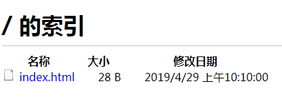

工具: vsftpd

安装vsftpd` yum install vsftpd -y`
- 检查是否已安装vsftpd`rpm -qa | grep vsftpd`
- 默认配置文件在`/etc/vsftpd/vsftpd.conf`

创建ftp工作目录,例如: `mkdir /usr/ftpdata`

添加用户**ftpuser**,`useradd ftpuser -d /usr/ftpdata -s /sbin/nologin`

修改ftp目录权限`chown -R ftpuser.ftpuser /usr/ftpdata/`

重置ftpuser密码`passwd ftpuser`

修改/添加配置:`vi /etc/vsftpd/vsftpd.conf`
```
# 不允许匿名登录
anonymous_enable=NO
# 用户根目录
local_root=/usr/ftpdata
# 匿名用户根目录
anon_root=/usr/ftpdata
# 使用本地时间
use_localtime=YES

pasv_min_port=61001
pasv_max_port=62000
```

修改安全组策略`sudo vi /etc/selinux/config`确保**SELINUX=disabled**,为了避免验证出现550拒绝访问错误，输入命令:`sudo setsebool -P ftp_home_dir 1`

进入到`/etc/vsftpd`目录下,新建文件`chroot_list`,增加内容: **ftpuser**.把刚才新建的用户ftpuser添加到此配置文件中,后续要引用.

在ftpdata目录中创建测试文件 `echo hello vsftp > index.html`,启动服务关闭防火墙`service iptables stop`

常用命令:
启动`service vsftpd start`
关闭`service vsftpd stop`
重启`service vsftpd restart`

启动服务,在浏览器中访问: ftp://192.168.37.200 输入用户名和密码



参考: https://www.jb51.net/article/138824.htm