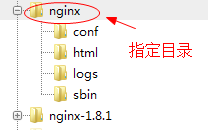
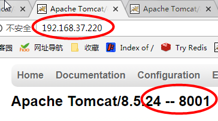
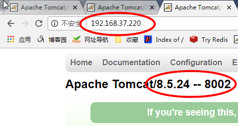

> [TOC]

# 第一章 环境搭建

依赖 gcc openssl-devel pcre-devel zlib-devel

1.1.安装依赖

    yum -y install gcc openssl-devel pcre-devel zlib-devel

1.2.上传nginx压缩包并解压

    tar -zxvf nginx-1.8.1.tar.gz 

1.3.进入目录并执行configure 命令

    cd nginx-1.8.1
    ./configure --prefix=/home/nginx 

1.4.编译安装

    make && make install

最终目录结构:


1.5.启动nginx访问
进入nginx安装目录(指定好的那个文件夹)中的sbin文件夹,然后启动nginx

    cd sbin/
    ./nginx 

浏览器访问: 虚拟机ip的80端口


Nginx默认监听80端口，当出现以上信息，说明安装启动成功。

1.6.常用命令
使用语法：`nginx -s 信号`
信号可以是下列之一：
* stop - 快速关机  
* quit - 优雅的关机
* reload - 重新加载配置文件  
* reopen - 重新打开日志文件

例如，要停止nginx进程并等待工作进程完成当前请求的服务，可以执行以下命令：

    ./nginx -s quit

# 第二章 负载均衡搭建

需要: 1个nginx 和 3个Tomcat服务

## 2.1.Tomcat配置

把Tomcat压缩包解压复制3份,并依次修改`conf/server.xml`中的端口配置

``` xml
<Server port="18001" shutdown="SHUTDOWN">
...
  <Service name="Catalina">
    <Connector port="8001" protocol="HTTP/1.1"
               connectionTimeout="20000"
               redirectPort="8441" />
```

 - 第一组: 18001	8001	8441 
 - 第二组: 18002	8002	8442 
 - 第三组: 18003	8003	8443

进入bin目录执行./startup.sh命令启动服务

## 2.2.nginx配置

修改`nginx.conf`文件

``` axapta
#user  nobody;
worker_processes  1;
error_log  logs/error.log;# 开启日志
pid        logs/nginx.pid;
...
    upstream lyf {
	server 192.168.37.220:8001; # 3个tomcat服务
	server 192.168.37.220:8002;
	server 192.168.37.220:8003;
    }
    server {
        listen       80;
        server_name  192.168.37.220;# 监听ip
        location / {
            proxy_pass   http://lyf;  # 设置代理
            index  index.html index.htm;
        }
}
```
标`lyf`的部分要对应,名称可以自由指定.

## 2.3.访问nginx

本机linux测试nginx地址为: `192.168.37.220` ,为了看到访问的是那台服务器,可以修改`webapps/ROOT/index.jsp`,标记为`8001 8002 8003`进行区别,多次访问结果:





# 第三章 负载均衡配置

nginx支持以下负载均衡机制

* 循环 - 对应用程序服务器的请求以循环方式分发
* 最少连接数 - 将下一个请求分配给活动连接数最少的服务器
* ip-hash - 哈希函数用于确定下一个请求（基于客户端的IP地址）应该选择哪个服务器

## 3.1.加权负载平衡

权重越大，分发到的请求就越多

``` nginx
upstream lyf {
	server 192.168.37.220:8001 weight=3; 
	server 192.168.37.220:8002;
	server 192.168.37.220:8003;
}
```

## 3.2.最少连接负载平衡

将新请求分发给不太繁忙的服务器，避免服务器过载

``` nginx
upstream lyf {
    least_conn;
	server 192.168.37.220:8001; 
	server 192.168.37.220:8002;
	server 192.168.37.220:8003;
}
```

## 3.3.会话持久性

使客户端的会话“粘滞”或“持久”,也就是说用户如果第一次访问被分发到8001,那么以后请求都在8001,而不会被再次分发到其他端口

``` nginx
upstream lyf {
    ip_hash;
	server 192.168.37.220:8001; 
	server 192.168.37.220:8002;
	server 192.168.37.220:8003;
}
```

## 3.4.访问控制

Nginx还可以对IP的访问进行控制，allow代表允许，deny代表禁止.

``` nginx
location / {
    deny 192.168.78.1;
    allow 192.168.78.0/24;
    allow 10.1.1.0/16;
    allow 192.168.1.0/32;
    deny all;
    proxy_pass http://lyf;
}
```

从上到下的顺序，先禁止了192.168.78.1，接下来允许了3个网段，其中包含了一个ipv6，最后未匹配的IP全部禁止访问.


  