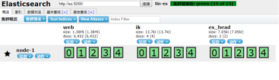
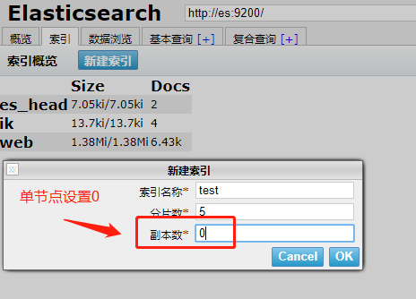
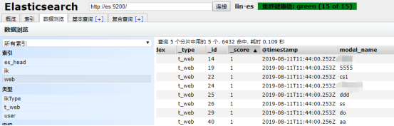

>[toc]


>环境: centos6 + elasticsearch-2.4.5 + mysql-5.1.37
>插件:elasticsearch-analysis-ik分词器, elasticsearch-head管理, Logstash和 logstash-input-jdbc

# 安装es和插件

## 安装环境
下载上传解压步骤跳过, https://www.elastic.co/cn/downloads/past-releases#elasticsearch
编辑配置文件
`vim ./config/elasticsearch.yml`
单节点es配置:
```
cluster.name: lin-es # 集群名
node.name: node-1 # 节点名
network.host: 192.168.37.151 # 主机ip
```
防止脑裂配置
```
discovery.zen.ping.multicast.enabled: false
discovery.zen.ping_timeout: 120s
client.transport.ping_timeout: 60s
discovery.zen.ping.unicast.hosts: ["192.168.37.151","192.168.37.152","192.168.37.153"]
```
创建新用户,如:es 启动es不能使用root账户
```
useradd es #创建用户
passwd es #修改密码
chown -R es:es elasticsearch-2.4.5 #授权目录给es用户
```
注意: 安装jdk路径不要放在/root目录下,会造成切换到es用户时,找不到java环境,放在/opt或者/usr都行(坑)
```
./bin/elasticsearch #启动
./bin/elasticsearch -d #后台启动
```
启动成功,访问: http://192.168.37.151:9200 

## 安装插件

elasticsearch-head: 管理es的web后台
https://github.com/mobz/elasticsearch-head
https://github.com/mobz/elasticsearch-head/releases

elasticsearch-analysis-ik: 中文分词器
https://github.com/medcl/elasticsearch-analysis-ik
https://github.com/medcl/elasticsearch-analysis-ik/releases

切换到es目录
安装head: `bin/plugin install file:/usr/soft/elasticsearch-head-master.zip`
安装ik: `bin/plugin install file:/usr/soft/elasticsearch-analysis-ik-1.10.5.zip`

安装成功,访问: http://192.168.37.151:9200/_plugin/head/


## 创建索引并使用


命令创建:` curl -XPUT http://192.168.37.151:9200/ik`

ES的动作是以http方法来决定的: 常用的http方法: GET/PUT/POST/DELETE
curl后跟的参数分别是：
* -X  指定http请求的方法
* -HEAD GET(查询) POST(更新) PUT(新增) DELETE(删除)
* -d  指定要传输的数据

设置分词器规则: 
`ik_max_word` 和 `ik_smart`的区别是,前者可以更细粒度的划分词汇,后者在查询效果上更占优势.
```
curl -XPOST http://192.168.37.151:9200/ik/ikType/_mapping -d'{
        "properties": {
            "content": {
                "type": "string",
                "index":"analyzed",
                "analyzer": "ik_max_word",
                "search_analyzer": "ik_smart"
            }
       }
}'
````
添加数据:
```
curl -XPOST http://192.168.37.151:9200/ik/ikType/1 -d'
{"content":"美国留给伊拉克的是个烂摊子吗"}
'
curl -XPOST http://192.168.37.151:9200/ik/ikType/2 -d'
{"content":"公安部：各地校车将享最高路权"}
'
curl -XPOST http://192.168.37.151:9200/ik/ikType/3 -d'
{"content":"中韩渔警冲突调查：韩警平均每天扣1艘中国渔船"}
'
curl -XPOST http://192.168.37.151:9200/ik/ikType/4 -d'
{"content":"中国驻洛杉矶领事馆遭亚裔男子枪击 嫌犯已自首"}
'
```
查询数据:
```
curl -XGET http://192.168.37.151:9200/ik/ikType/_search?pretty -d'{
    "query" : { "term" : { "content" : "中国" }}
}'
```
分析数据:
```
curl -XPOST http://192.168.37.151:9200/ik/ikType/_analyze?pretty -d'{
  "analyzer": "ik_max_word",
  "text": "美国留给伊拉克的是个烂摊子吗"
}'
```
结果:
```
{
	"tokens": [{
			"token": "美国",
			"start_offset": 0,
			"end_offset": 2,
			"type": "CN_WORD",
			"position": 0
		},
		{
			"token": "留给",
			"start_offset": 2,
			"end_offset": 4,
			"type": "CN_WORD",
			"position": 1
		},
		{
			"token": "伊拉克",
			"start_offset": 4,
			"end_offset": 7,
			"type": "CN_WORD",
			"position": 2
		},
		{
			"token": "伊",
			"start_offset": 4,
			"end_offset": 5,
			"type": "CN_WORD",
			"position": 3
		},
		{
			"token": "拉",
			"start_offset": 5,
			"end_offset": 6,
			"type": "CN_CHAR",
			"position": 4
		},
		{
			"token": "克",
			"start_offset": 6,
			"end_offset": 7,
			"type": "CN_WORD",
			"position": 5
		},
		{
			"token": "个",
			"start_offset": 9,
			"end_offset": 10,
			"type": "CN_CHAR",
			"position": 6
		},
		{
			"token": "烂摊子",
			"start_offset": 10,
			"end_offset": 13,
			"type": "CN_WORD",
			"position": 7
		},
		{
			"token": "摊子",
			"start_offset": 11,
			"end_offset": 13,
			"type": "CN_WORD",
			"position": 8
		},
		{
			"token": "摊",
			"start_offset": 11,
			"end_offset": 12,
			"type": "CN_WORD",
			"position": 9
		},
		{
			"token": "子",
			"start_offset": 12,
			"end_offset": 13,
			"type": "CN_CHAR",
			"position": 10
		},
		{
			"token": "吗",
			"start_offset": 13,
			"end_offset": 14,
			"type": "CN_CHAR",
			"position": 11
		}
	]
}
```

# 安装Logstash导入数据

## 安装Logstash

官网: https://www.elastic.co/products/logstash
下载解压执行安装:
`bin/logstash -e 'input { stdin {} } output { stdout {} }'`

## 安装logstash-input-jdbc插件

插件使用ruby语言开发,所以要安装ruby环境
`yum install ruby -y`
切换目录并安装,等待(^_^)
```
bin/logstash-plugin install logstash-input-jdbc
或者跳过检查直接安装
bin/logstash-plugin install --no-verify logstash-input-jdbc
```

## 实时同步mysql数据

提前准备**mysql驱动jar**包,创建**jdbc.conf**和**jdbc.sql**文件

`jdbc.conf`
```
input {
    stdin {
    }
    jdbc {
      # 数据库地址  端口  数据库名
      jdbc_connection_string => "jdbc:mysql://localhost:3306/es"
      # 数据库用户名
      jdbc_user => "root"
      # 数据库密码
      jdbc_password => "123456"
      # mysql java驱动地址 
      jdbc_driver_library => "/usr/soft/logstash-5.3.2/lib/mysql-connector-java-5.1.8.jar"
      jdbc_driver_class => "com.mysql.jdbc.Driver"
      jdbc_paging_enabled => "true"
      jdbc_page_size => "50000"
      # sql 语句文件
      statement_filepath => "/usr/soft/logstash-5.3.2/jdbc.sql"
      # 定时字段 各字段含义（由左至右）分、时、天、月、年，全部为*默认含义为每分钟都更新
      schedule => "* * * * *"
    }
}

filter {
    json {
        source => "message"
        remove_field => ["message"]
    }
}

output {
    elasticsearch {
        hosts => ["192.168.37.151:9200"]
        # index名称
        index => "web"
        # type名称
        document_type => "t_web"
        # 文档_id
        document_id => "%{id}"
    }
    stdout {
        codec => json_lines
    }
}
```
`jdbc.sql`
```
SELECT
id,
name,
domain
FROM
web
```
执行导入
`bin/logstash -f jdbc.conf`



# 整合java
v2.4.x版本
https://www.cnblogs.com/yzlsthl/p/9096541.html
https://www.cnblogs.com/anxbb/p/9383221.html
```
 <dependency>
    <groupId>org.elasticsearch</groupId>
    <artifactId>elasticsearch</artifactId>
    <version>2.4.5</version>
</dependency>
```

``` java
package es.utli;

import org.elasticsearch.action.search.SearchResponse;
import org.elasticsearch.client.transport.TransportClient;
import org.elasticsearch.cluster.node.DiscoveryNode;
import org.elasticsearch.common.settings.Settings;
import org.elasticsearch.common.transport.InetSocketTransportAddress;
import org.elasticsearch.index.query.QueryBuilder;
import org.elasticsearch.index.query.QueryBuilders;
import org.elasticsearch.search.SearchHit;

import java.net.InetAddress;
import java.net.UnknownHostException;
import java.util.ArrayList;
import java.util.HashMap;
import java.util.List;
import java.util.Map;

/**
 * Created by lyf on 2020/4/20.
 * ES v2.5.4
 */
public class ESUtil {
    static TransportClient client;

    static {
        Map<String, String> map = new HashMap<String, String>();
        map.put("cluster.name", "lin-es");
        Settings.Builder settings = Settings.builder().put(map);
        try {
            client = TransportClient.builder().settings(settings).build()
                    .addTransportAddress(
                            new InetSocketTransportAddress(InetAddress.getByName("es"),
                            Integer.parseInt("9300")));
        } catch (UnknownHostException e) {
            e.printStackTrace();
        }
    }

    public static void info() {
        List<DiscoveryNode> nodes = client.connectedNodes();
        for (DiscoveryNode node : nodes) {
            System.out.println(node.getHostAddress());
        }
    }

    /**
     * 查询
     * @param indexName 索引名称
     * @param typeName  索引类型
     * @param filedName 列名
     * @param value     查询内容
     * @param pageIndex
     * @param pageSize
     * @return
     */
    public static List<Map<String, Object>> query(String indexName, String typeName,
                                           String filedName, String value,
                                           Integer pageIndex,
                                           Integer pageSize) {

        QueryBuilder qb = QueryBuilders.matchPhraseQuery(filedName, value);
        SearchResponse response = client.prepareSearch(indexName)
                .setTypes(typeName)
                .setQuery(qb)
                .setFrom(pageIndex)
                .setSize(pageSize)
                .execute()
                .actionGet();
        List<Map<String, Object>> result = new ArrayList<>();
        for (SearchHit hit : response.getHits().getHits()) {
            result.add(hit.getSource());
        }
        return result;
    }
}
```


https://www.jianshu.com/p/fbe11ac6d204
https://www.liangzl.com/get-article-detail-3366.html
https://esdoc.bbossgroups.com/#/spring-booter-with-bboss

参考:
- https://www.jianshu.com/p/40e33c84693d
- https://blog.csdn.net/u013850277/article/details/88753348


