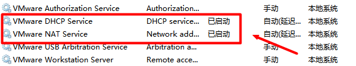

在VMware中安装Linux虚拟机后（比如CentOS6.*），不能访问网络，需要配置静态IP。虚拟机中推荐使用NET模式进行网络连接，在虚拟机的工具栏点击`编辑`>`虚拟网络编辑器`>`NET模式`，查看子网IP，比如：`192.168.52.0`。
这个很重要，每个人的不一样，接下来的配置就需要用到这个IP。

1.编辑 ifcfg-eth0

```
vi  /etc/sysconfig/network-scripts/ifcfg-eth0
```

2.添加配置

按`i` 进入文本编辑模式，出现游标，左下角会出现`INSERT`，即可以编辑。添加以下配置，其他删除掉：

```
DEVICE=eth0     #网卡设备名,请勿修改名字
TYPE=Ethernet   #网络类型，以太网
BOOTPROTO=static   #启用静态IP地址
ONBOOT=yes  #开启自动启用网络连接
IPADDR=192.168.52.100  #设置IP地址（末尾从100~200中选择一个，IP不冲突就行）
NETMASK=255.255.255.0  #设置子网掩码
GATEWAY=192.168.52.2   #设置网关
DNS1=114.114.114.114  #设置备DNS
```

按`ESC`退出编辑模式

```
:wq  #保存退出
```

3.重启服务

```
service network restart  #重启网络连接
```

4.查看IP

```
ifconfig  #查看IP地址
```

5.验证是否配置成功

```
ping  www.baidu.com  #ping一下外网

结果：
[root@root sbin]# ping www.baidu.com
PING www.a.shifen.com (115.239.210.27) 56(84) bytes of data.
64 bytes from 115.239.210.27: icmp_seq=1 ttl=128 time=44.2 ms
64 bytes from 115.239.210.27: icmp_seq=2 ttl=128 time=49.7 ms
64 bytes from 115.239.210.27: icmp_seq=3 ttl=128 time=36.2 ms
64 bytes from 115.239.210.27: icmp_seq=4 ttl=128 time=43.3 ms
64 bytes from 115.239.210.27: icmp_seq=5 ttl=128 time=14.7 ms
```

能ping通代表配置成功，如果不成功查看一下**单词拼写**，或者**重置一下虚拟机的NET连接**接配置。但是,每次启动虚拟机网络就不能访问,这时需要开启两个服务,最好设置为自动启动!

