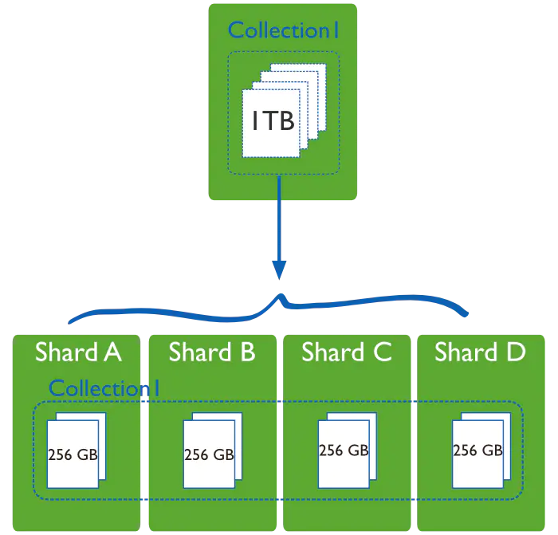
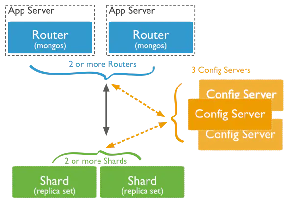
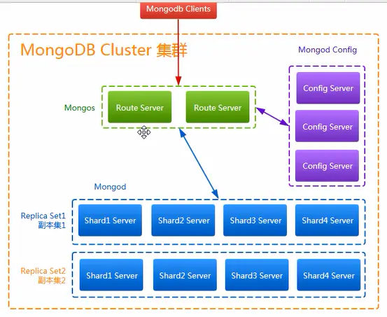
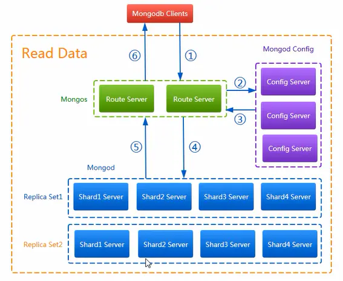
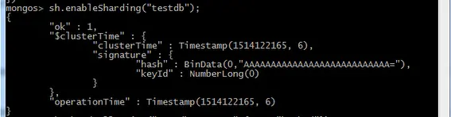
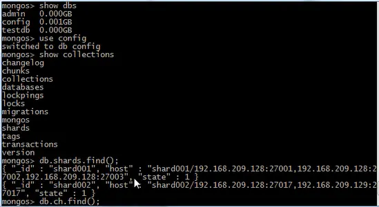
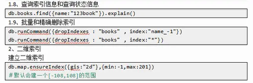

> 原文地址: https://www.jianshu.com/p/e7e70ca7c7e5

---

# 1. 集群架构(生产可用)

## MongoDB机器信息

| 192.168.252.121 | 192.168.252.122 | 192.168.252.123 |
| --- | --- | --- |
| mongos | mongos | mongos |
| config server | config server | config server |
| shard server1 主节点 | shard server1 副节点 | shard server1 仲裁 |
| shard server2 仲裁 | shard server2 主节点 | shard server2 副节点 |
| shard server3 副节点 | shard server3 仲裁 | shard server3 主节点 |

端口分配：

```
mongos：20000
config：21000
shard1：27001
shard2：27002
shard3：27003

```

## Sharding分片技术

当数据量比较大的时候，我们需要把数据分片运行在不同的机器中，以降低CPU、内存和IO的压力，Sharding就是数据库分片技术。

MongoDB分片技术类似MySQL的水平切分和垂直切分，数据库主要由两种方式做Sharding：垂直扩展和横向切分。

垂直扩展的方式就是进行集群扩展，添加更多的CPU，内存，磁盘空间等。

横向切分则是通过数据分片的方式，通过集群统一提供服务：



**（1）MongoDB的Sharding架构**



**（2）MongoDB分片架构中的角色**

**A.数据分片（Shards）**

用来保存数据，保证数据的高可用性和一致性。可以是一个单独的`mongod`实例，也可以是一个副本集。

在生产环境下Shard一般是一个Replica Set，以防止该数据片的单点故障。所有Shard中有一个PrimaryShard，里面包含未进行划分的数据集合：


**B.查询路由（Query Routers）**

路由就是mongos的实例，客户端直接连接mongos，由mongos把读写请求路由到指定的Shard上去。

一个Sharding集群，可以有一个mongos，也可以有多mongos以减轻客户端请求的压力。

**C.配置服务器（Config servers）**

保存集群的元数据（metadata），包含各个Shard的路由规则。

**Sharding分片技术(混合模式)高可用方案的大体架构图：**



**Sharding分片技术(混合模式)高可用方案架构下向mongodb写数据的流程图：**


**Sharding分片技术(混合模式)高可用方案架构下向mongodb读数据的流程图：**



> **以下所有配置在3台服务器上都要进行配置**

# 2. 下载安装

```
wget https://fastdl.mongodb.org/linux/mongodb-linux-x86_64-amazon-3.6.2.tgz
tar -xzvf mongodb-linux-x86_64-amazon-3.6.2.tgz  -C /usr/local/

```

所有版本二进制文件,自行下载

```
https://www.mongodb.org/dl/win32/x86_64-2008plus-ssl?_ga=2.87139544.1567998244.1517190032-1153843332.1517190032&_gac=1.204211492.1517212002.EAIaIQobChMI44v9_9b82AIV1AcqCh0lcABIEAAYASAAEgKI1_D_BwE

```

改名

```
cd /usr/local/
mv  mongodb-linux-x86_64-amazon-3.6.2 mongodb

```

分别在每台机器建立conf、mongos、config、shard1、shard2、shard3六个目录，因为mongos不存储数据，只需要建立日志文件目录即可。

```
mkdir -p /usr/local/mongodb/conf \
mkdir -p /usr/local/mongodb/mongos/log \
mkdir -p /usr/local/mongodb/config/data \
mkdir -p /usr/local/mongodb/config/log \
mkdir -p /usr/local/mongodb/shard1/data \
mkdir -p /usr/local/mongodb/shard1/log \
mkdir -p /usr/local/mongodb/shard2/data \
mkdir -p /usr/local/mongodb/shard2/log \
mkdir -p /usr/local/mongodb/shard3/data \
mkdir -p /usr/local/mongodb/shard3/log

```

配置环境变量

```
vi /etc/profile
# MongoDB 环境变量内容
export MONGODB_HOME=/usr/local/mongodb
export PATH=$MONGODB_HOME/bin:$PATH

```

使立即生效

```
source /etc/profile

```

# 3. 配置config server服务器

mongodb3.4以后要求配置服务器也创建副本集，不然集群搭建不成功。

添加配置文件

```
vi /usr/local/mongodb/conf/config.conf

## 配置文件内容
pidfilepath = /usr/local/mongodb/config/log/configsrv.pid
dbpath = /usr/local/mongodb/config/data
logpath = /usr/local/mongodb/config/log/congigsrv.log
logappend = true

bind_ip = 0.0.0.0
port = 21000
fork = true

#declare this is a config db of a cluster;
configsvr = true

#副本集名称
replSet = configs

#设置最大连接数
maxConns = 20000

```

启动三台服务器的config server

```
mongod -f /usr/local/mongodb/conf/config.conf

```

登录任意一台配置服务器，初始化配置副本集
连接 MongoDB

```
mongo --port 21000

```

config 变量

```
config = {
    _id : "configs",
    members : [
    {_id : 0, host : "192.168.252.121:21000" },
    {_id : 1, host : "192.168.252.122:21000" },
    {_id : 2, host : "192.168.252.123:21000" }
    ]
}

```

初始化副本集

```
rs.initiate(config)

```

其中，"_id" : "configs"应与配置文件中配置的 replicaction.replSetName 一致，"members" 中的 "host" 为三个节点的 ip 和 port
响应内容如下

```
> config = {
... _id : "configs",
... members : [
... {_id : 0, host : "192.168.252.121:21000" },
... {_id : 1, host : "192.168.252.122:21000" },
... {_id : 2, host : "192.168.252.123:21000" }
... ]
... }
{
    "_id" : "configs",
    "members" : [
        {
            "_id" : 0,
            "host" : "192.168.252.121:21000"
        },
        {
            "_id" : 1,
            "host" : "192.168.252.122:21000"
        },
        {
            "_id" : 2,
            "host" : "192.168.252.123:21000"
        }
    ]
}
> rs.initiate(config);
{
    "ok" : 1,
    "operationTime" : Timestamp(1517369899, 1),
    "$gleStats" : {
        "lastOpTime" : Timestamp(1517369899, 1),
        "electionId" : ObjectId("000000000000000000000000")
    },
    "$clusterTime" : {
        "clusterTime" : Timestamp(1517369899, 1),
        "signature" : {
            "hash" : BinData(0,"AAAAAAAAAAAAAAAAAAAAAAAAAAA="),
            "keyId" : NumberLong(0)
        }
    }
}
configs:SECONDARY>

```

此时会发现终端上的输出已经有了变化。

```
//从单个一个
>
//变成了
configs:SECONDARY>

```

查询状态

```
configs:SECONDARY> rs.status()

```

# 4. 配置分片副本集

## 第一分片副本集

配置文件

```
vi /usr/local/mongodb/conf/shard1.conf

#配置文件内容
#——————————————–
pidfilepath = /usr/local/mongodb/shard1/log/shard1.pid
dbpath = /usr/local/mongodb/shard1/data
logpath = /usr/local/mongodb/shard1/log/shard1.log
logappend = true

bind_ip = 0.0.0.0
port = 27001
fork = true

#副本集名称
replSet = shard1

#declare this is a shard db of a cluster;
shardsvr = true

#设置最大连接数
maxConns = 20000

```

启动三台服务器的shard1 server

```
mongod -f /usr/local/mongodb/conf/shard1.conf

```

登陆任意一台服务器，初始化副本集(除了192.168.252.123)
连接 MongoDB

```
mongo --port 27001

```

使用admin数据库

```
use admin

```

定义副本集配置

```
config = {
    _id : "shard1",
     members : [
         {_id : 0, host : "192.168.252.121:27001" },
         {_id : 1, host : "192.168.252.122:27001" },
         {_id : 2, host : "192.168.252.123:27001" , arbiterOnly: true }
     ]
 }

```

初始化副本集配置

```
rs.initiate(config)

```

响应内容如下

```
> use admin
switched to db admin
> config = {
...     _id : "shard1",
...      members : [
...          {_id : 0, host : "192.168.252.121:27001" },
...          {_id : 1, host : "192.168.252.122:27001" },
...          {_id : 2, host : "192.168.252.123:27001" , arbiterOnly: true }
...      ]
...  }
{
    "_id" : "shard1",
    "members" : [
        {
            "_id" : 0,
            "host" : "192.168.252.121:27001"
        },
        {
            "_id" : 1,
            "host" : "192.168.252.122:27001"
        },
        {
            "_id" : 2,
            "host" : "192.168.252.123:27001",
            "arbiterOnly" : true
        }
    ]
}
> rs.initiate(config)
{ "ok" : 1 }

```

此时会发现终端上的输出已经有了变化。

```
//从单个一个
>
//变成了
shard1:SECONDARY>

```

查询状态

```
shard1:SECONDARY> rs.status()

```

## 第二分片副本集

配置文件

```
vi /usr/local/mongodb/conf/shard2.conf

#配置文件内容
#——————————————–
pidfilepath = /usr/local/mongodb/shard2/log/shard2.pid
dbpath = /usr/local/mongodb/shard2/data
logpath = /usr/local/mongodb/shard2/log/shard2.log
logappend = true

bind_ip = 0.0.0.0
port = 27002
fork = true

#副本集名称
replSet=shard2

#declare this is a shard db of a cluster;
shardsvr = true

#设置最大连接数
maxConns=20000

```

启动三台服务器的shard2 server

```
mongod -f /usr/local/mongodb/conf/shard2.conf

```

连接 MongoDB

```
mongo --port 27002

```

使用admin数据库

```
use admin

```

定义副本集配置

```
config = {
    _id : "shard2",
     members : [
         {_id : 0, host : "192.168.252.121:27002"  , arbiterOnly: true },
         {_id : 1, host : "192.168.252.122:27002" },
         {_id : 2, host : "192.168.252.123:27002" }
     ]
 }

```

初始化副本集配置

```
rs.initiate(config)

```

响应内容如下

```
> use admin
switched to db admin
> config = {
...     _id : "shard2",
...      members : [
...          {_id : 0, host : "192.168.252.121:27002"  , arbiterOnly: true },
...          {_id : 1, host : "192.168.252.122:27002" },
...          {_id : 2, host : "192.168.252.123:27002" }
...      ]
...  }
{
    "_id" : "shard2",
    "members" : [
        {
            "_id" : 0,
            "host" : "192.168.252.121:27002",
            "arbiterOnly" : true
        },
        {
            "_id" : 1,
            "host" : "192.168.252.122:27002"
        },
        {
            "_id" : 2,
            "host" : "192.168.252.123:27002"
        }
    ]
}
> rs.initiate(config)
{ "ok" : 1 }
shard2:SECONDARY> rs.status()

```

## 第三分片副本集

```
vi /usr/local/mongodb/conf/shard3.conf

#配置文件内容
#——————————————–
pidfilepath = /usr/local/mongodb/shard3/log/shard3.pid
dbpath = /usr/local/mongodb/shard3/data
logpath = /usr/local/mongodb/shard3/log/shard3.log
logappend = true

bind_ip = 0.0.0.0
port = 27003
fork = true

#副本集名称
replSet=shard3

#declare this is a shard db of a cluster;
shardsvr = true

#设置最大连接数
maxConns=20000

```

启动三台服务器的shard3 server

```
mongod -f /usr/local/mongodb/conf/shard3.conf

```

登陆任意一台服务器，初始化副本集(除了192.168.252.121)

```
mongo --port 27003

```

使用admin数据库

```
use admin

```

定义副本集配置

```
config = {
    _id : "shard3",
     members : [
         {_id : 0, host : "192.168.252.121:27003" },
         {_id : 1, host : "192.168.252.122:27003" , arbiterOnly: true},
         {_id : 2, host : "192.168.252.123:27003" }
     ]
 }

```

初始化副本集配置

```
rs.initiate(config)

```

响应内容如下

```
> use admin
switched to db admin
> config = {
...     _id : "shard3",
...      members : [
...          {_id : 0, host : "192.168.252.121:27003" },
...          {_id : 1, host : "192.168.252.122:27003" , arbiterOnly: true},
...          {_id : 2, host : "192.168.252.123:27003" }
...      ]
...  }
{
    "_id" : "shard3",
    "members" : [
        {
            "_id" : 0,
            "host" : "192.168.252.121:27003"
        },
        {
            "_id" : 1,
            "host" : "192.168.252.122:27003",
            "arbiterOnly" : true
        },
        {
            "_id" : 2,
            "host" : "192.168.252.123:27003"
        }
    ]
}
> rs.initiate(config)
{ "ok" : 1 }
shard3:SECONDARY> rs.status()

```

# 5. 配置mongos路由服务器

（三台机器）先启动配置服务器和分片服务器,后启动路由实例启动路由实例:

```
vi /usr/local/mongodb/conf/mongos.conf

#内容
pidfilepath = /usr/local/mongodb/mongos/log/mongos.pid
logpath = /usr/local/mongodb/mongos/log/mongos.log
logappend = true

bind_ip = 0.0.0.0
port = 20000
fork = true

#监听的配置服务器,只能有1个或者3个 configs为配置服务器的副本集名字
configdb = configs/192.168.252.121:21000,192.168.252.122:21000,192.168.252.123:21000

#设置最大连接数
maxConns = 20000

```

启动三台服务器的mongos server

```
mongos -f /usr/local/mongodb/conf/mongos.conf

```

## 串联路由服务器

目前搭建了mongodb配置服务器、路由服务器，各个分片服务器，不过应用程序连接到mongos路由服务器并不能使用分片机制，还需要在程序里设置分片配置，让分片生效。
登陆任意一台mongos

```
mongo --port 20000

```

使用admin数据库

```
use  admin

```

串联路由服务器与分配副本集

```
sh.addShard("shard1/192.168.252.121:27001,192.168.252.122:27001,192.168.252.123:27001");
sh.addShard("shard2/192.168.252.121:27002,192.168.252.122:27002,192.168.252.123:27002");
sh.addShard("shard3/192.168.252.121:27003,192.168.252.122:27003,192.168.252.123:27003");

```

查看集群状态

```
sh.status()

```

响应内容如下

```
mongos> sh.status()
--- Sharding Status --- 
  sharding version: {
    "_id" : 1,
    "minCompatibleVersion" : 5,
    "currentVersion" : 6,
    "clusterId" : ObjectId("5a713a37d56e076f3eb47acf")
  }
  shards:
        {  "_id" : "shard1",  "host" : "shard1/192.168.252.121:27001,192.168.252.122:27001",  "state" : 1 }
        {  "_id" : "shard2",  "host" : "shard2/192.168.252.122:27002,192.168.252.123:27002",  "state" : 1 }
        {  "_id" : "shard3",  "host" : "shard3/192.168.252.121:27003,192.168.252.123:27003",  "state" : 1 }
  active mongoses:
        "3.6.2" : 3
  autosplit:
        Currently enabled: yes
  balancer:
        Currently enabled:  yes
        Currently running:  no
        Failed balancer rounds in last 5 attempts:  0
        Migration Results for the last 24 hours: 
                No recent migrations
  databases:
        {  "_id" : "config",  "primary" : "config",  "partitioned" : true }

mongos>

```

## 启用集合分片生效

目前配置服务、路由服务、分片服务、副本集服务都已经串联起来了，但我们的目的是希望插入数据，数据能够自动分片。连接在mongos上，准备让指定的数据库、指定的集合分片生效。
登陆任意一台mongos

```
mongo --port 20000

```

使用admin数据库

```
use  admin

```

指定testdb分片生效，如下图：

```
db.runCommand( { enablesharding :"testdb"});

或

mongos> sh.enablesharding("testdb")

```



指定数据库里需要分片的集合和片键，哈希name分片，如下图：

```
db.runCommand( { shardcollection : "testdb.table1",key : {"name": "hashed"} } );

或

mongos> sh.shardcollection("testdb.table1", {"name": "hashed"})

```


通过命令查看mongodb路由服务器上的shards集合会有数据展示，如下图：




通过命令查看mongodb路由服务器上的chunks集合会有数据展示，如下图：


我们设置testdb的 table1 表需要分片，根据 id 或name自动分片到 shard1 ，shard2，shard3 上面去。要这样设置是因为不是所有mongodb 的数据库和表 都需要分片！
测试分片配置结果
连接 MongoDB 路由服务

```
mongo  127.0.0.1:20000

```

切换到 testdb 数据库

```
use  testdb;

```

插入测试数据

```
for(i=1;i<=100000;i++){db.table1.insert({"id":i,"name":"penglei"})};

```

总条数

```
db.table1.aggregate([{$group : {_id : "$name", totle : {$sum : 1}}}])

```

查看分片情况如下

*   shard1： "count": 33755

*   shard2： "count": 33143,

*   shard3： "count": 33102

结论数据基本均匀

```
db.table1.stats();

```

```
mongos> db.table1.stats();
{
    "sharded": true,
    "capped": false,
    "ns": "testdb.table1",
    "count": 100000,
    "size": 5200000,
    "storageSize": 1519616,
    "totalIndexSize": 3530752,
    "indexSizes": {
        "_id_": 892928,
        "id_hashed": 2637824
    },
    "avgObjSize": 52,
    "nindexes": 2,
    "nchunks": 6,
    "shards": {
        "shard1": {
            "ns": "testdb.table1",
            "size": 1755260,
            "count": 33755,
            "avgObjSize": 52,
            "storageSize": 532480,
            "capped": false,
            "wiredTiger": {
            ...省略很多
            }
        },
        "shard2": {
            "ns": "testdb.table1",
            "size": 1723436,
            "count": 33143,
            "avgObjSize": 52,
            "storageSize": 479232,
            "capped": false,
            "wiredTiger": {
            ...省略很多
            }
        },
        "shard3": {
            "ns": "testdb.table1",
            "size": 1721304,
            "count": 33102,
            "avgObjSize": 52,
            "storageSize": 507904,
            "capped": false,
            "wiredTiger": {
            ...省略很多
            }
        }
    },
    "ok": 1,
    "$clusterTime": {
        "clusterTime": Timestamp(1517488062, 350),
        "signature": {
            "hash": BinData(0, "AAAAAAAAAAAAAAAAAAAAAAAAAAA="),
            "keyId": NumberLong(0)
        }
    },
    "operationTime": Timestamp(1517488062, 350)
}
mongos> 

```

分组查看总数量是：100000

```
mongos> db.table1.aggregate([{$group : {_id : "$name", totle : {$sum : 1}}}])
{ "_id" : "penglei", "totle" : 100000 }
mongos>

```

# 6. 后期运维

参考

手把手教你 MongoDB 的安装与详细使用（一）

[http://www.ymq.io/2018/01/26/MongoDB-1/](https://link.jianshu.com?t=http%3A%2F%2Fwww.ymq.io%2F2018%2F01%2F26%2FMongoDB-1%2F)

手把手教你 MongoDB 的安装与详细使用（二）

[http://www.ymq.io/2018/01/29/MongoDB-2/](https://link.jianshu.com?t=http%3A%2F%2Fwww.ymq.io%2F2018%2F01%2F29%2FMongoDB-2%2F)

创建索引

```
db.table1.createIndex({"name":1})
db.table1.getIndexes()

```





# 7. 启动说明

mongodb的启动顺序是，先启动配置服务器，在启动分片，最后启动mongos.

```
mongod -f /usr/local/mongodb/conf/config.conf
mongod -f /usr/local/mongodb/conf/shard1.conf
mongod -f /usr/local/mongodb/conf/shard2.conf
mongod -f /usr/local/mongodb/conf/shard3.conf
mongod -f /usr/local/mongodb/conf/mongos.conf

```

启动报错

```
about to fork child process, waiting until server is ready for connections.
forked process: 1303
child process started successfully, parent exiting
[root@node1 ~]# mongod -f /usr/local/mongodb/conf/shard1.conf
about to fork child process, waiting until server is ready for connections.
forked process: 1384

```

删除 mongod.lock

```
cd /usr/local/mongodb/shard1/data
rm -rf mongod.lock

```

关闭

```
#debian、ubuntu系统下：

apt-get install psmisc

#centos或、rhel系统下：

yum install psmisc

```

关闭时，直接killall杀掉所有进程

```
killall mongod
killall mongos
```

**参考：**

**[百度百科-高可用集群](http://baike.baidu.com/view/3878489.htm)**

**[MongoDB 教程](http://www.runoob.com/mongodb/mongodb-tutorial.html)**

**<https://www.cnblogs.com/binyue/p/5901328.html>**

Runoob 教程：[http://www.runoob.com/mongodb/mongodb-tutorial.html](https://link.jianshu.com?t=http%3A%2F%2Fwww.runoob.com%2Fmongodb%2Fmongodb-tutorial.html)

MongoDB 官网地址：[https://www.mongodb.com](https://link.jianshu.com?t=https%3A%2F%2Fwww.mongodb.com)

MongoDB 官方英文文档：[https://docs.mongodb.com/manual](https://link.jianshu.com?t=https%3A%2F%2Fdocs.mongodb.com%2Fmanual)

MongoDB 各平台下载地址：[https://www.mongodb.com/download-center#community](https://link.jianshu.com?t=https%3A%2F%2Fwww.mongodb.com%2Fdownload-center%23community)

MongoDB 安装 [https://docs.mongodb.com/manual/tutorial/install-mongodb-enterprise-on-ubuntu](https://link.jianshu.com?t=https%3A%2F%2Fdocs.mongodb.com%2Fmanual%2Ftutorial%2Finstall-mongodb-enterprise-on-ubuntu)

mongodb高可用具体配置参考：

Mongodb主从复制 及 副本集＋分片集群梳理：
<https://www.cnblogs.com/nulige/p/7613721.html>

搭建 MongoDB分片（sharding） / 分区 / 集群环境：<https://www.jianshu.com/p/66e7ba201545>