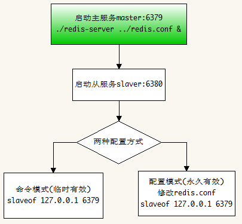
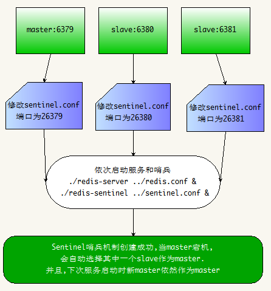
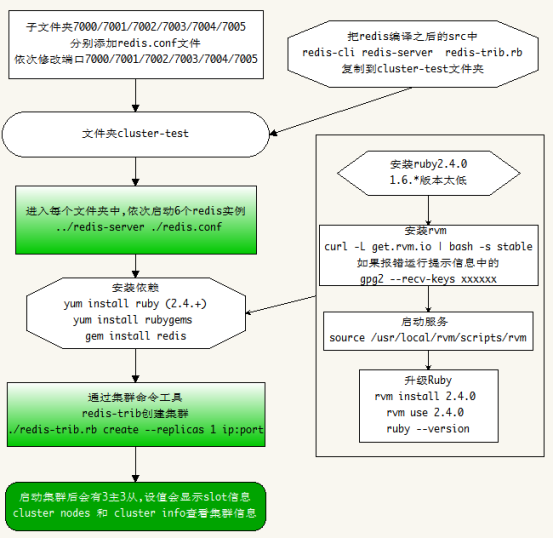

> [TOC]

1.主从: 国王和丞相,国王权力大(读写),丞相权利小(读)
2.哨兵: 国王和王子,国王死了(主服务挂掉),王子继位(从服务变主服务)
3.集群: 国王和国王,一个国王死了(节点挂掉),其他国王还活着,世界还没毁灭

# 主从配置

流程:
1. 复制多份redis编译之后(make)的文件,分别命名为: xxx-6379 xxx-6380 xxx-6381 ...
2. 开启6379服务和 6380服务
方式一: 在6380的客户端输入:`slaveof 127.0.0.1 6379`即可(一次性)
方式二: 在6380的redis.conf文件中配置(永久性)
3. 使用`info replication`查看信息

# 哨兵配置

流程:
1.配置好主从后, 修改sentinel.conf文件

``` vala
#sentinel端口
port 26379
#工作路径，注意路径不要和主重复
dir "/usr/local/redis-6379"
# 守护进程模式
daemonize yes
#关闭保护模式
protected-mode no
# 指明日志文件名
logfile "./sentinel.log"
#哨兵监控的master，主从配置一样，这里只用输入redis主节点的ip/port和法定人数。
sentinel monitor mymaster 192.168.125.128 6379 1
# master或slave多长时间（默认30秒）不能使用后标记为s_down状态。
sentinel down-after-milliseconds mymaster 3000
#若sentinel在该配置值内未能完成failover操作（即故障时master/slave自动切换），则认为本次failover失败。
sentinel failover-timeout mymaster 18000
#设置master和slaves验证密码
sentinel auth-pass mymaster 123456 
#指定了在执行故障转移时， 最多可以有多少个从服务器同时对新的主服务器进行同步
sentinel parallel-syncs mymaster 1
```

2.启动主服务和从服务, 开始从服务的哨兵进程
方式一：`redis-sentinel /path/to/sentinel.conf`（推荐，这种方式启动和redis实例没有任何关系）
方式二：`redis-server /path/to/sentinel.conf --sentinel`

3.当主服务挂掉,会有一个从服务自动变为主服务

# 集群配置


流程:
1.创建文件夹cluster-test以及子文件夹7000/7001/7002/7003/7004/7005
2.每个文件夹中创建一份redis.conf文件,端口依次为7000/7001/7002/7003/7004/7005

redis.conf最简配置:
``` yaml
port 7000
daemonize yes
cluster-enabled yes
cluster-config-file nodes.conf
cluster-node-timeout 5000
appendonly yes
```

3.把redis编译之后的`src`中`redis-cli redis-server  redis-trib.rb`复制到`cluster-test`文件夹
4.进入每个文件夹中,依次启动6个redis实例 `../redis-server ./redis.conf`
5.通过集群命令工具redis-trib(ruby编写)创建集群,需要安装ruby环境

``` shell
$ yum install ruby 
$ yum install rubygems 
$ gem install redis
```

6.安装ruby2.4.0(yum install ruby 是1.6.*版本太低)
1)安装rvm 

``` shell
$ curl -L get.rvm.io | bash -s stable
```
如果报错运行提示信息中的`gpg2 --recv-keys xxxxxx`

2)启动服务 

``` shell
$ source /usr/local/rvm/scripts/rvm
```

3)查看rvm库中已知ruby版本

``` shell
$ rvm list known
```

4)升级Ruby

``` vala
#安装ruby 
rvm install 2.4.0 
#使用新版本 
rvm use 2.4.0 
#移除旧版本 
rvm remove 2.0.0 
#查看当前版本 
ruby --version
```

7.安装gem 

``` shell
$ gem install redis
```

8.执行redis-trib.rb命令

``` shell
$ ./redis-trib.rb create --replicas 1 127.0.0.1:7000 127.0.0.1:7001 127.0.0.1:7002 127.0.0.1:7003 127.0.0.1:7004 127.0.0.1:7005
[root@root cluster-test]# ./redis-trib.rb create --replicas 1 127.0.0.1:7000 127.0.0.1:7001 \
> 127.0.0.1:7002 127.0.0.1:7003 127.0.0.1:7004 127.0.0.1:7005
>>> Creating cluster
>>> Performing hash slots allocation on 6 nodes...
Using 3 masters:
127.0.0.1:7000
127.0.0.1:7001
127.0.0.1:7002
Adding replica 127.0.0.1:7004 to 127.0.0.1:7000
Adding replica 127.0.0.1:7005 to 127.0.0.1:7001
Adding replica 127.0.0.1:7003 to 127.0.0.1:7002
>>> Trying to optimize slaves allocation for anti-affinity
[WARNING] Some slaves are in the same host as their master
M: 033d0dbea959fb15a3a27552d18dbb623985a180 127.0.0.1:7000
   slots:0-5460 (5461 slots) master
M: 77812723f46f25191eeed04a42303ae83bec66be 127.0.0.1:7001
   slots:5461-10922 (5462 slots) master
M: 17fccfc10108c81301a501ec8eaccfb57541fa87 127.0.0.1:7002
   slots:10923-16383 (5461 slots) master
S: 89b452f2d5553bef131152932c5725429b0c4aa1 127.0.0.1:7003
   replicates 77812723f46f25191eeed04a42303ae83bec66be
S: 095f3d47fa5788ddd94a4c962f7e02fe79a6e8b1 127.0.0.1:7004
   replicates 17fccfc10108c81301a501ec8eaccfb57541fa87
S: ba4ca2e1e87ec1a38ad891f2aec5d44f300a52bd 127.0.0.1:7005
   replicates 033d0dbea959fb15a3a27552d18dbb623985a180
Can I set the above configuration? (type 'yes' to accept): yes
>>> Nodes configuration updated
>>> Assign a different config epoch to each node
>>> Sending CLUSTER MEET messages to join the cluster
Waiting for the cluster to join...
>>> Performing Cluster Check (using node 127.0.0.1:7000)
M: 033d0dbea959fb15a3a27552d18dbb623985a180 127.0.0.1:7000
   slots:0-5460 (5461 slots) master
   1 additional replica(s)
S: 095f3d47fa5788ddd94a4c962f7e02fe79a6e8b1 127.0.0.1:7004
   slots: (0 slots) slave
   replicates 17fccfc10108c81301a501ec8eaccfb57541fa87
S: ba4ca2e1e87ec1a38ad891f2aec5d44f300a52bd 127.0.0.1:7005
   slots: (0 slots) slave
   replicates 033d0dbea959fb15a3a27552d18dbb623985a180
S: 89b452f2d5553bef131152932c5725429b0c4aa1 127.0.0.1:7003
   slots: (0 slots) slave
   replicates 77812723f46f25191eeed04a42303ae83bec66be
M: 17fccfc10108c81301a501ec8eaccfb57541fa87 127.0.0.1:7002
   slots:10923-16383 (5461 slots) master
   1 additional replica(s)
M: 77812723f46f25191eeed04a42303ae83bec66be 127.0.0.1:7001
   slots:5461-10922 (5462 slots) master
   1 additional replica(s)
[OK] All nodes agree about slots configuration.
>>> Check for open slots...
>>> Check slots coverage...
[OK] All 16384 slots covered.
```

9.客户端验证

``` shell
$ ./redis-cli -c -p 7000
127.0.0.1:7000> set name lin
-> Redirected to slot [5798] located at 127.0.0.1:7001
OK
```

10.查看集群状态

``` shell
127.0.0.1:7001> cluster nodes
17fccfc10108c81301a501ec8eaccfb57541fa87 127.0.0.1:7002@17002 master - 0 1535691791595 3 connected 10923-16383
89b452f2d5553bef131152932c5725429b0c4aa1 127.0.0.1:7003@17003 slave 77812723f46f25191eeed04a42303ae83bec66be 0 1535691791595 4 connected
77812723f46f25191eeed04a42303ae83bec66be 127.0.0.1:7001@17001 myself,master - 0 1535691790000 2 connected 5461-10922
ba4ca2e1e87ec1a38ad891f2aec5d44f300a52bd 127.0.0.1:7005@17005 slave 033d0dbea959fb15a3a27552d18dbb623985a180 0 1535691790000 6 connected
033d0dbea959fb15a3a27552d18dbb623985a180 127.0.0.1:7000@17000 master - 0 1535691791393 1 connected 0-5460
095f3d47fa5788ddd94a4c962f7e02fe79a6e8b1 127.0.0.1:7004@17004 slave 17fccfc10108c81301a501ec8eaccfb57541fa87 0 1535691790390 5 connected
```

``` shell
127.0.0.1:7001> cluster info
cluster_state:ok
cluster_slots_assigned:16384
cluster_slots_ok:16384
cluster_slots_pfail:0
cluster_slots_fail:0
cluster_known_nodes:6
cluster_size:3
cluster_current_epoch:6
cluster_my_epoch:2
cluster_stats_messages_ping_sent:429
cluster_stats_messages_pong_sent:440
cluster_stats_messages_meet_sent:1
cluster_stats_messages_sent:870
cluster_stats_messages_ping_received:436
cluster_stats_messages_pong_received:430
cluster_stats_messages_meet_received:4
cluster_stats_messages_received:870
```