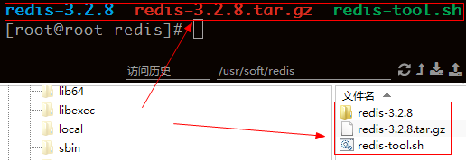
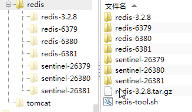
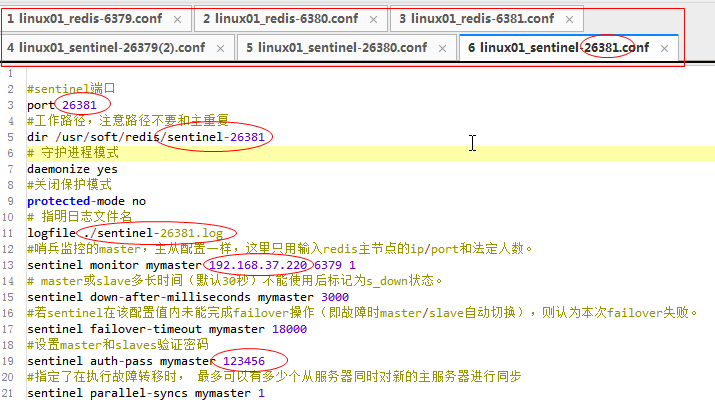

每次创建redis主从和哨兵服务,文件夹要复制好几个,配置文件改一大堆.繁琐还容易出错,就想通过shell脚本自动帮我配置好端口以及文件,下面就是脚本内容:

redis-tool.sh

``` bash
#!/bin/bash
redis_port=6379
sentinel_port=26379
ip=127.0.0.1

function config()
{
rm -rf $1
cp -rf $2 $1
cd $1
touch $1.conf
echo "$3" > $1.conf
cd ../
}

function cre_redis_conf()
{
redis_conf="
# 启动端口
port ${redis_port}
# 守护进程模式
daemonize yes
#关闭保护模式
protected-mode no
"
config redis-${redis_port} $1 "${redis_conf}"
}

function cre_sentinel_conf()
{
sentinel_conf="
#sentinel端口
port ${sentinel_port}
#工作路径，注意路径不要和主重复
dir `pwd`/sentinel-${sentinel_port}
# 守护进程模式
daemonize yes
#关闭保护模式
protected-mode no
# 指明日志文件名
logfile ./sentinel-${sentinel_port}.log
#哨兵监控的master，主从配置一样，这里只用输入redis主节点的ip/port和法定人数。
sentinel monitor mymaster ${ip} 6379 1
# master或slave多长时间（默认30秒）不能使用后标记为s_down状态。
sentinel down-after-milliseconds mymaster 3000
#若sentinel在该配置值内未能完成failover操作（即故障时master/slave自动切换），则认为本次failover失败。
sentinel failover-timeout mymaster 18000
#设置master和slaves验证密码
sentinel auth-pass mymaster 123456 
#指定了在执行故障转移时， 最多可以有多少个从服务器同时对新的主服务器进行同步
sentinel parallel-syncs mymaster 1
"
config sentinel-${sentinel_port} $1 "${sentinel_conf}"
}


function init()
{
  echo "redis文件夹名称:"
  read path
  echo "创建redis服务数:"
  read num
  echo "ip地址:"
  read local_ip
  ip=$local_ip
  for((i=0;i<$num;i++));
do
  cre_redis_conf $path
  cre_sentinel_conf $path
  ((redis_port++))
  ((sentinel_port++))
done
echo "创建完成!"
}
init
# init 4 redis-3.5.2
```

使用时
1. 将脚本放在编译完成后的redis文件夹的同级目录中



``` stata
chmod +x redis-tool.sh # 授权为可执行文件
```
2. 执行脚本依次输入redis文件夹/需要多少个服务/本机ip

``` shell
./redis-tool.sh 
redis文件夹名称:
redis-3.2.8
创建redis服务数:
3
ip地址:
192.168.37.220
创建完成!
```





