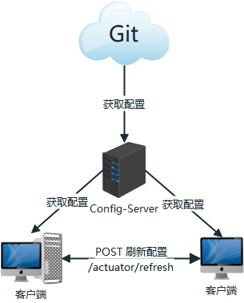
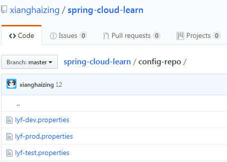

> [toc]



# 1.github配置

通过github作为分布式配置中心,在github上新建仓库:spring-cloud-learn,并创建文件夹config-repo(也可以不创建文件夹,配置会有一点不同)并上传3分文件,内容分别为:
1. lyf-dev.properties 模拟开发环境

``` 
from=local-dev
```

2. lyf-test.properties 模拟测试环境

``` 
from=local-test
```

3. lyf-prod.properties 模拟生产环境

``` 
from=local-prod
```



# 2.服务端配置

## pom.xml

``` xml
<!-- config-server 服务配置中心 -->
<dependency>
   <groupId>org.springframework.cloud</groupId>
   <artifactId>spring-cloud-config-server</artifactId>
</dependency>
```

## application.xml

``` yaml
spring:
  application:
    name: config-server
  cloud:
    config:
      server:
        git:
          uri: https://github.com/xianghaizing/spring-cloud-learn
          search-paths: config-repo
server:
  port: 8888
```
- `uri` 指定github地址
- `search-paths` 指定配置搜索目录

## Application.java

``` java
@EnableConfigServer
@SpringBootApplication
public class ConfigServerApplication {

 public static void main(String[] args) {
  SpringApplication.run(ConfigServerApplication.class, args);
 }

}
```
`@EnableConfigServer` 启动配置中心

# 3.配置和命名

## 1. 配置加载顺序

**bootstrap.yml 高于 application.yml, bootstrap.yml一般用于加载远程配置**

## 2. 客户端命名规则

> /{application}/{profile}[/{label}]
/{application}-{profile}.yml
/{label}/{application}-{profile}.yml
/{application}-{profile}.properties
/{label}/{application}-{profile}.properties

**一定要记住这个命名规则,不然客户端获取不到配置.这个坑困扰了我好几天,终于踩平了**

- `application` 作为client的 `spring.application.name` (**必须一致**)
- `profile` 作为client的 `spring.cloud.config.profile` 
- `label` 作为client的 `spring.cloud.config.label` (**默认master**)

# 4.客户端配置

## pom.xml

``` xml
<!-- spring mvc -->
<dependency>
   <groupId>org.springframework.boot</groupId>
   <artifactId>spring-boot-starter-web</artifactId>
</dependency>
<!-- 配置中心client端 -->
<dependency>
   <groupId>org.springframework.cloud</groupId>
   <artifactId>spring-cloud-starter-config</artifactId>
</dependency>
```

## application.yml

``` yaml
spring:
  application:
    name: lyf
  cloud:
    config:
      uri: http://localhost:8888
      profile: dev
      label: master
      
server:
   port: 8030
   
management:
  endpoints:
    web:
      exposure:
        include: refresh # 暴露刷新节点 2.x版本需要手动开启
```

## Controller.java

``` java
@RefreshScope
@RestController
public class ConfigClientController {
  
  @Value("${from}")
  private String from;
  
  @RequestMapping("/from")
  public String getFrom(){
    return this.from;
  }
  
}
```
`${from}`就是远程properties文件中的`from=dev`中的那个`key`

# 5.获取远程配置

启动服务端和客户端

## 1.访问服务端

由于配置文件名为`lyf-dev.properties`,所以访问地址为 `/lyf/dev`

GET http://localhost:8888/lyf/dev

``` json
{
  "name": "lyf",
  "profiles": [
    "dev"
  ],
  "label": null,
  "version": "9dd38a778c9b4ec9d7b8e972aeabe749e24e0161",
  "state": null,
  "propertySources": [
    {
      "name": "https://github.com/xianghaizing/spring-cloud-learn/config-repo/lyf-dev.properties",
      "source": {
        "from": "local-dev"
      }
    },
    {
      "name": "https://github.com/xianghaizing/spring-cloud-learn/config-repo/lyf.properties",
      "source": {
        "from": "local"
      }
    }
  ]
}
```

## 2.访问客户端

GET http://localhost:8030/from
> local-dev

# 6.修改配置

修改dev配置: `from=local-dev-02` 并push到github

## 1.访问服务

GET http://localhost:8888/lyf/dev

``` json
{
  "name": "lyf",
  "profiles": [
    "dev"
  ],
  "label": null,
  "version": "a89342009a315c78671b31a35392158673828bba",
  "state": null,
  "propertySources": [
    {
      "name": "https://github.com/xianghaizing/spring-cloud-learn/config-repo/lyf-dev.properties",
      "source": {
        "from": "local-dev-02"
      }
    },
    {
      "name": "https://github.com/xianghaizing/spring-cloud-learn/config-repo/lyf.properties",
      "source": {
        "from": "local"
      }
    }
  ]
}
```

## 2.访问客户端

> GET http://localhost:8030/from
local-dev

此时客户端并没有拿到最新配置,需要手动发送post请求执行刷新
> POST http://localhost:8030/actuator/refresh
[
  "config.client.version",
  "from"
]

再次访问
> GET http://localhost:8030/from
local-dev-02


