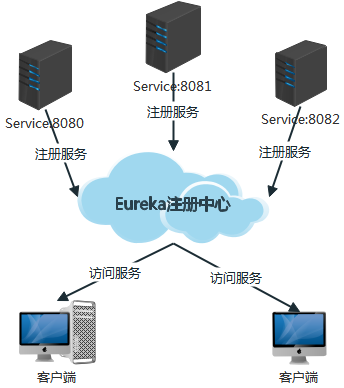
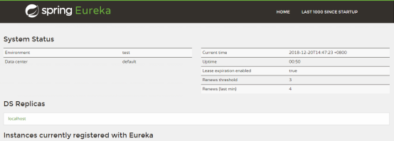
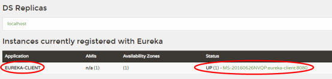

> [toc]



# 1．服务端配置

使用`Spring Boot 2.0.2.RELEASE`和`Spring Cloud Finchley.SR2`官方正式版进行项目构建,创建名字为`eureka-server`的Spring Boot工程

## pom.xml
`spring-cloud-starter-netflix-eureka-server`服务注册中心依赖
``` xml
<?xml version="1.0" encoding="UTF-8"?>
<project xmlns="http://maven.apache.org/POM/4.0.0" xmlns:xsi="http://www.w3.org/2001/XMLSchema-instance"
   xsi:schemaLocation="http://maven.apache.org/POM/4.0.0 http://maven.apache.org/xsd/maven-4.0.0.xsd">
   <modelVersion>4.0.0</modelVersion>
   
   <parent>
      <groupId>org.springframework.boot</groupId>
      <artifactId>spring-boot-starter-parent</artifactId>
      <version>2.0.2.RELEASE</version>
      <relativePath/> <!-- lookup parent from repository -->
   </parent>
   
   <groupId>com.lyf</groupId>
   <artifactId>eureka-server</artifactId>
   <version>0.0.1-SNAPSHOT</version>
   <name>eureka-server</name>
   <description>Demo project for Spring Boot</description>

   <repositories>
      <repository>
         <id>spring-snapshots</id>
         <name>Spring Snapshots</name>
         <url>https://repo.spring.io/libs-snapshot</url>
         <snapshots>
            <enabled>true</enabled>
         </snapshots>
      </repository>
      <repository>
         <id>spring-milestones</id>
         <name>Spring Milestones</name>
         <url>https://repo.spring.io/libs-milestone</url>
         <snapshots>
            <enabled>false</enabled>
         </snapshots>
      </repository>
      <repository>
         <id>spring-releases</id>
         <name>Spring Releases</name>
         <url>https://repo.spring.io/libs-release</url>
         <snapshots>
            <enabled>false</enabled>
         </snapshots>
      </repository>
   </repositories>

   <properties>
      <java.version>1.8</java.version>
   </properties>

   <dependencies>
      <dependency>
         <groupId>org.springframework.boot</groupId>
         <artifactId>spring-boot-starter</artifactId>
      </dependency>
      <dependency>
         <groupId>org.springframework.boot</groupId>
         <artifactId>spring-boot-starter-test</artifactId>
         <scope>test</scope>
      </dependency>
      <!-- eureka 服务端 -->
      <dependency>
         <groupId>org.springframework.cloud</groupId>
         <artifactId>spring-cloud-starter-netflix-eureka-server</artifactId>
      </dependency>
   </dependencies>

   <dependencyManagement>
      <dependencies>
         <dependency>
            <groupId>org.springframework.cloud</groupId>
            <artifactId>spring-cloud-dependencies</artifactId>
            <version>Finchley.SR2</version>
            <type>pom</type>
            <scope>import</scope>
         </dependency>
      </dependencies>
   </dependencyManagement>    
   
   <build>
      <plugins>
         <plugin>
            <groupId>org.springframework.boot</groupId>
            <artifactId>spring-boot-maven-plugin</artifactId>
         </plugin>
      </plugins>
   </build>

</project>
```

## application.yml

``` yaml
spring:
  application:
    name: eureka-server

server:
  port: 8761

eureka:
  client:
    registerWithEureka: false
    fetchRegistry: false
  server:
    waitTimeInMsWhenSyncEmpty: 0
```
- registerWithEureka: false 不向注册中心注册自己
- fetchRegistry: false 不需要向注册中心获取实例
- waitTimeInMsWhenSyncEmpty: 获取不到实例等待时间

## Application.java
`@EnableEurekaServer`启动服务注册中心
``` java
@EnableEurekaServer
@SpringBootApplication
public class EurekaServerApplication {

 public static void main(String[] args) {
  SpringApplication.run(EurekaServerApplication.class, args);
 }

}
```
启动服务,访问: http://localhost:8761/



# 2．客户端配置

新建项目`eureka-client`,pom引用同上, 去掉eureka-server依赖, 添加如下依赖

## pom.xml

``` xml
<!-- eureka 客户端 -->
<dependency>
   <groupId>org.springframework.cloud</groupId>
   <artifactId>spring-cloud-starter-netflix-eureka-client</artifactId>
</dependency>
<!-- springboot web模块 -->
<dependency>
   <groupId>org.springframework.boot</groupId>
   <artifactId>spring-boot-starter-web</artifactId>
</dependency>
```

## application.yml

``` yaml
spring:
  application:
    name: eureka-client
server:
  port: 8080

eureka:
  client:
    serviceUrl:
      defaultZone: http://localhost:8761/eureka/
```

## 新建HelloController.java

``` java
@RestController
public class HelloController {
  
  @GetMapping("hello")
  public String hello(){
    return "Hello World!";
  }
}
```
启动项目,在注册中心可以看到服务



访问: http://localhost:8080/hello

``` 
Hello World!
```

# 3．优化pom引用

每个pom中都要引用一大堆相同的东西,可以被一个父项目代替掉.
1. 在父项目引用所有资源
2. 子项目以父项目为基础进行构建

## 父项目:spring-cloud-base

``` xml
<?xml version="1.0" encoding="UTF-8"?>
<project xmlns="http://maven.apache.org/POM/4.0.0"
         xmlns:xsi="http://www.w3.org/2001/XMLSchema-instance"
         xsi:schemaLocation="http://maven.apache.org/POM/4.0.0 http://maven.apache.org/xsd/maven-4.0.0.xsd">
    <modelVersion>4.0.0</modelVersion>

    <groupId>com.lyf</groupId>
    <artifactId>spring-cloud-base</artifactId>
    <version>1.0-SNAPSHOT</version>
    <packaging>pom</packaging>

    <parent>
        <groupId>org.springframework.boot</groupId>
        <artifactId>spring-boot-starter-parent</artifactId>
        <version>2.0.2.RELEASE</version>
        <relativePath/> <!-- lookup parent from repository -->
    </parent>


    <repositories>
        <repository>
            <id>spring-snapshots</id>
            <name>Spring Snapshots</name>
            <url>https://repo.spring.io/libs-snapshot</url>
            <snapshots>
                <enabled>true</enabled>
            </snapshots>
        </repository>
        <repository>
            <id>spring-milestones</id>
            <name>Spring Milestones</name>
            <url>https://repo.spring.io/libs-milestone</url>
            <snapshots>
                <enabled>false</enabled>
            </snapshots>
        </repository>
        <repository>
            <id>spring-releases</id>
            <name>Spring Releases</name>
            <url>https://repo.spring.io/libs-release</url>
            <snapshots>
                <enabled>false</enabled>
            </snapshots>
        </repository>
    </repositories>


    <properties>
        <java.version>1.8</java.version>
    </properties>

    <dependencies>
        <dependency>
            <groupId>org.springframework.boot</groupId>
            <artifactId>spring-boot-starter</artifactId>
        </dependency>

        <dependency>
            <groupId>org.springframework.boot</groupId>
            <artifactId>spring-boot-starter-test</artifactId>
            <scope>test</scope>
        </dependency>

    </dependencies>

    <dependencyManagement>
        <dependencies>
            <dependency>
                <groupId>org.springframework.cloud</groupId>
                <artifactId>spring-cloud-dependencies</artifactId>
                <version>Finchley.SR2</version>
                <type>pom</type>
                <scope>import</scope>
            </dependency>
        </dependencies>
    </dependencyManagement>

    <build>
        <plugins>
            <plugin>
                <groupId>org.springframework.boot</groupId>
                <artifactId>spring-boot-maven-plugin</artifactId>
            </plugin>
        </plugins>
    </build>

</project>
```

## 子项目:eureka-server修改如下

``` xml
<?xml version="1.0" encoding="UTF-8"?>
<project xmlns="http://maven.apache.org/POM/4.0.0" xmlns:xsi="http://www.w3.org/2001/XMLSchema-instance"
   xsi:schemaLocation="http://maven.apache.org/POM/4.0.0 http://maven.apache.org/xsd/maven-4.0.0.xsd">
   <modelVersion>4.0.0</modelVersion>
   
   <groupId>com.lyf</groupId>
   <artifactId>eureka-server</artifactId>
   <version>0.0.1-SNAPSHOT</version>
   <name>eureka-server</name>
   <description>Demo project for Spring Boot</description>

   <properties>
      <java.version>1.8</java.version>
   </properties>

   <parent>
      <groupId>com.lyf</groupId>
      <artifactId>spring-cloud-base</artifactId>
      <version>1.0-SNAPSHOT</version>
   </parent>
   
   <dependencies>
      <dependency>
         <groupId>org.springframework.cloud</groupId>
         <artifactId>spring-cloud-starter-netflix-eureka-server</artifactId>
      </dependency>
   </dependencies>

</project>
```

## 子项目:eureka-client修改如下

``` xml
<?xml version="1.0" encoding="UTF-8"?>
<project xmlns="http://maven.apache.org/POM/4.0.0" xmlns:xsi="http://www.w3.org/2001/XMLSchema-instance"
   xsi:schemaLocation="http://maven.apache.org/POM/4.0.0 http://maven.apache.org/xsd/maven-4.0.0.xsd">
   <modelVersion>4.0.0</modelVersion>

   <groupId>com.lyf</groupId>
   <artifactId>eureka-client</artifactId>
   <version>0.0.1-SNAPSHOT</version>
   <name>eureka-client</name>
   <description>Demo project for Spring Boot</description>

   <properties>
      <java.version>1.8</java.version>
   </properties>

   <parent>
      <groupId>com.lyf</groupId>
      <artifactId>spring-cloud-base</artifactId>
      <version>1.0-SNAPSHOT</version>
   </parent>
   
   <dependencies>
      <!-- eureka 客户端 -->
      <dependency>
         <groupId>org.springframework.cloud</groupId>
         <artifactId>spring-cloud-starter-netflix-eureka-client</artifactId>
      </dependency>
      <!-- springboot web模块 -->
      <dependency>
         <groupId>org.springframework.boot</groupId>
         <artifactId>spring-boot-starter-web</artifactId>
      </dependency>
   </dependencies>

</project>
```


