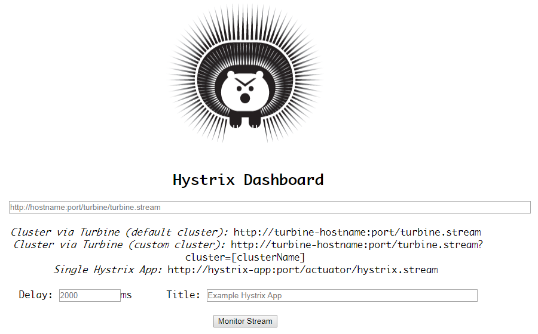
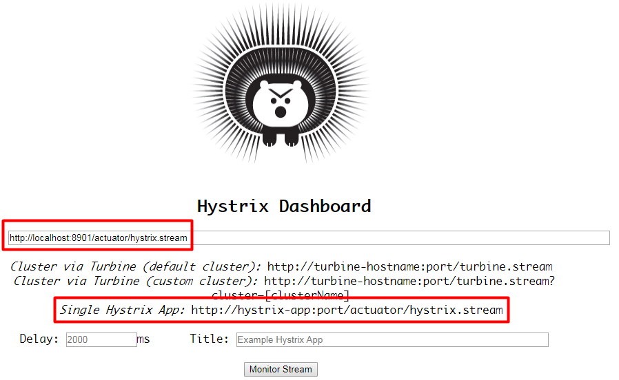
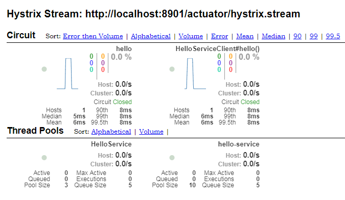
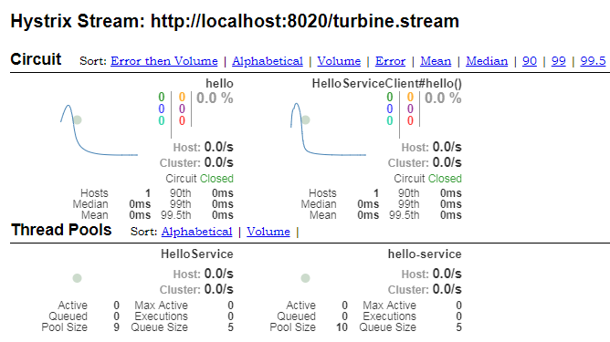

> [toc]

Hystrix DashBoard 监控仪表盘用来监测请求访问量

# 1.监控系统配置

## pom.xml

``` xml
<!-- dashboard 客户端 -->
<dependency>
   <groupId>org.springframework.cloud</groupId>
   <artifactId>spring-cloud-starter-netflix-hystrix-dashboard</artifactId>
</dependency>
```

## application.yml

``` yaml
spring:
  application:
    name: hystrix-dashboard
server:
  port: 8010
```

## Application.java

``` java
@EnableHystrixDashboard
@SpringBootApplication
public class HystrixDashboardApplication {

 public static void main(String[] args) {
  SpringApplication.run(HystrixDashboardApplication.class, args);
 }

}
```
`@EnableHystrixDashboard` 开启仪表盘功能

访问: http://localhost:8010/hystrix




# 2.被监控服务配置

## pom.xml

``` xml
<!-- 系统健康监控工具 -->
<dependency>
    <groupId>org.springframework.boot</groupId>
    <artifactId>spring-boot-starter-actuator</artifactId>
</dependency>
```
**每个需要被监控的项目都要加,且是使用熔断机制的项目**

## application.yml

``` yaml
spring:
  application:
    name: hystrix-client
    
server:
  port: 8091

feign:
  hystrix:
    enabled: true
    
management:
  endpoints:
    web:
      exposure:
        include: "*" # 暴露endpoints节点 2.x版本需要手动开启
```

`management.endpoints` 管理端点, 2.x版本需要手动开启

监控页面输入: http://localhost:8091/actuator/hystrix.stream



访问被监听的服务可以看到




或者`被监控的项目`采用如下配置

``` java
@Bean
public ServletRegistrationBean getServlet() {
 HystrixMetricsStreamServlet streamServlet = new HystrixMetricsStreamServlet();
 ServletRegistrationBean registrationBean = new ServletRegistrationBean(streamServlet);
 registrationBean.setLoadOnStartup(1);
 registrationBean.addUrlMappings("/hystrix.stream");
 registrationBean.setName("HystrixMetricsStreamServlet");
 return registrationBean;
}
```
监控页面输入: http://localhost:8091/hystrix.stream 进行监控

# 3.集群监控配置

创建spring-boot项目并添加依赖

## pom.xml

``` xml
<dependency>
   <groupId>org.springframework.cloud</groupId>
   <artifactId>spring-cloud-starter-netflix-turbine</artifactId>
</dependency>
```

## application.xml

``` yaml
spring:
  application:
    name: turbine-client
    
server:
  port: 8020
  
turbine:
  app-config: hystrix-client
  aggregator:
    cluster-config: default
  cluster-name-expression: new String("default")
  combine-host-port: true
```

`app-config` 被监控集群的服务名称

## Application.java

``` java
@EnableTurbine
@SpringBootApplication
public class TurbineClientApplication {

 public static void main(String[] args) {
  SpringApplication.run(TurbineClientApplication.class, args);
 }

}
```
监控页面输入:  http://localhost:8020/turbine.stream




