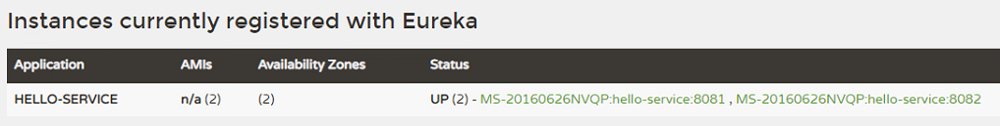
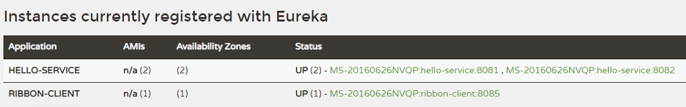
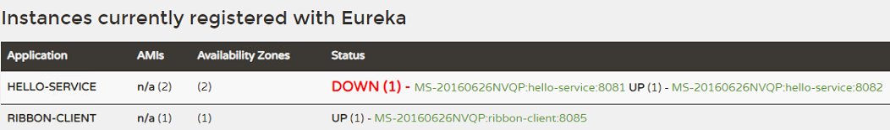

> [toc]

# 1.Hello-Service服务端配置

在pom文件中添加Eureka客户端依赖,并配置Eureka注册中心的服务地址.也可以不配置,那就会使用默认的localhost的`8761`端口.
## pom.xml
``` xml
<!-- eureka 客户端 -->
<dependency>
 <groupId>org.springframework.cloud</groupId>
 <artifactId>spring-cloud-starter-netflix-eureka-client</artifactId>
</dependency>
```
## application.yml

``` yaml
spring:
  application:
    name: hello-service
server:
  port: 8080

eureka:
  client:
    serviceUrl:
      defaultZone: http://localhost:8761/eureka/
```

## 启动两个service

- `mvn package` 打包
- `java -jar jar包 --server.port=端口` 启动并指定端口

使用bat脚本可以快速启动服务,

``` bat
start java -jar hello-service-0.0.1-SNAPSHOT.jar --server.port=8081
start java -jar hello-service-0.0.1-SNAPSHOT.jar --server.port=8082
```

启动 `8081` `8082` 两个端口提供服务




# 2.Ribbon客户端配置

## pom.xml

``` xml
<!-- ribbon 客户端 负载均衡 -->
<dependency>
 <groupId>org.springframework.cloud</groupId>
 <artifactId>spring-cloud-starter-netflix-ribbon</artifactId>
</dependency>
```

## application.yml

``` yaml
spring:
  application:
    name: ribbon-client
    
server:
  port: 8085

hello:
  serviceUrl: http://localhost:8081/hello/ 
```

http://localhost:8081/hello 是hello-service的服务请求地址,用于`非负载均衡`的情况下,Bean的配置不需要加` @LoadBalanced`注解;

在Ribbon中可以直接调用`HELLO-SERVICE`服务注册的名字使用服务,已达到`负载均衡`的目的.


## Application.java

``` java
@SpringBootApplication
public class RibbonClientApplication {
 
 @LoadBalanced
 @Bean
 RestTemplate restTemplate(){
  return new RestTemplate();
 }
 
 public static void main(String[] args) {
  SpringApplication.run(RibbonClientApplication.class, args);
 }

}
```

`@LoadBalanced` 客户端负载均衡模板

## Controller.java

``` java
@RestController
@RequestMapping("con")
public class ConsumerController {

  @Autowired
  private RestTemplate template;
  
  @Value("${hello.serviceUrl}")
  private String helloServiceUrl;

  /**
   * 非负载均衡请求,不需要@LoadBalance
   * @return
   */
  @GetMapping("hello01")
  public String hello01(){
    return template.getForObject(helloServiceUrl, String.class);
  }

  /**
   * 负载均衡请求 HELLO-SERVICE 服务在Eureka上注册的名字
   * @return
   */
  @GetMapping("hello02")
  public String hello02(){
    return template.getForObject("http://HELLO-SERVICE/hello", String.class);
  }

}
```

# 3.启动服务并验证
依次启动Eureka注册中心,2个Hello-Service和Ribbon-Client



访问:  http://localhost:8085/con/hello02

```
Hello World!
```

验证负载均衡和高可用,可以直接访问服务,然后关闭其中一个服务再访问

第一次访问:  http://localhost:8085/con/hello02

``` 
Hello World!
```
可以直接访问到服务.然后关闭其中一个服务再访问



访问:  http://localhost:8085/con/hello02 可能会看到如下报错

``` json
{"timestamp":"2018-12-21T04:01:02.288+0000","status":500,"error":"Internal Server Error","message":"I/O error on GET request for \"http://HELLO-SERVICE/hello\": Connection refused: connect; nested exception is java.net.ConnectException: Connection refused: connect","path":"/con/hello02"}
```
继续访问,就会正常被请求到了

``` groovy
访问:  http://localhost:8090/con/hello02
Hello World!
访问:  http://localhost:8090/con/hello02
Hello World!
访问:  http://localhost:8090/con/hello02
Hello World!
```

默认服务采用轮询方式提供服务,每两次会有一次失败.多访问几次后,就只有运行的服务提供服务.


